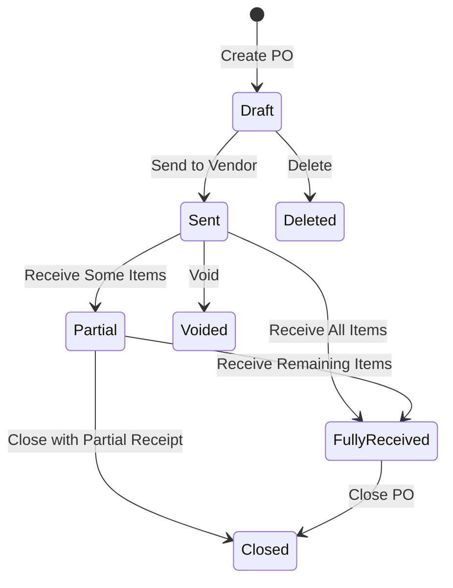
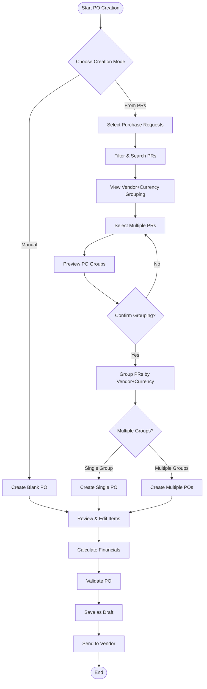
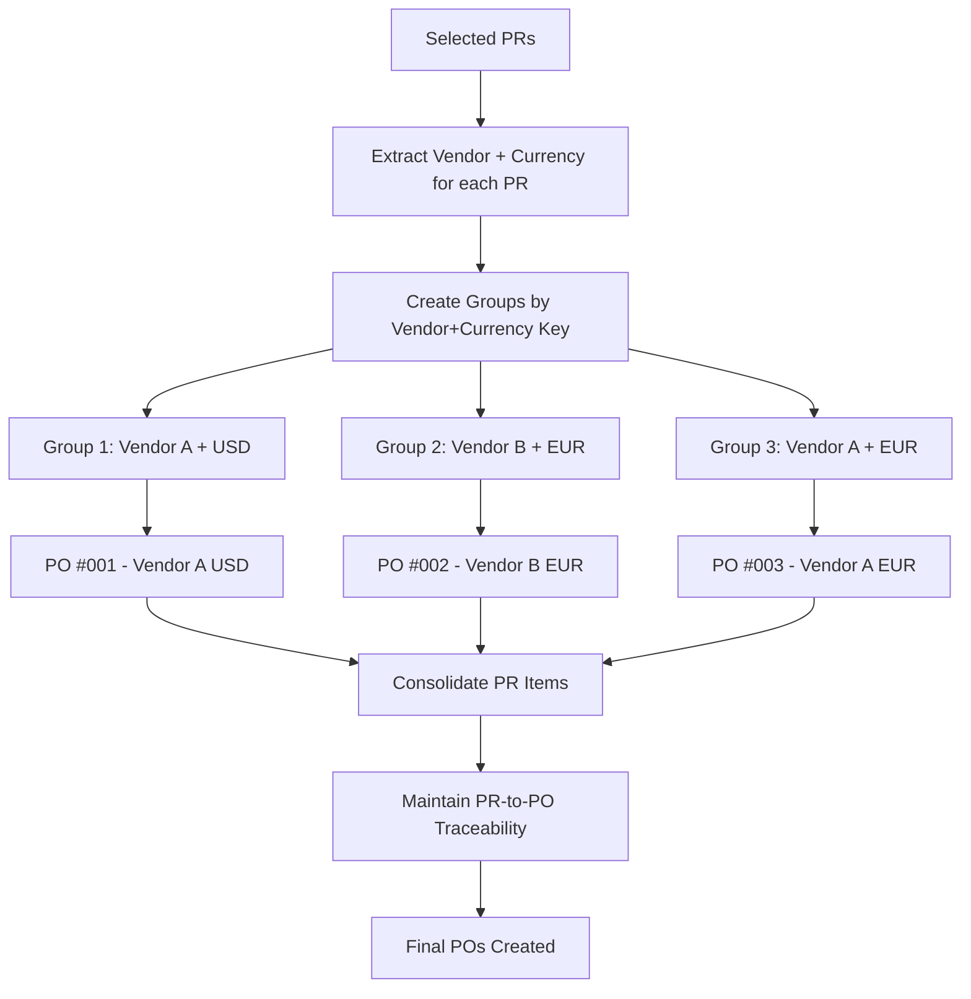
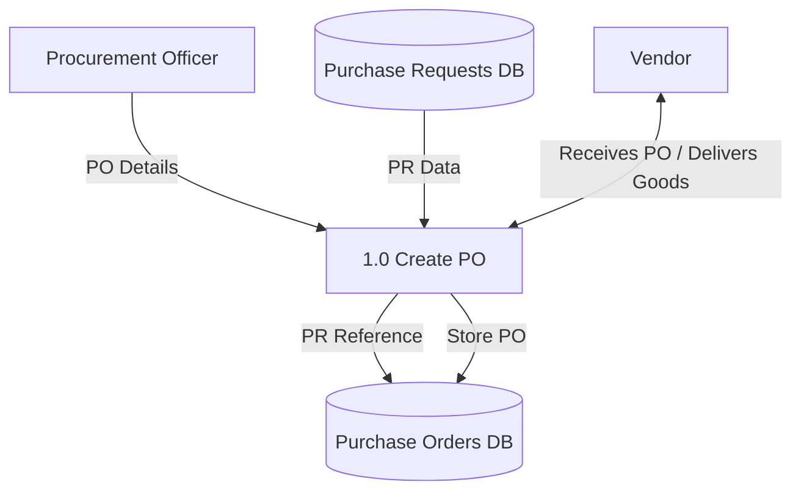

# Purchase Order Module: Consolidated Documentation

This document provides a comprehensive, consolidated overview of the Purchase Order (PO) module, combining all related business, functional, and technical documentation into a single source of truth.

---

## 1. Business Analysis

### 1.1. Introduction

*   **Purpose**: This section provides a comprehensive business analysis of the Purchase Order (PO) module within the Carmen F&B Management System. The module is essential for managing and tracking purchase orders, ensuring proper vendor relationships, and maintaining accurate procurement records.
*   **Scope**: The analysis covers the entire purchase order process, including PO creation, vendor management, item management, financial processing, and document tracking.

### 1.2. Business Objectives
*   Streamline purchase order creation and management
*   Ensure accurate vendor and pricing information
*   Maintain procurement compliance and control
*   Track order status and delivery
*   Monitor procurement spending
*   Support audit requirements

### 1.3. Business Rules

*   **PO Creation**: All POs must have unique reference numbers and be linked to approved purchase requests. Required fields include vendor, delivery date, and currency.
*   **Vendor Rules**: Vendor must be from an approved list, and credit terms must be specified.
*   **Financial Rules**: Tax calculations must be itemized, discounts documented, and budget validation is required.
*   **PR-to-PO Traceability**: Each PO item created from a PR must maintain a reference to its source. This link must be preserved throughout the lifecycle for audit and operational efficiency.
*   **Vendor+Currency Grouping**: When creating POs from multiple Purchase Requests, PRs must be automatically grouped by vendor and currency combination. Each unique vendor+currency pair generates a separate PO to ensure proper procurement practices and vendor management.

### 1.4. System Calculation Rules
*   **Item Subtotal**: `Round(Quantity (3 decimals) × Unit Price (2 decimals), 2)`
*   **Item Discount**: `Round(Round(Subtotal, 2) × Discount Rate, 2)`
*   **Item Net Amount**: `Round(Round(Subtotal, 2) - Round(Discount Amount, 2), 2)`
*   **Item Tax**: `Round(Round(Net Amount, 2) × Tax Rate, 2)`
*   **Item Total**: `Round(Round(Net Amount, 2) + Round(Tax Amount, 2), 2)`
*   **Order Totals**: Sum of the corresponding rounded item-level calculations.
*   **Rounding**: All intermediate calculations must be rounded before use in subsequent calculations. Final rounding uses the half-up (banker's) method.

---

## 2. Product Requirements

### 2.1. Overview
The Purchase Order (PO) Module is a web-based component that enables users to create, view, edit, and manage the full lifecycle of purchase orders, from creation (often from a Purchase Requisition) to final closure.

### 2.2. Functional Requirements

*   **PO Management**: Create POs from PRs or from scratch. Generate unique reference numbers. Allow editing of drafts, and cancellation/voiding of active POs. Track status through the entire lifecycle.
*   **PO Creation from PRs**: Support dual creation modes - manual blank PO creation and automated creation from selected Purchase Requests with intelligent vendor+currency grouping.
*   **Item Management**: Add, edit, and remove items using the `ItemDetailsComponent` dialog. The dialog provides access to related information, including PR details, on-hand inventory, pending POs, and GRN history. Support for Free-of-Charge (FOC) items and unit conversions is included.
*   **Financial Management**: Automatically calculate subtotals, taxes, and discounts. Support multiple currencies with exchange rate conversions. Validate against budgets.
*   **Integration**: Integrate with Vendor Management, Purchase Requests, Goods Received Notes (GRN), Inventory, and Finance modules.
*   **Reporting & Analytics**: Provide list views with filtering/sorting. Generate printable PO documents. Offer reports on PO status, vendor performance, and spending. A detailed sidepanel allows users to configure exports with options for date ranges, locations, categories, and more. Users can also select which columns to include in an export.

### 2.3. PO Creation from Purchase Requests

#### 2.3.1. Creation Workflow
The system supports two distinct PO creation methods:

1. **Manual Creation**: Users can create blank POs from scratch with full control over all fields and items.

2. **PR-Based Creation**: Users can select multiple approved Purchase Requests and automatically create POs with intelligent grouping.

#### 2.3.2. Vendor+Currency Grouping Logic
When creating POs from multiple Purchase Requests, the system implements the following business logic:

*   **Automatic Grouping**: PRs are automatically grouped by the combination of `vendor` and `currency`.
*   **Separate PO Generation**: Each unique vendor+currency combination generates a distinct PO.
*   **Consolidated Items**: All PR items within the same vendor+currency group are consolidated into a single PO.
*   **Preserved Traceability**: Each PO item maintains references to its originating PR for audit and tracking purposes.

#### 2.3.3. User Interface Features
*   **Visual Grouping Indicators**: Table rows are color-coded by vendor+currency combinations to help users understand grouping.
*   **Real-time Preview**: Users see exactly how many POs will be created and which PRs belong to each group.
*   **Smart Selection**: The system shows totals and counts for each vendor+currency group as users make selections.
*   **Bulk Creation Support**: For multiple vendor+currency groups, the system provides bulk creation workflows.

#### 2.3.4. Example Scenarios

**Scenario 1**: Single Vendor+Currency
- Input: 3 PRs from "Office Supplies Co." (USD)
- Output: 1 PO containing all 3 PRs' items

**Scenario 2**: Multiple Vendors, Same Currency
- Input: 2 PRs from "Office Supplies Co." (USD) + 2 PRs from "Tech Solutions Inc." (USD)
- Output: 2 POs (one per vendor)

**Scenario 3**: Same Vendor, Multiple Currencies
- Input: 2 PRs from "Global Suppliers Ltd." (USD) + 1 PR from "Global Suppliers Ltd." (EUR)
- Output: 2 POs (one per currency)

**Scenario 4**: Mixed Vendors and Currencies
- Input: 2 PRs from "Office Supplies Co." (USD) + 2 PRs from "Global Suppliers Ltd." (EUR) + 1 PR from "Kitchen Pro Equipment" (USD)
- Output: 3 POs (Office Supplies-USD, Global Suppliers-EUR, Kitchen Pro-USD)

### 2.4. UI Components and Interactions
*   **Advanced Filtering**: A filter builder (`FilterBuilder.tsx`) allows users to create complex queries with AND/OR logic.
*   **Saved Filters**: Users can save and reuse their custom filters (`filter-storage.ts`).
*   **Multiple Views**: The PO list (`PurchaseOrderList.tsx`) can be viewed as a table or a grid of cards.
*   **Export/Print Options**: Sidepanels (`ExportSidepanel.tsx`, `PrintOptionsSidepanel.tsx`) provide detailed options for configuring exports and print jobs, including column selection (`ColumnSelectionScreen.tsx`).
*   **Item Details Dialog**: A comprehensive dialog (`ItemDetailsComponent.tsx`) for viewing, editing, and adding items, with access to related information like PRs, inventory, and GRNs.
*   **PR Selection Dialog**: A comprehensive dialog (`CreatePOFromPR.tsx`) for selecting and grouping Purchase Requests with visual indicators and real-time grouping preview.

#### 2.4.1. PO Detail View Tabs
The PO detail view utilizes a tabbed interface to organize various aspects of a Purchase Order. The following tabs are available:

*   **ActivityLogTab.tsx**: Displays a chronological log of all activities and changes related to the Purchase Order.
*   **CommentsAttachmentsTab.tsx**: Allows users to view and add comments, and manage attachments associated with the PO.
*   **FinancialDetailsTab.tsx**: Provides a detailed breakdown of the financial aspects of the PO, including costs, taxes, and totals.
*   **GeneralInfoTab.tsx**: Shows general information and basic details of the Purchase Order.
*   **GoodsReceiveNoteTab.tsx**: Displays information related to Goods Receive Notes (GRNs) linked to the PO.
*   **InventoryStatusTab.tsx**: Provides an overview of the inventory status for items on the Purchase Order.
*   **ItemsTab.tsx**: Lists all line items included in the Purchase Order, with quantities and pricing.
*   **PendingPurchaseOrders.tsx**: Shows any pending purchase orders related to the current view (e.g., for an item).
*   **RelatedDocumentsTab.tsx**: Links to other relevant documents or records associated with the PO.
*   **Summary.tsx**: Offers a high-level summary of the Purchase Order.
*   **VendorInfoTab.tsx**: Displays detailed information about the vendor for the Purchase Order.

### 2.4. Non-Functional Requirements

*   **Performance**: Fast page loads (<2s for lists, <1s for details) and real-time calculations.
*   **Usability**: Responsive UI for desktop and tablets, with clear error messages and consistent navigation.
*   **Reliability**: High data integrity, audit logging, and 99.9% uptime.
*   **Security**: Role-based access control (RBAC), encryption of sensitive data, and input validation.

### 2.5. User Roles & Permissions (RBAC)

| Role | Description | Key Permissions |
|---|---|---|
| Procurement Officer | Creates and manages POs | Create, Edit (Draft), View, Void (Active) |
| Procurement Manager | Oversees procurement | All Procurement Officer permissions + Delete (Draft) |
| Finance Officer | Reviews financial aspects | View POs, Export reports |
| Inventory Manager | Manages goods receipt | Receive goods, Create GRNs, Close POs |

---

## 3. System Architecture & Design

### 3.1. Architecture Principles
*   **Modularity**: Loosely coupled components.
*   **Scalability**: Handle increasing loads without performance degradation.
*   **Maintainability**: Well-structured and documented code.
*   **Reliability**: Graceful error handling and data integrity.
*   **Security**: Enforced access control and protection of sensitive data.

### 3.2. Component Architecture
*   **Presentation Layer**: Next.js frontend with React components (Server and Client).
*   **Application Layer**: Next.js API routes and Server Actions for business logic.
*   **Data Access Layer**: Prisma ORM with a repository pattern.
*   **Database Layer**: PostgreSQL.

---

## 4. Implementation Details

### 4.1. Technology Stack
*   **Frontend**: Next.js 14, React 18, TypeScript 5, Tailwind CSS, Shadcn UI, React Hook Form, Zod, React Table, React Query, Zustand.
*   **Backend**: Next.js 14 (API Routes, Server Actions), Node.js 18+.
*   **Database**: PostgreSQL 15+, Prisma.

### 4.2. API Specification

*   **`GET /api/purchase-orders`**: Retrieves a list of POs with filtering and pagination.
*   **`POST /api/purchase-orders`**: Creates a new PO.
*   **`POST /api/purchase-orders/from-prs`**: Creates POs from grouped Purchase Requests with vendor+currency grouping logic.
*   **`GET /api/purchase-orders/:id`**: Retrieves a specific PO.
*   **`PUT /api/purchase-orders/:id`**: Updates an existing PO.
*   **`POST /api/purchase-orders/:id/status`**: Updates the status of a PO.
*   **`POST /api/purchase-orders/:id/items`**: Adds an item to a PO.
*   **`GET /api/purchase-requests/approved`**: Retrieves approved PRs eligible for PO creation.
*   **`POST /api/purchase-requests/group-preview`**: Previews how selected PRs would be grouped by vendor+currency.

### 4.3. Data Models & Validation
*   **PurchaseOrder Interface**: Defines the structure for a PO, including all financial and metadata fields.
*   **PurchaseOrderItem Interface**: Defines the structure for a PO line item, including traceability fields (`prItemId`, `prNumber`, etc.).
*   **Validation**: Zod schemas are used for validating creation, update, and status change operations.

---

## 5. Data Dictionary

### 5.1. `purchase_orders` Table
| Attribute | Data Type | Description |
|---|---|---|
| id | UUID | Primary Key |
| number | VARCHAR(20) | Unique reference number |
| vendor_id | UUID | Foreign Key to vendors table |
| order_date | DATE | Date of order creation |
| status | VARCHAR(20) | e.g., 'draft', 'sent', 'closed' |
| currency_code | VARCHAR(3) | Transaction currency |
| exchange_rate | DECIMAL(10,5) | Exchange rate to base currency |
| total_amount | DECIMAL(15,2) | Final total amount |
| created_by | UUID | Foreign Key to users table |

### 5.2. `purchase_order_items` Table
| Attribute | Data Type | Description |
|---|---|---|
| id | UUID | Primary Key |
| purchase_order_id | UUID | Foreign Key to purchase_orders table |
| item_id | UUID | Foreign Key to items table |
| ordered_quantity | DECIMAL(15,3) | Quantity ordered |
| unit_price | DECIMAL(15,2) | Price per unit |
| total_amount | DECIMAL(15,2) | Line item total |
| pr_item_id | UUID | Foreign key for PR traceability |

---

## 6. Diagrams and Flows

### 6.1. State Diagram

*Rule: A PO can only be deleted in `Draft` status. Active POs can be `Voided` or `Closed`.* 

### 6.2. User Flow

#### 6.2.1. PO Creation from PRs Flow

#### 6.2.2. Vendor+Currency Grouping Logic Flow

### 6.3. Data Flow

---

## 7. Quality Assurance and Deployment

### 7.1. Testing Strategy
*   **Unit Testing (Jest)**: For business logic, utility functions, and custom hooks. Target coverage: 80%.
*   **Integration Testing (Jest, Supertest)**: For API endpoints and component integration. Target coverage: 70%.
*   **End-to-End Testing (Playwright)**: For critical user flows like PO creation and goods receipt.

### 7.2. Quality Assurance
*   **Static Analysis**: ESLint, TypeScript compiler, and Prettier to enforce code quality.
*   **Code Reviews**: Mandatory peer review process for all pull requests.
*   **Continuous Integration (GitHub Actions)**: Automated build, test, and linting pipeline.

### 7.3. Deployment
*   **Environments**: Separate Development, Staging, and Production environments.
*   **Process**: Automated deployment pipeline with build, test, deploy, and verify stages.
*   **Database Migrations (Prisma Migrate)**: Schema and data migrations are version controlled and run automatically.
