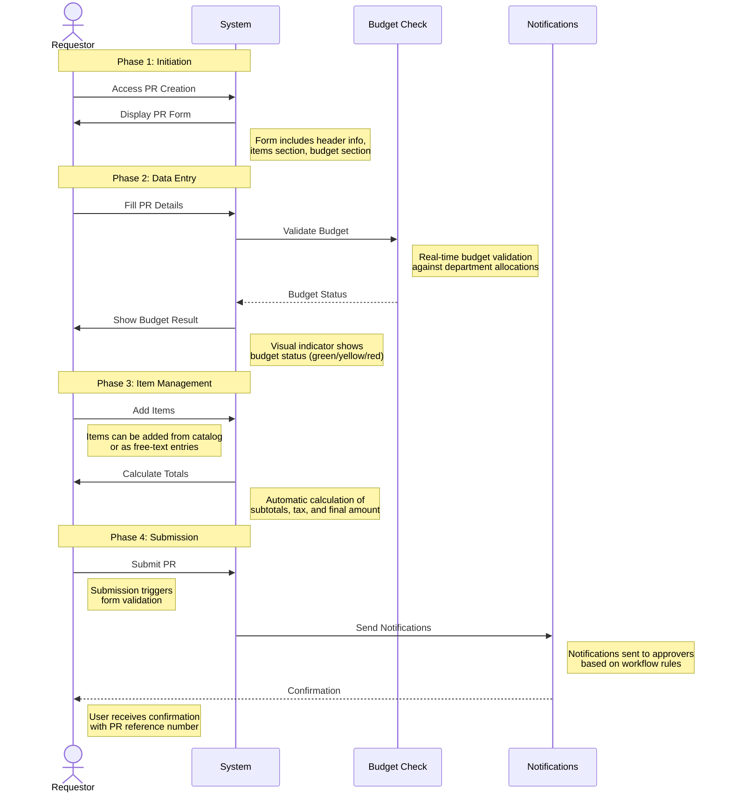
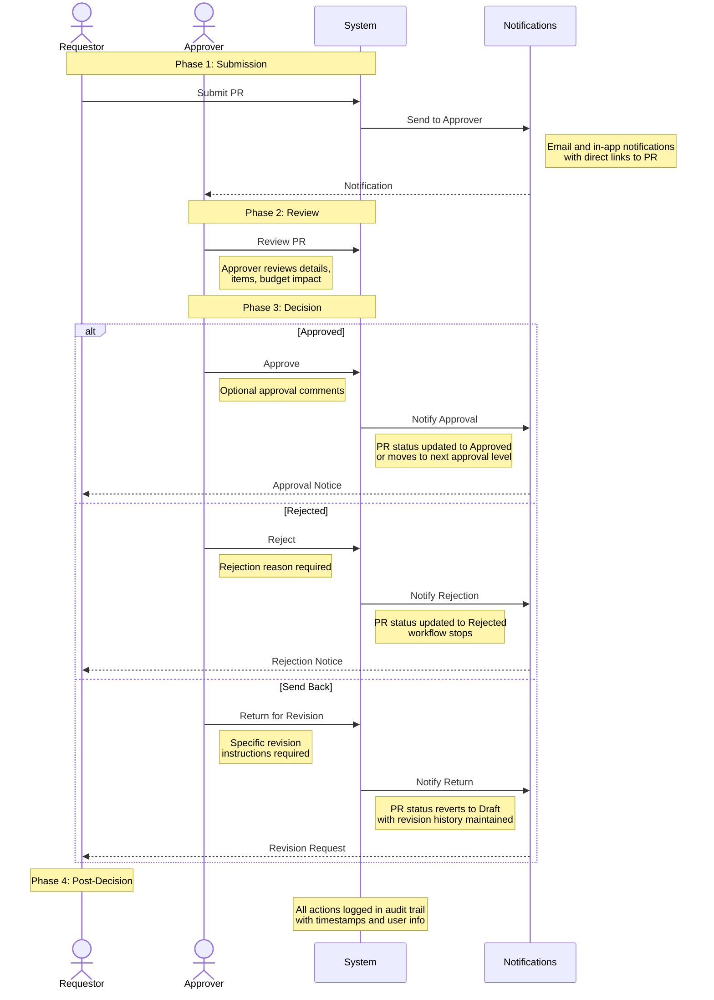
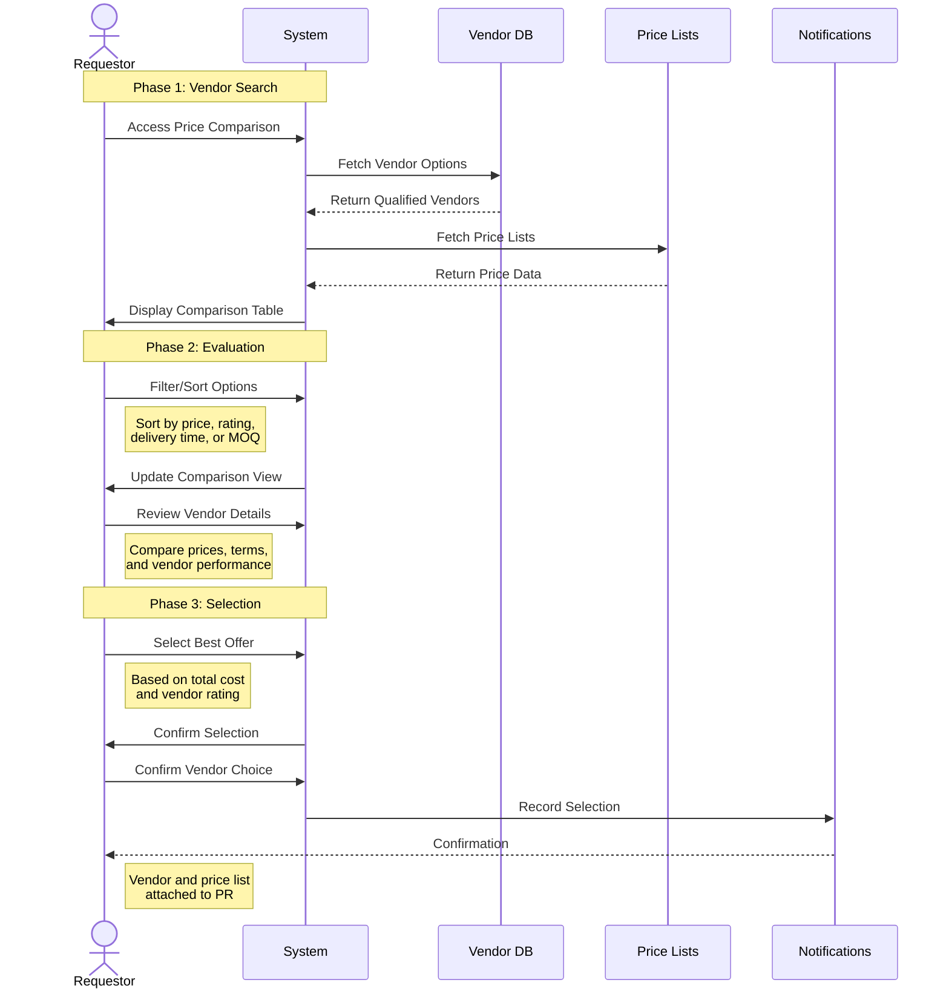
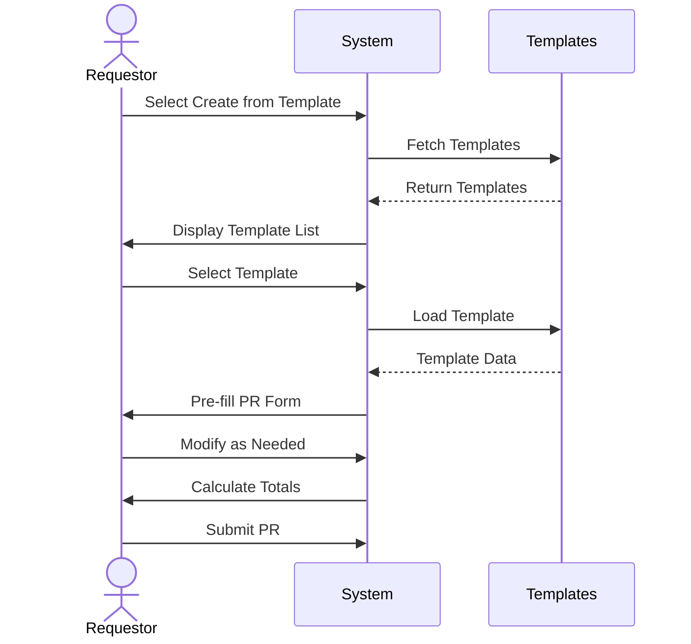
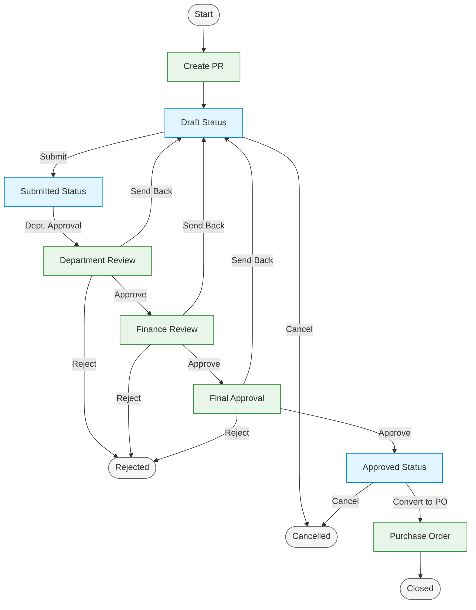
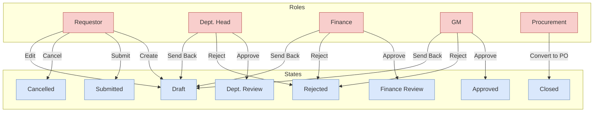

# Purchase Request Module - User Experience

> **Note**: This is a consolidated document that combines content from:
> - user-flow.md
> - ui-flow-specification.md
> - pr-sitemap.md

## Table of Contents
- [Introduction](#introduction)
  - [Purpose and Scope](#purpose-and-scope)
- [User Roles](#user-roles)
- [Main User Flows](#main-user-flows)
  - [Create Purchase Request](#create-purchase-request)
  - [Approval Process](#approval-process)
  - [Vendor Price Comparison](#vendor-price-comparison)
  - [Template Usage](#template-usage)
- [Detailed User Interactions](#detailed-user-interactions)
  - [PR Creation Process](#pr-creation-process)
  - [Approval Process](#approval-process-1)
  - [Template Management](#template-management)
  - [Vendor Price Comparison](#vendor-price-comparison-1)
- [Integration Points](#integration-points)
  - [Vendor Management Integration](#vendor-management-integration)
  - [Budget Management Integration](#budget-management-integration)
  - [Inventory Management Integration](#inventory-management-integration)
  - [Purchase Order Integration](#purchase-order-integration)
  - [Workflow Engine Integration](#workflow-engine-integration)
  - [Reporting and Analytics Integration](#reporting-and-analytics-integration)
- [Error Handling](#error-handling)
  - [Validation Errors](#validation-errors)
  - [System Errors](#system-errors)
  - [Budget Validation Process](#budget-validation-process)
- [User Interface States](#user-interface-states)
  - [PR Status Indicators](#pr-status-indicators)
  - [Action Availability](#action-availability)
- [Notifications](#notifications)
  - [Email Notifications](#email-notifications)
  - [In-App Notifications](#in-app-notifications)
- [Mobile Experience](#mobile-experience)
  - [Mobile Views](#mobile-views)
  - [Mobile Actions](#mobile-actions)
- [Accessibility Considerations](#accessibility-considerations)
  - [Keyboard Navigation](#keyboard-navigation)
  - [Screen Reader Support](#screen-reader-support)
  - [Visual Design](#visual-design)
  - [Form Accessibility](#form-accessibility)
  - [Accessibility Testing](#accessibility-testing)
  - [Accessibility Documentation](#accessibility-documentation)
- [Shortcuts and Quick Actions](#shortcuts-and-quick-actions)
  - [Keyboard Shortcuts](#keyboard-shortcuts)
  - [Quick Actions](#quick-actions)
- [Help and Support](#help-and-support)
  - [Contextual Help](#contextual-help)
  - [Support Access](#support-access)
- [Comprehensive Purchase Request Lifecycle](#comprehensive-purchase-request-lifecycle)
  - [Complete PR Lifecycle Flowchart](#complete-pr-lifecycle-flowchart)
  - [Role-Based PR Interaction Diagram](#role-based-pr-interaction-diagram)
- [Site Map](#site-map)
  - [Navigation Structure](#navigation-structure)
  - [Page Hierarchy](#page-hierarchy)
  - [Component Hierarchy](#component-hierarchy)
- [UI Components](#ui-components)
  - [Form Components](#form-components)
  - [List Components](#list-components)
  - [Detail Components](#detail-components)
  - [Modal Components](#modal-components)
- [Interface Mockups](#interface-mockups)
  - [PR List View](#pr-list-view)
  - [PR Creation Form](#pr-creation-form)
  - [PR Detail View](#pr-detail-view)
  - [Mobile View - PR List](#mobile-view---pr-list)
  - [Error State Example](#error-state-example)
- [Related Documentation](#related-documentation)
- [Version History](#version-history)

## Introduction
This document details the user experience aspects of the Purchase Request (PR) module, including user flows, interactions, interface states, and navigation structure. It provides comprehensive guidance for all user roles and scenarios.

The Purchase Request module is designed to provide an intuitive and efficient user experience for creating, managing, and approving purchase requests. This document serves as a reference for developers, designers, and testers to ensure a consistent and user-friendly experience across the module.

### Purpose and Scope
The Purchase Request module is a critical component of the procurement process, serving as the initial step in the procurement lifecycle. It enables users to:

- Formalize purchase needs across the organization
- Standardize the request process for goods and services
- Implement proper approval workflows based on organizational hierarchy
- Enforce budget controls and financial governance
- Create an audit trail for all procurement activities
- Facilitate vendor selection through price comparison
- Streamline the transition from request to purchase order

This document covers all aspects of the user experience within the PR module, from initial request creation through approval workflows to final processing. It addresses the needs of all stakeholders involved in the procurement process, including requestors, approvers, finance personnel, and procurement officers.

## User Roles
The Purchase Request module supports the following user roles, each with specific permissions and responsibilities:

- **Requestor**: 
  - Creates and submits purchase requests
  - Provides detailed specifications for requested items
  - Selects vendors through price comparison
  - Responds to queries during approval process
  - Tracks request status through the approval workflow
  - Can cancel requests or make revisions when sent back

- **Department Approver**: 
  - Reviews and approves requests from their department
  - Validates business need and request details
  - Can reject or send back requests for revision
  - Ensures compliance with department policies
  - May delegate approval authority temporarily
  - Monitors department spending through requests

- **Finance Approver**: 
  - Validates budget and financial aspects
  - Ensures proper account coding and financial classifications
  - Reviews financial impact of requests
  - Enforces budget constraints and financial policies
  - May request additional justification for expenses
  - Monitors overall financial impact across departments

- **Budget Controller**: 
  - Monitors budget impact and allocations
  - Reviews requests against budget availability
  - Provides budget override approvals when necessary
  - Tracks spending patterns and budget utilization
  - Generates budget impact reports
  - Ensures fiscal responsibility across the organization

- **Procurement Officer**: 
  - Processes approved requests
  - Converts requests to purchase orders
  - Negotiates with vendors when necessary
  - Ensures compliance with procurement policies
  - Reviews vendor selections and pricing
  - Manages the transition from request to order

- **System Administrator**: 
  - Configures system settings and permissions
  - Manages approval workflows and routing rules
  - Sets up user accounts and role assignments
  - Maintains system integrations and data flows
  - Monitors system performance and usage
  - Provides technical support for users

## Main User Flows

### Create Purchase Request


### Approval Process


### Vendor Price Comparison


### Template Usage


## Detailed User Interactions

### PR Creation Process
1. **Access PR Creation**
   - Navigate to PR module
   - Click "Create New PR" button
   - Select creation method (blank/template)

2. **Fill Header Information**
   - Enter/select department
   - Choose currency
   - Set delivery date
   - Add description
   - Select priority
   - Select/assign vendor (optional)
   - Set vendor-specific terms (optional)

3. **Add Items**
   - Click "Add Item" button
   - Search for item in catalog
   - Enter quantity and unit
   - Set price (if not auto-filled)
   - Add item-specific notes
   - Repeat for additional items

4. **Budget Validation**
   - System automatically checks budget availability
   - Display budget status (Available/Warning/Exceeded)
   - Allow override with justification (if permitted)
   - Display impact on department budget

5. **Document Attachment**
   - Click "Attachments" tab
   - Upload supporting documents
   - Add document descriptions
   - Set document visibility

6. **Review and Submit**
   - Review all entered information
   - Check financial summary
   - Add submission notes
   - Click "Submit" button
   - Confirm submission in dialog

### Approval Process
1. **Receive Approval Request**
   - Notification via email/in-app
   - Access approval dashboard
   - View pending approvals

2. **Review Request Details**
   - Open PR details
   - Review header information
   - Check item details
   - Verify budget impact
   - View attachments
   - Check approval history

3. **Take Action**
   - Approve: Click "Approve" button, add comments
   - Reject: Click "Reject" button, provide reason
   - Return for Revision: Click "Send Back" button, specify changes needed
   - Delegate: Click "Delegate" button, select delegate

4. **Post-Approval Actions**
   - System updates PR status
   - Notifications sent to relevant parties
   - PR moves to next approval level or completion

### Template Management
1. **Create Template**
   - Create PR as normal
   - Click "Save as Template" before submission
   - Enter template name and description
   - Set sharing permissions
   - Click "Save Template"

2. **Use Template**
   - Click "Create from Template" when creating new PR
   - Select template from list
   - System pre-fills PR form
   - Modify as needed
   - Submit as normal PR

3. **Manage Templates**
   - Access template management
   - View all available templates
   - Edit template details
   - Delete unused templates
   - Clone existing templates

### Vendor Price Comparison
1. **Access Price Comparison**
   - From PR item section, click "Compare Prices" button
   - System loads vendor comparison interface
   - View all qualified vendors for the item

2. **Compare Vendor Offers**
   - View side-by-side comparison of vendor prices
   - Compare unit prices, minimum order quantities, and delivery terms
   - View vendor ratings and performance metrics
   - Sort by different criteria (price, rating, delivery time)
   - Filter by preferred vendors or specific criteria

3. **Evaluate Total Cost**
   - System calculates normalized prices (including shipping, taxes, etc.)
   - Compare landed costs across vendors
   - View price history and trends
   - Analyze quantity break pricing

4. **Select Best Offer**
   - Select vendor with optimal price-quality ratio
   - System attaches vendor and price information to PR item
   - Option to split order across multiple vendors for different items
   - Document selection justification if required

5. **Finalize Selection**
   - Confirm vendor selection
   - System updates PR with selected vendor information
   - Price and terms are locked in for approval process

## Integration Points

The Purchase Request module integrates with several other modules in the system to provide a seamless procurement experience:

### Vendor Management Integration
- **Vendor Data Access**: Pulls vendor information, contact details, and performance metrics
- **Price List Integration**: Accesses vendor price lists for accurate pricing
- **Vendor Performance**: Displays vendor ratings and historical performance data
- **Preferred Vendor Flagging**: Highlights preferred vendors based on system settings

### Budget Management Integration
- **Real-time Budget Checking**: Validates requests against available budget
- **Budget Allocation**: Updates budget allocation when requests are approved
- **Financial Period Validation**: Ensures requests align with correct financial periods
- **Cost Center Validation**: Verifies cost center assignments and permissions

### Inventory Management Integration
- **Stock Availability**: Checks current inventory levels for requested items
- **Item Master Data**: Pulls product specifications and details from item master
- **Unit of Measure Conversion**: Handles conversions between different units of measure
- **Reorder Point Alerts**: Flags items that are below reorder points

### Purchase Order Integration
- **PR to PO Conversion**: Seamless transition from approved PR to PO
- **Change Tracking**: Maintains relationship between PR and resulting PO
- **Status Synchronization**: Updates PR status when PO is created
- **Document Linking**: Maintains links between related PR and PO documents

### Workflow Engine Integration
- **Dynamic Approval Routing**: Routes requests based on configurable business rules
- **Delegation Management**: Handles temporary approval delegations
- **Escalation Procedures**: Manages approval timeouts and escalations
- **Conditional Approvals**: Implements different approval paths based on request attributes

### Reporting and Analytics Integration
- **Data Extraction**: Provides data for procurement analytics
- **KPI Tracking**: Feeds into key performance indicators for procurement
- **Audit Trail**: Maintains comprehensive audit data for compliance
- **Dashboard Integration**: Supplies data for procurement dashboards

## Error Handling

### Validation Errors
1. **Field Validation**
   - Required fields: Display red asterisk, highlight empty fields on submission
   - Format validation: Show inline error messages for incorrect formats
   - Numeric validation: Enforce min/max values, decimal precision
   - Date validation: Ensure logical date ranges

2. **Business Rule Validation**
   - Budget exceeded: Warning with override option (if permitted)
   - Duplicate PR: Error with link to existing PR
   - Invalid vendor: Error with suggestion for valid vendors
   - Missing attachments: Warning for required document types

3. **Error Presentation**
   - Inline errors: Displayed next to relevant fields
   - Summary errors: Displayed at top of form
   - Toast notifications: For system-level errors
   - Error logs: For technical issues (admin only)

### System Errors
1. **Connection Issues**
   - Auto-save draft on connection loss
   - Retry mechanism for failed submissions
   - Offline mode with sync when connection restored

2. **Server Errors**
   - User-friendly error messages
   - Error codes for support reference
   - Contact information for assistance
   - Option to report issues

### Budget Validation Process
1. **Real-time Validation**
   - Check budget as items are added/modified
   - Display running total vs. available budget
   - Color-coded indicators (green/yellow/red)

2. **Override Process**
   - Justification field for budget overrides
   - Additional approval level for overrides
   - Documentation requirements for overrides
   - Audit trail for override approvals

## User Interface States

### PR Status Indicators
- **Draft**: Yellow - PR is being created, not yet submitted
- **Submitted**: Blue - PR has been submitted but not yet reviewed
- **Under Review**: Orange - PR is currently being reviewed
- **Approved**: Green - PR has been fully approved
- **Rejected**: Red - PR has been rejected
- **Cancelled**: Grey - PR has been cancelled
- **Closed**: Black - PR has been completed and closed
- **Sent Back**: Purple - PR has been returned for revision

### Action Availability
The following table shows which actions are available based on PR status and user role:

| Status | Requestor | Dept. Approver | Finance Approver | Procurement |
|--------|-----------|----------------|------------------|-------------|
| Draft | Edit, Submit, Delete | View | View | View |
| Submitted | View, Cancel | Approve, Reject, Send Back | View | View |
| Under Review | View, Cancel | View | Approve, Reject, Send Back | View |
| Approved | View | View | View | Convert to PO, Close |
| Rejected | View, Clone | View | View | View |
| Sent Back | Edit, Submit, Cancel | View | View | View |

## Notifications

### Email Notifications
1. **Submission Notifications**
   - To: Requestor, Department Approver
   - Subject: "New Purchase Request [PR-ID] Submitted"
   - Content: PR details, link to PR, next steps

2. **Approval Notifications**
   - To: Approvers at current level
   - Subject: "Purchase Request [PR-ID] Awaiting Your Approval"
   - Content: PR summary, approval deadline, link to approval page

3. **Status Change Notifications**
   - To: Requestor, Previous Approvers
   - Subject: "Purchase Request [PR-ID] Status Updated to [Status]"
   - Content: Status details, comments, next steps

4. **Reminder Notifications**
   - To: Current Approver
   - Subject: "Reminder: Purchase Request [PR-ID] Pending Approval"
   - Content: PR summary, days pending, link to approval page

### In-App Notifications
1. **Pending Actions**
   - Badge counter on PR module icon
   - Notification center entries
   - Dashboard widgets showing pending items

2. **Status Changes**
   - Toast notifications for immediate feedback
   - Activity feed entries
   - Status updates in PR list view

3. **Budget Warnings**
   - Real-time alerts during PR creation
   - Dashboard warnings for budget issues
   - Periodic budget status notifications

4. **System Messages**
   - Maintenance notifications
   - Feature updates
   - Policy changes

5. **Reminders**
   - Pending approval reminders
   - Approaching deadline alerts
   - Follow-up reminders for rejected PRs

## Mobile Experience

### Mobile Views
1. **Responsive Layouts**
   - Optimized for various screen sizes
   - Collapsible sections for better navigation
   - Touch-friendly controls and inputs

2. **Simplified Workflows**
   - Streamlined creation process
   - Step-by-step wizards
   - Reduced form fields where possible

3. **Offline Capabilities**
   - Draft saving
   - Offline review
   - Background synchronization

### Mobile Actions
1. **Quick Approvals**
   - Swipe gestures for approve/reject
   - One-tap approval for simple requests
   - Voice commands for comments

2. **Notifications**
   - Push notifications
   - Badge counters
   - Action buttons in notifications

3. **Document Handling**
   - Camera integration for document capture
   - Mobile document scanning
   - Cloud storage integration

## Accessibility Considerations

The Purchase Request module is designed to be accessible to all users, including those with disabilities. The following accessibility features are implemented:

### Keyboard Navigation
- All interactive elements are keyboard accessible
- Logical tab order follows visual layout
- Focus indicators are clearly visible
- Keyboard shortcuts for common actions
- No keyboard traps in modal dialogs

### Screen Reader Support
- Proper ARIA labels for all interactive elements
- Meaningful alt text for images and icons
- Descriptive form labels
- Status updates announced to screen readers
- Error messages linked to corresponding fields

### Visual Design
- Color is not the only means of conveying information
- Sufficient color contrast (WCAG AA compliant)
- Text resizable up to 200% without loss of functionality
- Responsive design adapts to zoom levels
- Focus states clearly visible

### Form Accessibility
- Labels properly associated with form controls
- Error messages linked to form fields
- Required fields clearly indicated
- Form validation provides clear feedback
- Sufficient time to complete forms

### Accessibility Testing
- Regular automated testing with accessibility tools
- Manual testing with screen readers
- Keyboard-only testing
- Testing with users with disabilities
- Compliance with WCAG 2.1 AA standards

### Accessibility Documentation
- Accessibility statement available
- Alternative workflows documented
- Known limitations and workarounds
- Contact information for accessibility support
- Regular accessibility audits and improvements

## Shortcuts and Quick Actions

### Keyboard Shortcuts
| Shortcut | Action |
|----------|--------|
| Alt+N | Create New PR |
| Alt+S | Save Draft |
| Alt+U | Submit PR |
| Alt+A | Approve (if applicable) |
| Alt+R | Reject (if applicable) |
| Alt+F | Open Filters |
| Alt+E | Export Current View |
| Ctrl+Enter | Save Form |
| Esc | Cancel/Close Dialog |

### Quick Actions
1. **List View Actions**
   - Hover actions: View, Edit, Delete
   - Bulk selection for mass actions
   - Right-click context menu

2. **Detail View Actions**
   - Action buttons in header
   - Tab navigation
   - Floating action button for primary actions

3. **Global Actions**
   - Quick create button in navigation
   - Recent items dropdown
   - Favorites/bookmarks

## Help and Support

### Contextual Help
1. **Field-Level Help**
   - Tooltips for field descriptions
   - Validation guidance
   - Examples and best practices

2. **Page-Level Help**
   - Help panels with process overview
   - Video tutorials
   - Step-by-step guides

3. **Guided Tours**
   - Interactive walkthroughs
   - Feature highlights
   - New feature introductions

### Support Access
1. **Help Resources**
   - Searchable knowledge base
   - FAQ section
   - Process documentation

2. **Support Channels**
   - In-app chat support
   - Support ticket creation
   - Contact information

3. **Feedback Mechanisms**
   - Feature request submission
   - Bug reporting
   - Satisfaction surveys

## Comprehensive Purchase Request Lifecycle

### Complete PR Lifecycle Flowchart


### Role-Based PR Interaction Diagram


## Site Map

### Navigation Structure
```
/procurement/purchase-requests/
├── /                                # PR List View (Main Landing Page)
├── /new                            # Create New PR
└── /[id]/                          # PR Detail View
    └── /edit                       # Edit PR
```

### Page Hierarchy
```
Purchase Requests
├── Dashboard
├── My Requests
│   ├── Draft
│   ├── Submitted
│   ├── Approved
│   └── Rejected
├── All Requests
│   ├── List View
│   └── Calendar View
├── Templates
│   ├── My Templates
│   ├── Shared Templates
│   └── Create Template
├── Approvals
│   ├── Pending
│   ├── Approved
│   └── Rejected
└── Reports
    ├── Status Summary
    ├── Budget Impact
    └── Approval Time
```

### Component Hierarchy
```
PurchaseRequestList
├── Header
│   ├── Page Title: "Purchase Requests"
│   └── Action Buttons
│       ├── "+ New Request" Button
│       ├── Import Button
│       └── Export Button
├── Filter Panel
│   ├── Search Input
│   ├── Status Filter
│   ├── Date Range Picker
│   ├── Department Dropdown
│   └── Advanced Filters Button
└── DataGrid
    ├── Column Headers
    │   ├── PR Number (sortable)
    │   ├── Date (sortable)
    │   ├── Requestor
    │   ├── Department
    │   ├── Total Amount (sortable) 
    │   ├── Status (with badge)
    │   └── Actions
    └── Row Actions
        ├── View
        ├── Edit
        ├── Delete
        └── Download
```

## UI Components

### Form Components
1. **Header Form**
   - Department selector
   - Date pickers
   - Currency selector
   - Description field
   - Priority selector

2. **Item Form**
   - Item search/selector
   - Quantity input with unit selector
   - Price input with currency
   - Tax and discount fields
   - Delivery information

3. **Budget Form**
   - Budget category selector
   - Cost center selector
   - Budget availability indicator
   - Override justification field

4. **Approval Form**
   - Approval action buttons
   - Comment field
   - Attachment uploader
   - Delegation selector

### List Components
1. **PR List**
   - Filterable columns
   - Status badges
   - Action buttons
   - Pagination
   - Bulk selection

2. **Item List**
   - Drag-and-drop reordering
   - Inline editing
   - Subtotal calculation
   - Bulk actions
   - Validation indicators

3. **Approval List**
   - Approval status timeline
   - Approver information
   - Comments display
   - Action timestamps

### Detail Components
1. **PR Detail Tabs**
   - General Information
   - Items
   - Budget
   - Approvals
   - Attachments
   - History

2. **Financial Summary**
   - Subtotal
   - Tax summary
   - Discount summary
   - Currency conversion
   - Total amount

3. **Status Timeline**
   - Visual status progression
   - Status change history
   - Actor information
   - Timestamps
   - Comments

### Modal Components
1. **Confirmation Dialogs**
   - Submit confirmation
   - Approval confirmation
   - Rejection confirmation
   - Deletion confirmation

2. **Selection Modals**
   - Item selector
   - Vendor selector
   - Template selector
   - Approver selector

3. **Advanced Filters**
   - Filter builder
   - Saved filters
   - Date range selector
   - Multi-select filters

## Interface Mockups

### PR List View

```
+-----------------------------------------------------------------------+
| Purchase Requests                                + New Request  Export |
+-----------------------------------------------------------------------+
| Search...         Status ▼   Date Range ▼   Department ▼   Advanced ▼ |
+-----------------------------------------------------------------------+
| □ | PR Number ▼ | Date ▼      | Requestor   | Department | Amount ▼   | Status    | Actions |
|---+-------------+-------------+-------------+------------+------------+-----------+---------|
| □ | PR-202403-0001 | 2024-03-01 | John Smith  | F&B       | $1,250.00  | [APPROVED] | ⋮      |
| □ | PR-202403-0002 | 2024-03-02 | Sarah Lee   | Kitchen   | $3,750.50  | [PENDING]  | ⋮      |
| □ | PR-202403-0003 | 2024-03-03 | David Wong  | Bar       | $850.75    | [REJECTED] | ⋮      |
| □ | PR-202403-0004 | 2024-03-04 | Lisa Chen   | F&B       | $2,100.00  | [DRAFT]    | ⋮      |
| □ | PR-202403-0005 | 2024-03-05 | Mike Johnson| Kitchen   | $1,875.25  | [SUBMITTED]| ⋮      |
+-----------------------------------------------------------------------+
| Items 1-5 of 24                                 < 1 2 3 4 5 >         |
+-----------------------------------------------------------------------+
```

### PR Creation Form

```
+-----------------------------------------------------------------------+
| Create Purchase Request                    Save as Draft    Submit    |
+-----------------------------------------------------------------------+
|                                                                       |
| +-------------------------------------------------------------------+ |
| | Basic Information                                                 | |
| +-------------------------------------------------------------------+ |
| | Department*: [F&B          ▼]  Currency*: [USD ▼]                 | |
| | Delivery Date*: [2024-03-15  📅]  Priority: [Normal ▼]            | |
| | Description*: [                                                 ] | |
| |              [                                                 ] | |
| | Vendor (Optional): [                   🔍]                        | |
| +-------------------------------------------------------------------+ |
|                                                                       |
| +-------------------------------------------------------------------+ |
| | Items*                                              + Add Item    | |
| +-------------------------------------------------------------------+ |
| | # | Item Name    | Description | Quantity | Unit  | Price    | Total    |
| |---+--------------+-------------+----------+-------+----------+----------|
| | 1 | Coffee Beans | Arabica     | 10       | Kg    | $25.00   | $250.00  |
| | 2 | Sugar        | White       | 20       | Kg    | $2.50    | $50.00   |
| | 3 | Milk         | Full Fat    | 50       | Liter | $3.00    | $150.00  |
| +-------------------------------------------------------------------+ |
|                                                                       |
| +-------------------------------------------------------------------+ |
| | Budget Information                                                | |
| +-------------------------------------------------------------------+ |
| | Budget Category*: [Food & Beverage ▼]                             | |
| | Cost Center*: [F&B-MAIN ▼]                                        | |
| | Budget Status: [AVAILABLE] ($5,000.00 remaining)                  | |
| +-------------------------------------------------------------------+ |
|                                                                       |
| +-------------------------------------------------------------------+ |
| | Attachments                                      + Add Attachment | |
| +-------------------------------------------------------------------+ |
| | No attachments added                                              | |
| +-------------------------------------------------------------------+ |
|                                                                       |
| +-------------------------------------------------------------------+ |
| | Summary                                                           | |
| +-------------------------------------------------------------------+ |
| | Subtotal:                                               $450.00   | |
| | Tax (7%):                                                $31.50   | |
| | Total:                                                  $481.50   | |
| +-------------------------------------------------------------------+ |
+-----------------------------------------------------------------------+
```

### PR Detail View

```
+-----------------------------------------------------------------------+
| Purchase Request: PR-202403-0001                                      |
| Created by: John Smith on 2024-03-01                    [APPROVED]    |
+-----------------------------------------------------------------------+
| Edit    Convert to PO    Print    Export    More ▼                    |
+-----------------------------------------------------------------------+
|                                                                       |
| [Details] [Items] [Approvals] [Attachments] [History]                 |
+-----------------------------------------------------------------------+
|                                                                       |
| +-------------------------------------------------------------------+ |
| | General Information                                               | |
| +-------------------------------------------------------------------+ |
| | Department: F&B                                                   | |
| | Delivery Date: 2024-03-15                                         | |
| | Currency: USD                                                     | |
| | Description: Monthly coffee supplies for all F&B outlets          | |
| | Vendor: Bean Suppliers Co.                                        | |
| +-------------------------------------------------------------------+ |
|                                                                       |
| +-------------------------------------------------------------------+ |
| | Items (3)                                                         | |
| +-------------------------------------------------------------------+ |
| | # | Item Name    | Description | Quantity | Unit  | Price    | Total    |
| |---+--------------+-------------+----------+-------+----------+----------|
| | 1 | Coffee Beans | Arabica     | 10       | Kg    | $25.00   | $250.00  |
| | 2 | Sugar        | White       | 20       | Kg    | $2.50    | $50.00   |
| | 3 | Milk         | Full Fat    | 50       | Liter | $3.00    | $150.00  |
| +-------------------------------------------------------------------+ |
|                                                                       |
| +-------------------------------------------------------------------+ |
| | Approval Timeline                                                 | |
| +-------------------------------------------------------------------+ |
| | ●──────●──────●──────○                                            | |
| | Submitted  Dept.   Finance  GM                                    | |
| | 03/01/24   03/02/24 03/03/24                                     | |
| |                                                                   | |
| | Latest Action: Approved by Finance Manager (Sarah Johnson)        | |
| | Comment: "Approved within budget. Please proceed."                | |
| +-------------------------------------------------------------------+ |
|                                                                       |
| +-------------------------------------------------------------------+ |
| | Summary                                                           | |
| +-------------------------------------------------------------------+ |
| | Subtotal:                                               $450.00   | |
| | Tax (7%):                                                $31.50   | |
| | Total:                                                  $481.50   | |
| +-------------------------------------------------------------------+ |
+-----------------------------------------------------------------------+
```

### Mobile View - PR List

```
+---------------------------+
| Purchase Requests     ⋮  |
+---------------------------+
| + New Request             |
+---------------------------+
| Search...          Filter |
+---------------------------+
| PR-202403-0001            |
| 2024-03-01                |
| John Smith - F&B          |
| $1,250.00                 |
| [APPROVED]                |
+---------------------------+
| PR-202403-0002            |
| 2024-03-02                |
| Sarah Lee - Kitchen       |
| $3,750.50                 |
| [PENDING]                 |
+---------------------------+
| PR-202403-0003            |
| 2024-03-03                |
| David Wong - Bar          |
| $850.75                   |
| [REJECTED]                |
+---------------------------+
| Items 1-3 of 24     < 1 > |
+---------------------------+
```

### Error State Example

```
+-----------------------------------------------------------------------+
| Create Purchase Request                    Save as Draft    Submit    |
+-----------------------------------------------------------------------+
|                                                                       |
| ⚠️ Please correct the errors below before submitting                  |
|                                                                       |
| +-------------------------------------------------------------------+ |
| | Basic Information                                                 | |
| +-------------------------------------------------------------------+ |
| | Department*: [F&B          ▼]  Currency*: [USD ▼]                 | |
| | Delivery Date*: [2024-02-15  📅] ❌ Date must be in the future    | |
| | Description*: [                                                 ] | |
| |              [                                                 ] | |
| | ❌ Description is required                                        | |
| | Vendor (Optional): [                   🔍]                        | |
| +-------------------------------------------------------------------+ |
|                                                                       |
| +-------------------------------------------------------------------+ |
| | Items*                                              + Add Item    | |
| +-------------------------------------------------------------------+ |
| | ❌ At least one item is required                                   | |
| | No items added                                                    | |
| +-------------------------------------------------------------------+ |
|                                                                       |
| +-------------------------------------------------------------------+ |
| | Budget Information                                                | |
| +-------------------------------------------------------------------+ |
| | Budget Category*: [Food & Beverage ▼]                             | |
| | Cost Center*: [F&B-MAIN ▼]                                        | |
| | Budget Status: [AVAILABLE] ($5,000.00 remaining)                  | |
| +-------------------------------------------------------------------+ |
+-----------------------------------------------------------------------+
```

## Related Documentation
- [PR Overview](./PR-Overview.md)
- [PR Technical Specification](./PR-Technical-Specification.md)
- [PR Component Specifications](./PR-Component-Specifications.md)
- [PR API Specifications](./PR-API-Specifications.md)
- [Procurement Process Flow](../Procurement-Process-Flow.md)

---

**Document Status**: Final - Content Refined (Phase 3 Complete)  
**Last Updated**: March 14, 2024  
**Next Update**: As needed for maintenance or feature additions

### Version History
| Version | Date | Description |
|---------|------|-------------|
| 1.0 | March 14, 2024 | Initial consolidated document (Phase 2) |
| 2.0 | March 14, 2024 | Content refinement with enhanced diagrams, mockups, and accessibility considerations (Phase 3) |
| 2.1 | March 14, 2024 | Updated Vendor Allocation section to Vendor Price Comparison to accurately reflect its purpose for selecting the best price offer |