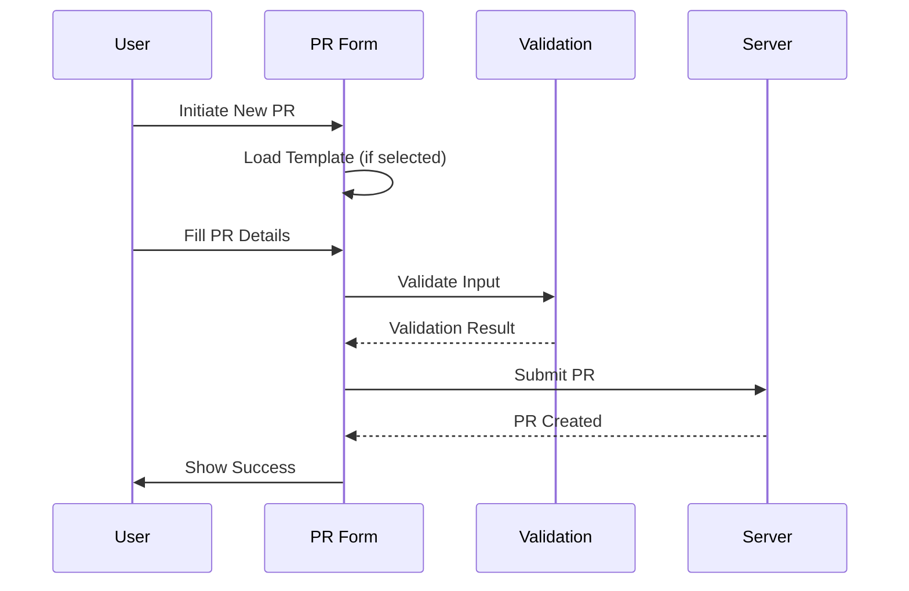
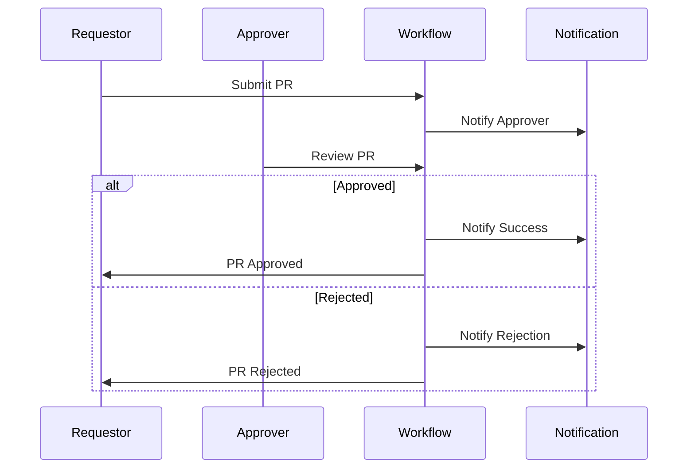

# Purchase Request Module Map

## Overview

This document provides a comprehensive map of the Purchase Request (PR) module, including its pages, components, state management, and workflows.

## 1. Directory Structure

```
app/(main)/procurement/purchase-requests/
├── page.tsx                    # Main PR list page
├── [id]/                      # PR detail page directory
├── new-pr/                    # New PR page directory
└── components/                # Shared components
    ├── tabs/                  # Tab components
    │   ├── ActivityTab.tsx
    │   ├── AttachmentsTab.tsx
    │   ├── WorkflowTab.tsx
    │   ├── ItemsTab.tsx
    │   ├── Summary-pr-table.tsx
    │   ├── budget-tab.tsx
    │   ├── BudgetsTab.tsx
    │   └── DetailsTab.tsx
    ├── PRDetailPage.tsx       # Main detail page component
    ├── purchase-request-list.tsx
    ├── advanced-filter.tsx
    ├── vendor-comparison.tsx
    ├── SummaryTotal.tsx
    ├── inventory-breakdown.tsx
    ├── item-details-edit-form.tsx
    ├── pending-purchase-orders.tsx
    ├── pricing-form.tsx
    ├── PRForm.tsx
    ├── PRHeader.tsx
    ├── dashboard-approval.tsx
    └── utils.tsx
```

## 2. Page Structure

### 2.1 List View (page.tsx)
- **Purpose**: Main landing page for PR module
- **Key Features**:
  - List of purchase requests
  - Advanced filtering
  - Bulk actions
  - Quick actions
- **Main Components**:
  ```typescript
  interface ListViewComponents {
    PurchaseRequestList: {
      filters: FilterState
      pagination: PaginationState
      sorting: SortConfig
      bulkActions: string[]
    }
    AdvancedFilter: {
      fields: FilterField[]
      operators: FilterOperator[]
      values: FilterValue[]
    }
    DashboardApproval: {
      pendingApprovals: number
      recentActions: Action[]
    }
  }
  ```

### 2.2 Detail View ([id]/page.tsx)
- **Purpose**: Detailed view and management of a single PR
- **Key Features**:
  - PR information management
  - Multi-tab interface
  - Workflow management
- **Tab Structure**:
  ```typescript
  interface PRTabs {
    details: {
      basicInfo: PRBasicInfo
      requestor: RequestorInfo
      department: DepartmentInfo
    }
    items: {
      list: PRItem[]
      management: ItemManagement
      pricing: PricingInfo
    }
    budget: {
      allocation: BudgetAllocation
      availability: BudgetAvailability
      tracking: BudgetTracking
    }
    workflow: {
      approvals: ApprovalStep[]
      history: WorkflowHistory
      actions: WorkflowAction[]
    }
    attachments: {
      documents: Document[]
      uploads: FileUpload[]
    }
    activity: {
      timeline: ActivityEvent[]
      audit: AuditRecord[]
    }
  }
  ```

### 2.3 New PR (new-pr/page.tsx)
- **Purpose**: Creation of new purchase requests
- **Key Features**:
  - PR template selection
  - Item management
  - Budget validation
- **Form Structure**:
  ```typescript
  interface NewPRForm {
    header: {
      requestor: RequestorInfo
      department: DepartmentInfo
      date: Date
      priority: PRPriority
    }
    items: {
      selection: ItemSelection
      quantities: ItemQuantity
      pricing: ItemPricing
    }
    budget: {
      allocation: BudgetAllocation
      validation: BudgetValidation
    }
    workflow: {
      route: ApprovalRoute
      notifications: NotificationConfig
    }
  }
  ```

## 3. Component Details

### 3.1 Core Components

#### PRDetailPage
```typescript
interface PRDetailPageProps {
  mode: 'view' | 'edit' | 'add'
  data: PurchaseRequest
  permissions: UserPermissions
  onSave: (data: PurchaseRequest) => Promise<void>
  onSubmit: (data: PurchaseRequest) => Promise<void>
  onCancel: () => void
}
```

#### PRForm
```typescript
interface PRFormProps {
  initialData?: Partial<PurchaseRequest>
  mode: FormMode
  validation: ValidationRules
  onChange: (data: Partial<PurchaseRequest>) => void
  onSubmit: (data: PurchaseRequest) => Promise<void>
}
```

#### ItemsTab
```typescript
interface ItemsTabProps {
  items: PRItem[]
  permissions: ItemPermissions
  onItemChange: (item: PRItem) => void
  onItemDelete: (itemId: string) => void
  onBulkAction: (action: BulkAction, items: string[]) => void
}
```

### 3.2 Supporting Components

#### AdvancedFilter
```typescript
interface AdvancedFilterProps {
  fields: FilterField[]
  initialFilters: Filter[]
  onFilterChange: (filters: Filter[]) => void
  onFilterSave: (name: string, filters: Filter[]) => void
}
```

#### PricingForm
```typescript
interface PricingFormProps {
  data: PricingData
  currency: Currency
  exchangeRates: ExchangeRate[]
  taxes: TaxConfig[]
  onPriceChange: (pricing: PricingData) => void
}
```

## 4. State Management

### 4.1 List View State
```typescript
interface ListViewState {
  items: PurchaseRequest[]
  filters: {
    active: Filter[]
    saved: SavedFilter[]
  }
  pagination: {
    page: number
    pageSize: number
    total: number
  }
  selection: {
    selected: string[]
    actions: BulkAction[]
  }
  sort: {
    field: string
    direction: 'asc' | 'desc'
  }
}
```

### 4.2 Detail View State
```typescript
interface DetailViewState {
  mode: 'view' | 'edit' | 'add'
  data: {
    current: PurchaseRequest
    original: PurchaseRequest
    isDirty: boolean
  }
  ui: {
    activeTab: string
    loading: boolean
    errors: ValidationError[]
  }
  workflow: {
    currentStep: WorkflowStep
    availableActions: WorkflowAction[]
  }
}
```

### 4.3 Form State
```typescript
interface FormState {
  values: FormValues
  touched: Record<string, boolean>
  errors: Record<string, string>
  validation: {
    rules: ValidationRule[]
    status: ValidationStatus
  }
  submission: {
    status: 'idle' | 'submitting' | 'success' | 'error'
    error?: Error
  }
}
```

## 5. Workflows

### 5.1 PR Creation Flow


### 5.2 PR Approval Flow


## 6. Integration Points

### 6.1 External Services
```typescript
interface ExternalServices {
  inventory: {
    checkStock: (itemId: string) => Promise<StockLevel>
    reserveStock: (itemId: string, quantity: number) => Promise<void>
  }
  budget: {
    checkAvailability: (budgetCode: string, amount: number) => Promise<BudgetStatus>
    allocate: (budgetCode: string, amount: number) => Promise<void>
  }
  workflow: {
    initiate: (prId: string) => Promise<WorkflowInstance>
    progress: (instanceId: string, action: WorkflowAction) => Promise<void>
  }
  notification: {
    send: (userId: string, notification: Notification) => Promise<void>
    track: (notificationId: string) => Promise<NotificationStatus>
  }
}
```

### 6.2 Data Integration
```typescript
interface DataIntegration {
  masterData: {
    items: ItemMaster[]
    vendors: Vendor[]
    accounts: Account[]
  }
  transactions: {
    purchaseOrders: PurchaseOrder[]
    receipts: GoodsReceipt[]
    payments: Payment[]
  }
  reporting: {
    budgetUtilization: BudgetReport[]
    approvalMetrics: ApprovalMetrics[]
    spendAnalysis: SpendReport[]
  }
}
```

## 7. Security & Permissions

### 7.1 Role-Based Access
```typescript
interface RolePermissions {
  requester: {
    create: boolean
    edit: boolean
    view: boolean
    delete: boolean
  }
  approver: {
    approve: boolean
    reject: boolean
    delegate: boolean
    comment: boolean
  }
  admin: {
    manageWorkflow: boolean
    manageUsers: boolean
    manageSettings: boolean
    viewReports: boolean
  }
}
```

### 7.2 Data Security
```typescript
interface SecurityControls {
  encryption: {
    inTransit: boolean
    atRest: boolean
    fields: string[]
  }
  audit: {
    enabled: boolean
    level: 'basic' | 'detailed'
    retention: number
  }
  access: {
    ipRestriction: boolean
    mfa: boolean
    sessionTimeout: number
  }
}
```

## 8. Error Handling

### 8.1 Error Types
```typescript
type ErrorType =
  | 'ValidationError'
  | 'NetworkError'
  | 'AuthorizationError'
  | 'BusinessLogicError'
  | 'SystemError'

interface ErrorHandling {
  retry: {
    enabled: boolean
    maxAttempts: number
    backoff: 'linear' | 'exponential'
  }
  fallback: {
    action: 'cache' | 'default' | 'error'
    cache: {
      ttl: number
      strategy: 'stale-while-revalidate' | 'cache-first'
    }
  }
  notification: {
    user: boolean
    admin: boolean
    logging: boolean
  }
}
```

## 9. Performance Optimization

### 9.1 Caching Strategy
```typescript
interface CachingStrategy {
  data: {
    masterData: CacheConfig
    transactions: CacheConfig
    userPreferences: CacheConfig
  }
  ui: {
    components: string[]
    routes: string[]
    assets: AssetCacheConfig
  }
}

interface CacheConfig {
  enabled: boolean
  ttl: number
  strategy: CacheStrategy
  invalidation: InvalidationRule[]
}
```

### 9.2 Loading Optimization
```typescript
interface LoadingOptimization {
  lazy: {
    components: string[]
    routes: string[]
    threshold: number
  }
  prefetch: {
    enabled: boolean
    routes: string[]
    data: string[]
  }
  compression: {
    enabled: boolean
    algorithm: string
    threshold: number
  }
}
``` 