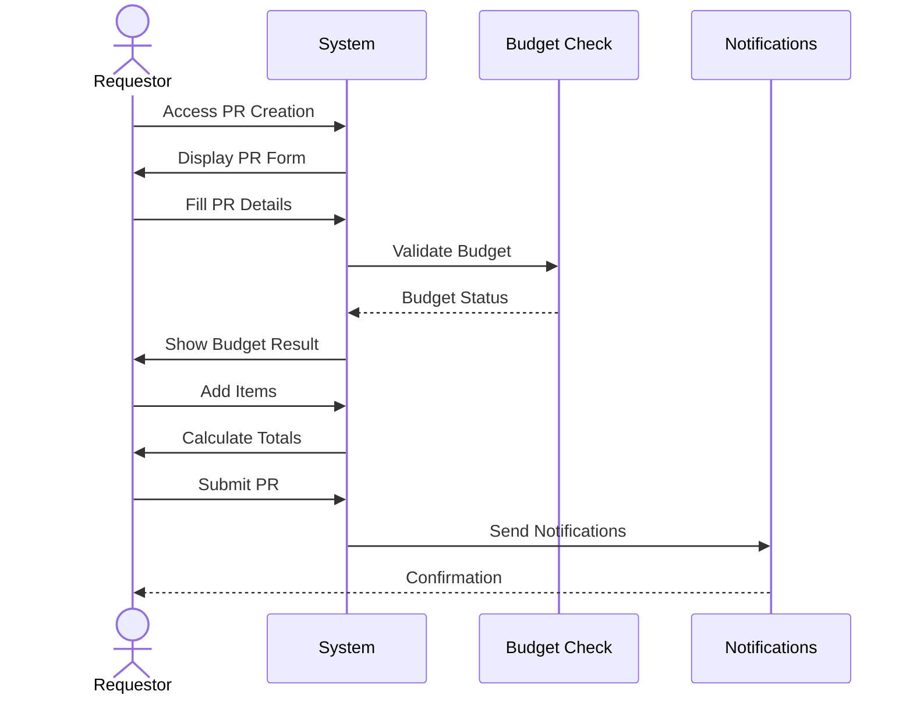
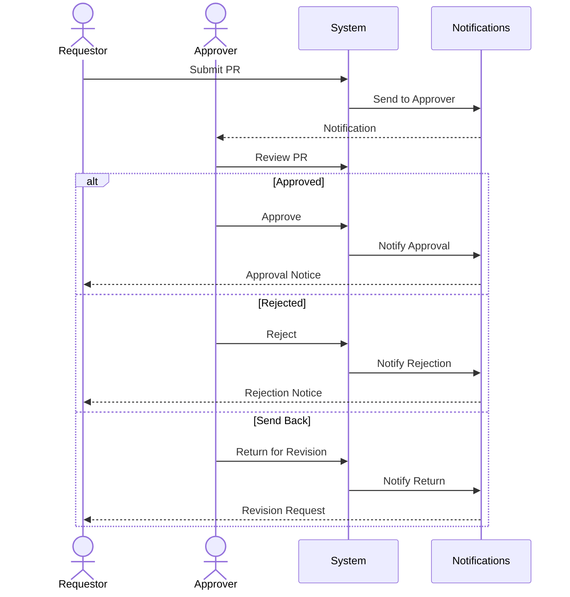
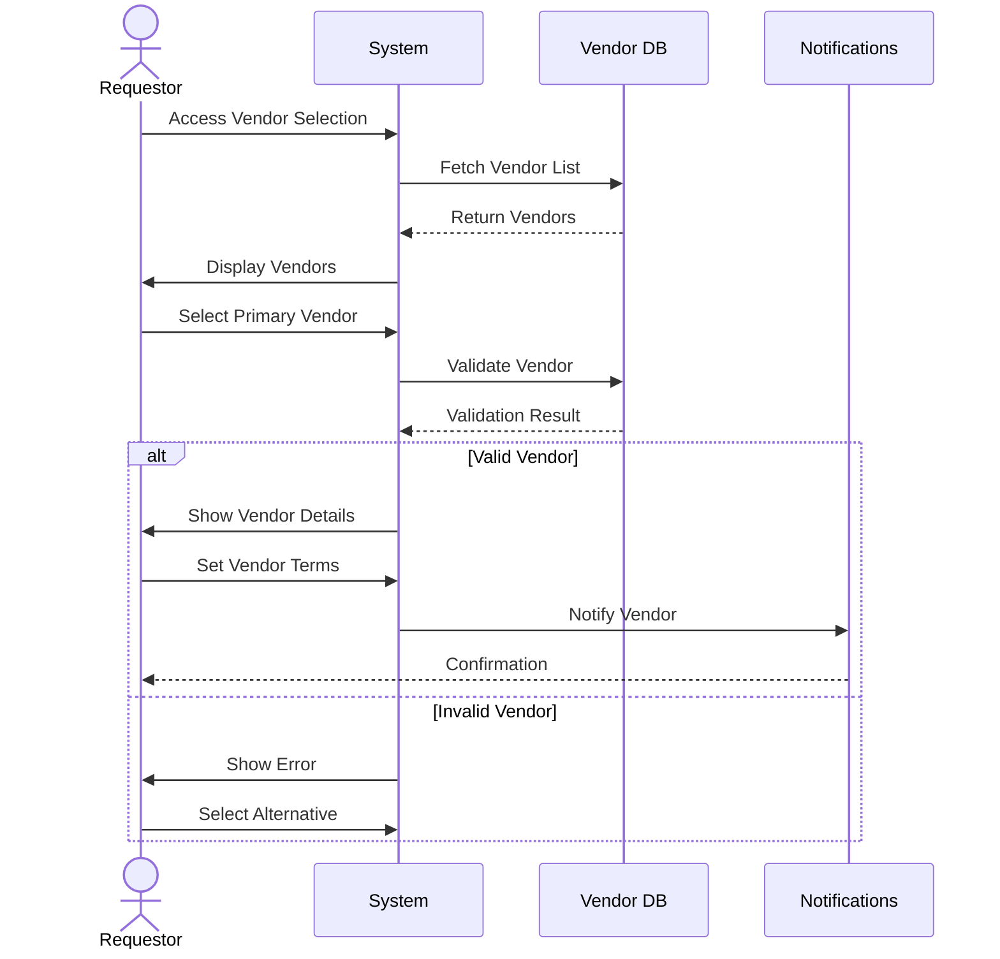
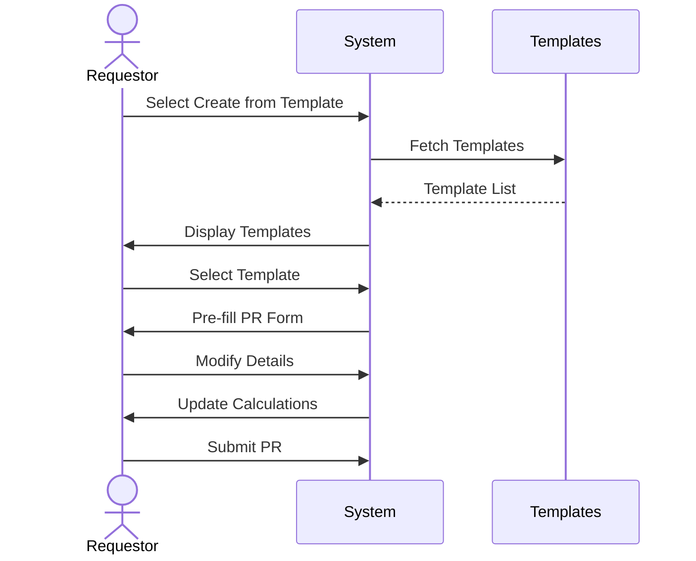
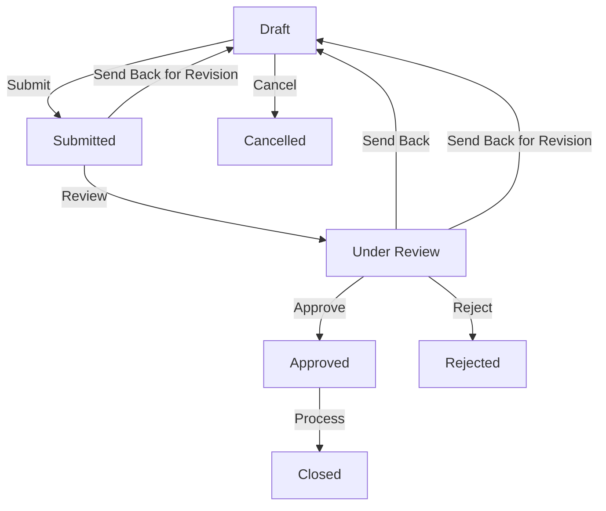

# Purchase Request Module - User Flow Documentation

## 1. Overview

### 1.1 Purpose
This document details the user flows and interactions within the Purchase Request (PR) module, providing step-by-step guidance for all user roles and scenarios.

### 1.2 User Roles
- Requestor
- Department Approver
- Finance Approver
- Budget Controller
- Procurement Officer
- System Administrator

## 2. Main User Flows

### 2.1 Create Purchase Request

### 2.2 Approval Process

### 2.3 Vendor Allocation

### 2.4 Template Usage

## 3. Detailed User Interactions

### 3.1 PR Creation Process
1. Access PR Creation
   - Navigate to PR module
   - Click "Create New PR"
   - Select creation method (blank/template)

2. Fill Header Information
   - Enter/select department
   - Choose currency
   - Set delivery date
   - Add description
   - Select priority
   - Select/assign vendor
   - Set vendor-specific terms

3. Vendor Selection
   - Search vendor database
   - View vendor details
   - Check vendor status
   - Review vendor ratings
   - Verify vendor compliance
   - Check vendor categories
   - Set vendor terms
   - Add alternate vendors

4. Add Items
   - Search/select items
   - Enter quantities
   - Add item notes
   - Set budget categories
   - Review pricing
   - Verify vendor availability
   - Check vendor quotations

5. Attach Documents
   - Upload files
   - Add document descriptions
   - Set document types
   - Review attachments

6. Submit PR
   - Review all details
   - Check budget status
   - Add submission notes
   - Confirm submission

### 3.2 Approval Process
1. Receive Approval Request
   - Get notification
   - Access PR details
   - Review information

2. Review PR Details
   - Check items
   - Verify budget
   - Review attachments
   - Check history

3. Take Action
   - Approve PR
   - Reject PR
   - Return for revision
   - Add comments
   - Set conditions

### 3.3 Template Management
1. Create Template
   - Start from existing PR
   - Set template name
   - Define default values
   - Set access rights

2. Use Template
   - Select template
   - Modify details
   - Update quantities
   - Adjust pricing
   - Submit PR

## 4. Error Handling

### 4.1 Validation Errors
1. Required Fields
   - Display error messages
   - Highlight missing fields
   - Show field requirements

2. Budget Validation
   - Show budget status
   - Display available amount
   - Highlight overages
   - Provide override options

3. Data Format Errors
   - Show format requirements
   - Highlight invalid entries
   - Provide correction guidance

### 4.2 System Errors
1. Connection Issues
   - Show connection status
   - Provide retry options
   - Save draft automatically
   - Recover last state

2. Processing Errors
   - Display error details
   - Provide error codes
   - Show recovery steps
   - Offer support contact

## 5. User Interface States

### 5.1 PR Status Indicators
- Draft: Yellow
- Submitted: Blue
- Under Review: Orange
- Approved: Green
- Rejected: Red
- Cancelled: Grey
- Closed: Black
- Sent Back: Purple

### 5.2 Action Availability
- Edit: Draft status only
- Submit: Complete required fields
- Approve: Authorized approvers only
- Cancel: Before final approval
- Close: After completion

## 6. Notifications

### 6.1 Email Notifications
- PR Submission
- Approval Request
- Approval Decision
- Budget Alert
- Status Update
- Action Required

### 6.2 In-App Notifications
- Pending Actions
- Status Changes
- Budget Warnings
- System Messages
- Reminders

## 7. Mobile Experience

### 7.1 Mobile Views
- PR List
- PR Details
- Approval Actions
- Status Updates
- Notifications

### 7.2 Mobile Actions
- View PR Details
- Basic Approvals
- Status Checks
- Notifications
- Comments

## 8. Shortcuts and Quick Actions

### 8.1 Keyboard Shortcuts
- Alt + N: New PR
- Alt + S: Save Draft
- Alt + A: Approve
- Alt + R: Reject
- Ctrl + Enter: Submit

### 8.2 Quick Actions
- Copy PR
- Save Template
- Quick Approve
- Bulk Update
- Export Data

## 9. Help and Support

### 9.1 Contextual Help
- Field descriptions
- Process guidance
- Validation rules
- Error solutions
- Best practices

### 9.2 Support Access
- Help documentation
- Video tutorials
- Support contact
- FAQ access
- Training materials

## 10. Appendices

### 10.1 Status Flow Diagram

### 10.2 Screen Maps
1. PR List View
2. PR Creation Form
3. Approval View
4. Template Selection
5. Document Attachment
6. Budget Review
7. Status History
8. Audit Trail

## 11. Sign-off

| Role | Name | Date | Signature |
|------|------|------|-----------|
| UX Designer | | | |
| Business Analyst | | | |
| Training Lead | | | |
| User Representative | | | | 