# Carmen ERP Visual Documentation

**Generated**: January 22, 2025  
**Screenshots Captured**: 12 key routes  
**Coverage**: Desktop (1920×1080) - Core application screens  

## 📊 Documentation Overview

This directory contains visual documentation of the Carmen ERP application captured from the running development environment. All screenshots represent the actual current implementation state.

### Screenshot Collection
- **Total Screenshots**: 12
- **Resolution**: 1920×1080 (Desktop)
- **Format**: PNG (Full page captures)
- **Source**: http://localhost:3006

## 📂 Core Application Screens

### 1. Dashboard
**File**: `dashboard.png`  
**Route**: `/dashboard`  
**Description**: Main executive dashboard with KPIs and business metrics

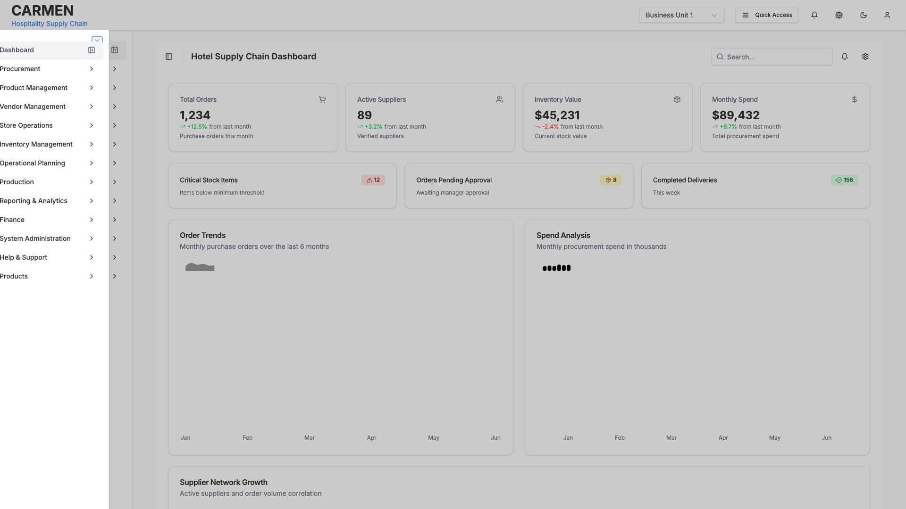

### 2. Purchase Requests
**File**: `procurement-purchase-requests.png`  
**Route**: `/procurement/purchase-requests`  
**Description**: Purchase request management interface with approval workflow

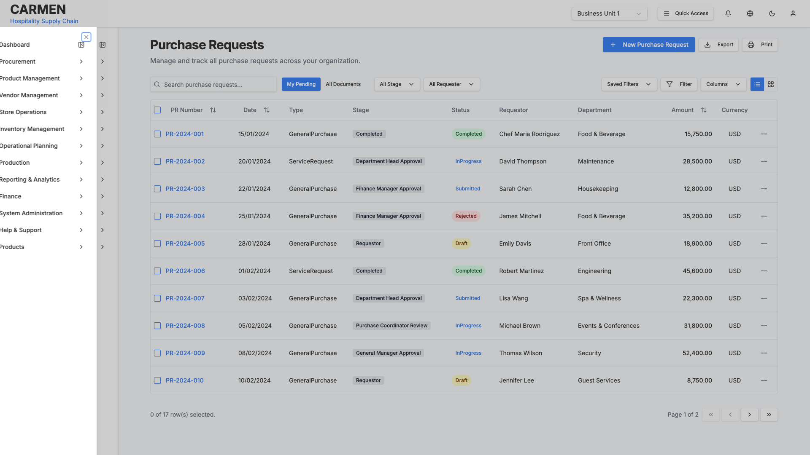

### 3. Purchase Request Creation  
**File**: `procurement-purchase-requests-new-pr.png`  
**Route**: `/procurement/purchase-requests/new-pr`  
**Description**: New purchase request creation form with item management

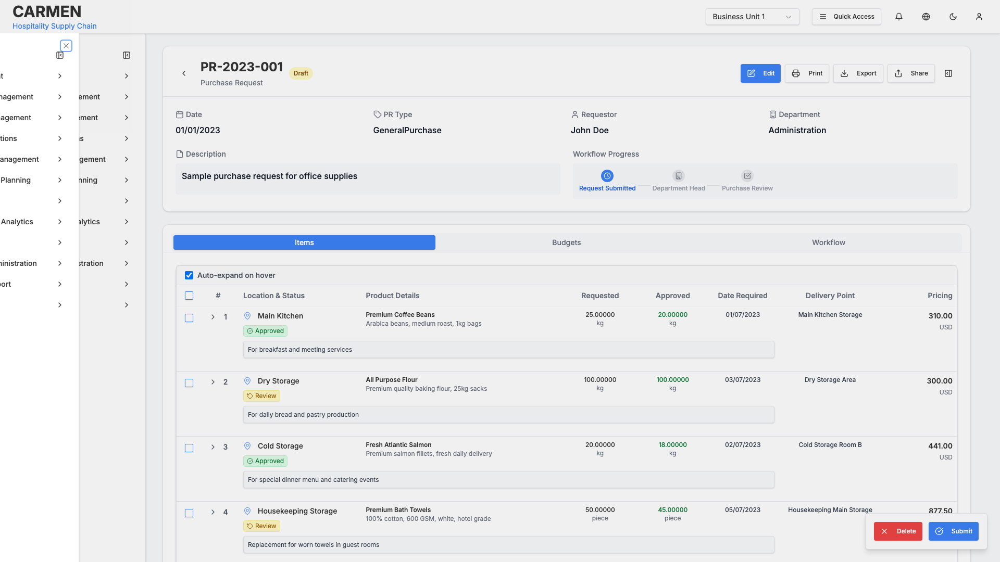

### 4. Purchase Orders
**File**: `procurement-purchase-orders.png`  
**Route**: `/procurement/purchase-orders`  
**Description**: Purchase order listing and management interface

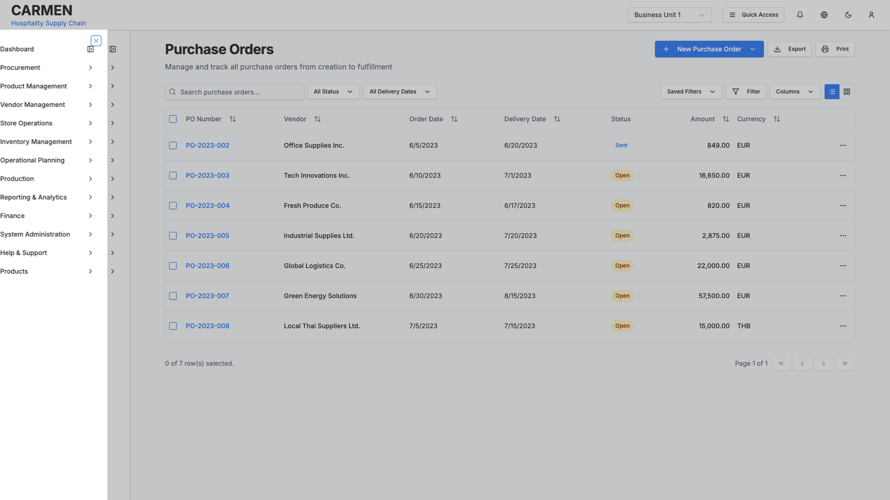

### 5. Stock Overview
**File**: `inventory-management-stock-overview.png`  
**Route**: `/inventory-management/stock-overview`  
**Description**: Real-time inventory levels and stock monitoring

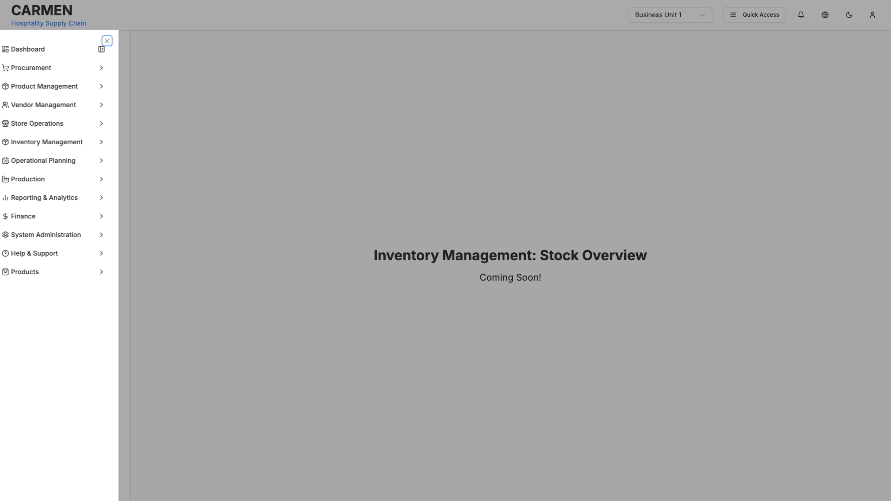

### 6. Physical Count
**File**: `inventory-management-physical-count.png`  
**Route**: `/inventory-management/physical-count`  
**Description**: Physical inventory counting process management

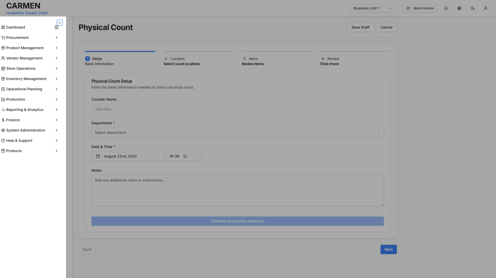

### 7. Vendor Management
**File**: `vendor-management-vendors.png`  
**Route**: `/vendor-management/vendors`  
**Description**: Vendor profile management and relationship tracking

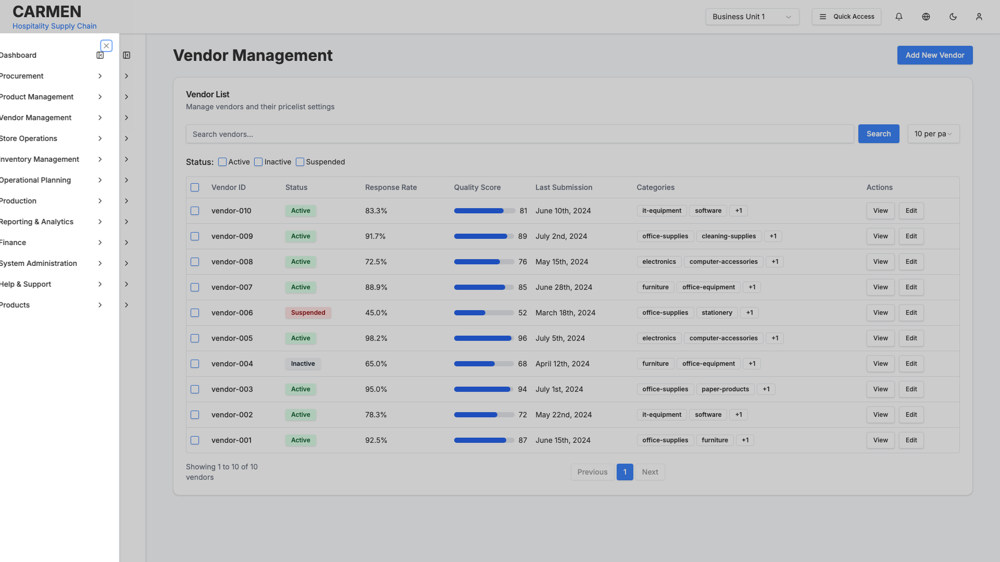

### 8. New Vendor Creation
**File**: `vendor-management-vendors-new.png`  
**Route**: `/vendor-management/vendors/new`  
**Description**: Vendor registration and onboarding form

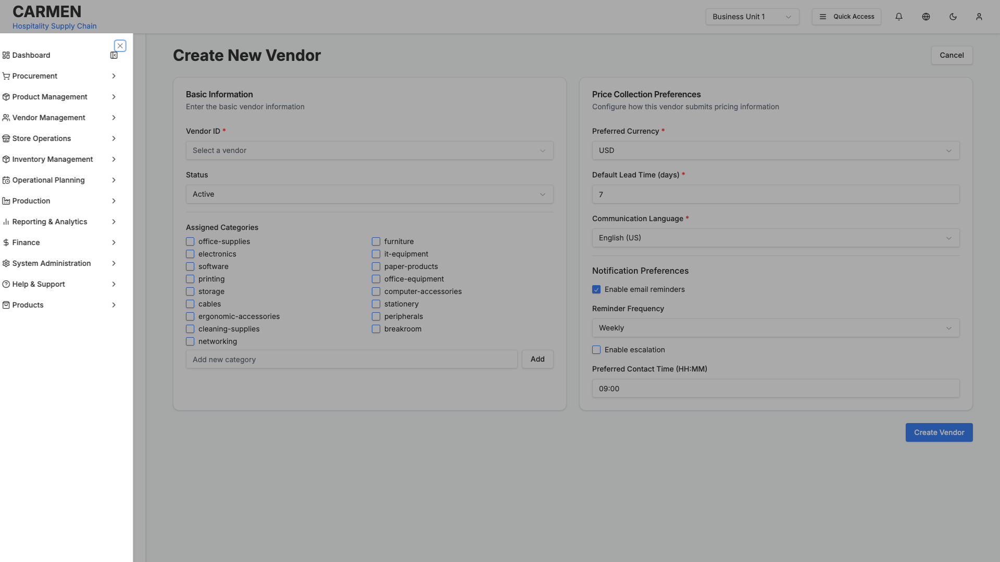

### 9. Product Management
**File**: `product-management-products.png`  
**Route**: `/product-management/products`  
**Description**: Product catalog management and specifications

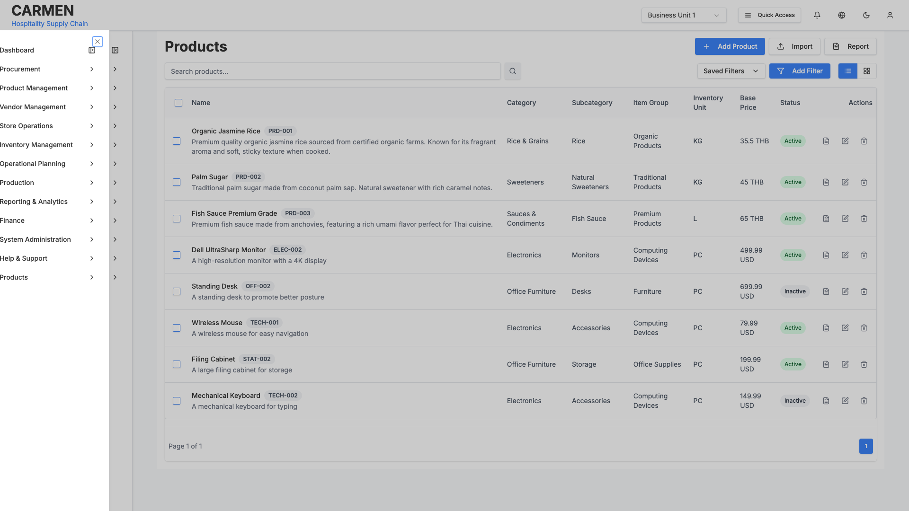

### 10. Recipe Management
**File**: `operational-planning-recipe-management-recipes.png`  
**Route**: `/operational-planning/recipe-management/recipes`  
**Description**: Recipe creation and ingredient management system

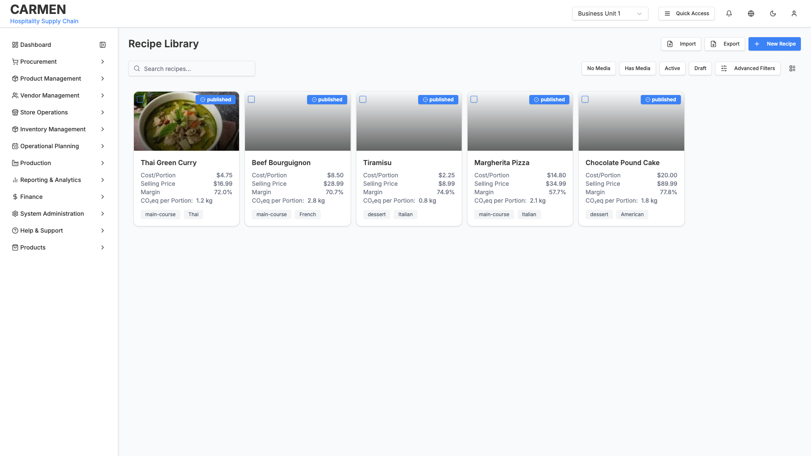

### 11. Store Requisitions
**File**: `store-operations-store-requisitions.png`  
**Route**: `/store-operations/store-requisitions`  
**Description**: Inter-store inventory requisition management

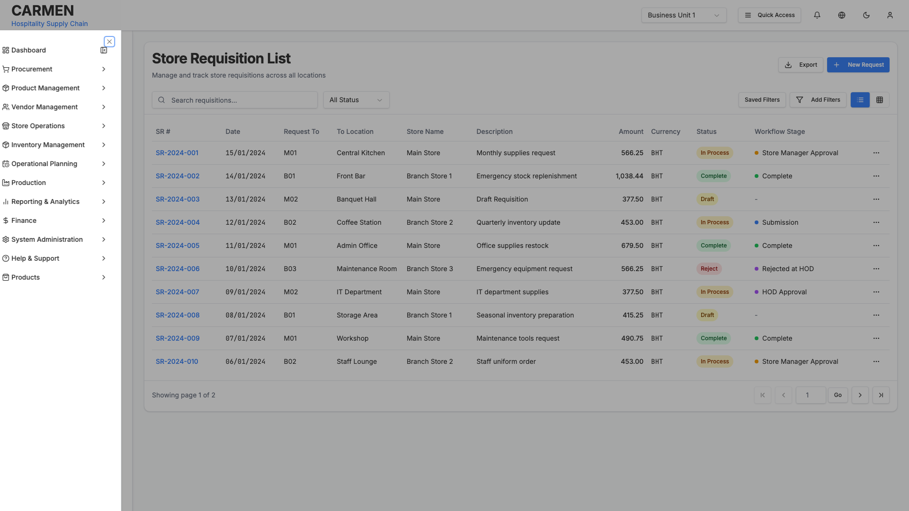

### 12. User Management
**File**: `system-administration-user-management.png`  
**Route**: `/system-administration/user-management`  
**Description**: User account and role management interface

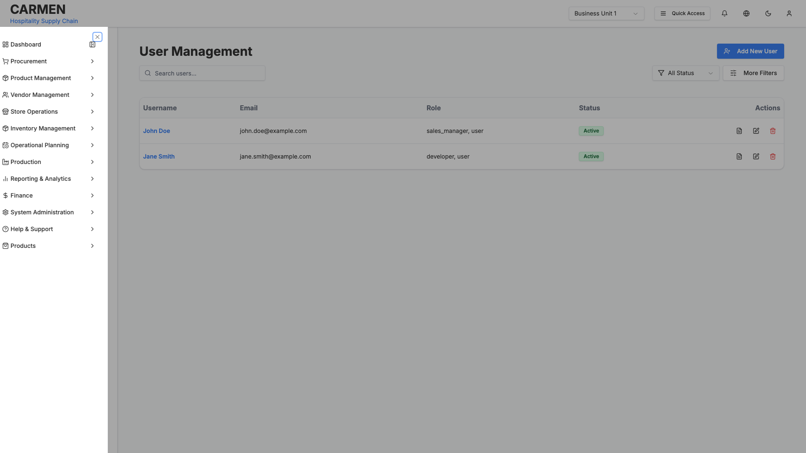

## 🎯 Key Features Documented

### Navigation System
- Multi-level sidebar navigation with icons
- Breadcrumb navigation
- Role-based menu visibility
- Responsive collapse/expand functionality

### Form Components
- Complex multi-section forms
- Dynamic item addition/removal
- Real-time validation
- Rich dropdowns and selectors
- Date/time pickers

### Data Display
- Sortable and filterable tables
- Card-based layouts
- Status badges and indicators
- Progress tracking
- Statistical dashboards

### User Experience
- Consistent design system
- Loading states and feedback
- Modal dialogs and overlays
- Responsive design patterns
- Accessible interface elements

## 📋 Business Modules Covered

### Procurement (4 screens)
- Purchase request lifecycle
- Purchase order management
- Approval workflows
- Vendor interaction

### Inventory Management (2 screens)  
- Real-time stock monitoring
- Physical count processes
- Multi-location tracking
- Stock adjustments

### Vendor Management (2 screens)
- Vendor profiles and relationships
- Onboarding and registration
- Contact management
- Performance tracking

### Product Management (1 screen)
- Product catalog management
- Specifications and attributes
- Category organization
- Pricing and costing

### Recipe Management (1 screen)
- Recipe creation and editing
- Ingredient management
- Portion calculations
- Nutritional information

### Store Operations (1 screen)
- Inter-store requisitions
- Inventory transfers
- Operational workflows
- Location management

### System Administration (1 screen)
- User account management
- Role-based permissions
- System configuration
- Access control

## 🔍 Technical Implementation Details

### Component Architecture
- Next.js 14 with App Router
- React Server Components
- TypeScript with strict mode
- Shadcn/ui component library

### Styling System  
- Tailwind CSS utility framework
- Consistent design tokens
- Responsive grid layouts
- Dark/light theme support

### Form Handling
- React Hook Form integration
- Zod schema validation
- Real-time validation feedback
- Error state management

### State Management
- Zustand for global state
- React Query for server state
- Local component state
- Context-based user management

### Data Architecture
- Centralized TypeScript types
- Mock data factories
- Role-based access control
- Permission system integration

## 💡 Usage Guidelines

### For Developers
1. **Reference Implementation**: Use screenshots as visual specifications for feature development
2. **Component Patterns**: Study existing UI patterns for consistency
3. **Layout Structure**: Follow established layout conventions
4. **Form Design**: Implement form patterns shown in captures

### For Designers
1. **Visual Standards**: Screenshots represent current design system implementation
2. **Component Variations**: Reference different states and configurations
3. **Layout Patterns**: Use as baseline for responsive design decisions
4. **User Experience**: Study interaction patterns and user flows

### For Business Stakeholders
1. **Feature Validation**: Verify implemented functionality matches requirements
2. **Process Review**: Validate business workflows and user journeys  
3. **Permission Model**: Review role-based access and visibility
4. **Data Architecture**: Confirm data relationships and business rules

## 🔄 Maintenance and Updates

### Regeneration Process
Screenshots should be updated when:
- UI components are modified
- New features are added
- Design system changes
- Business logic updates

### Regeneration Command
```bash
# Start development server
npm run dev

# Capture updated screenshots  
node scripts/simple-screenshot-capture.js
```

### Quality Assurance
- Screenshots reflect actual running application
- All captures use consistent viewport (1920×1080)
- Full page captures include scrollable content
- Images are optimized for documentation use

## 📈 Coverage Analysis

### Current Coverage: 12 Key Screens
- **Dashboard**: Executive overview ✅
- **Procurement**: Core workflows ✅  
- **Inventory**: Stock management ✅
- **Vendor**: Relationship management ✅
- **Product**: Catalog management ✅
- **Recipe**: Operational planning ✅
- **Store Operations**: Inter-store flows ✅
- **System Administration**: User management ✅

### Future Expansion Opportunities
- Role-based variations (6 user roles)
- Responsive variations (tablet, mobile)
- Interactive state captures (modals, dropdowns)
- Workflow step documentation
- Error and empty state captures

---

**Note**: This documentation represents the current implementation state as of January 2025. Screenshots should be regularly updated to reflect ongoing development changes.

## 🚀 Next Steps

1. **Expand Coverage**: Capture additional routes and user roles
2. **Interactive Documentation**: Add modal and dropdown captures  
3. **Responsive Variants**: Document tablet and mobile layouts
4. **Workflow Documentation**: Step-by-step process captures
5. **Component Library**: Individual component documentation