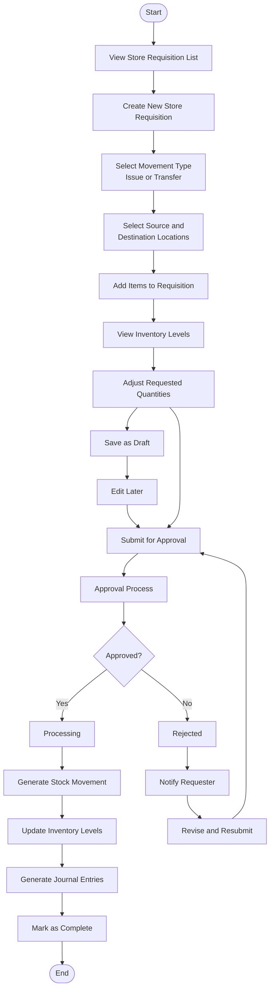
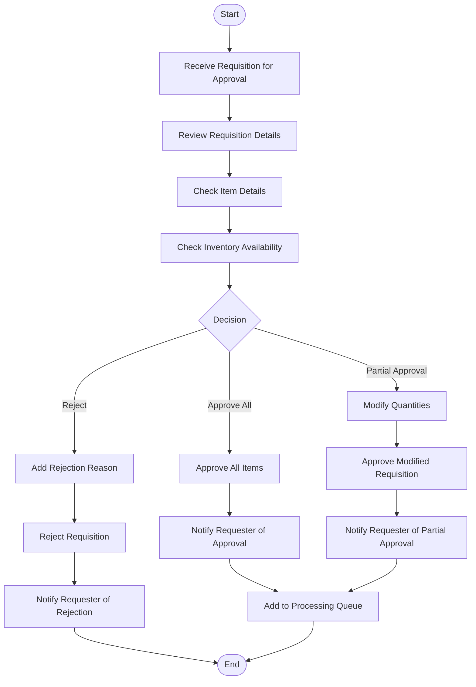
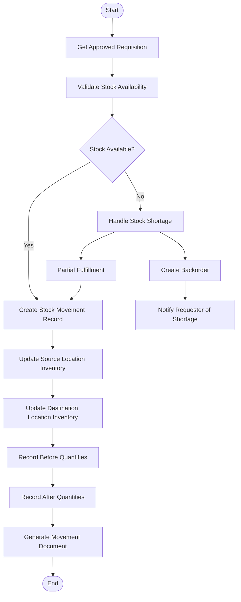
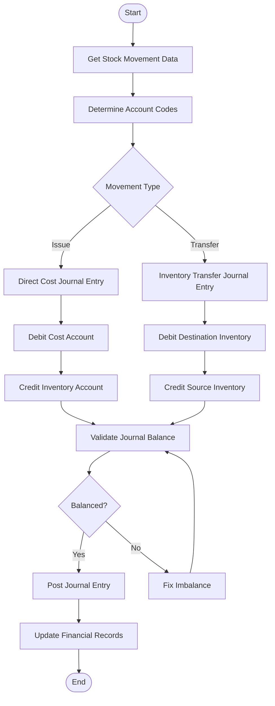
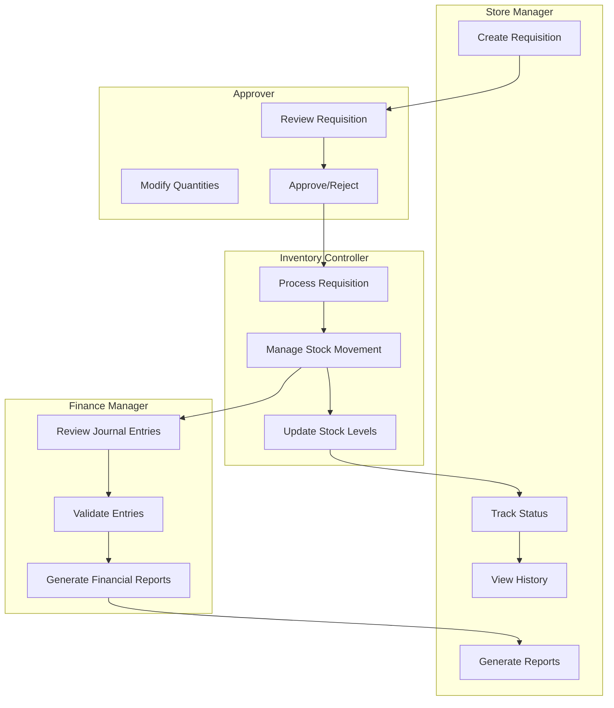
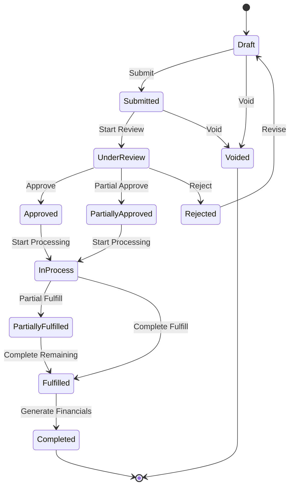

# Store Requisition Module - User Experience

> **Document Status**: Initial Draft - Content Consolidation (Phase 1)  
> **Last Updated**: March 14, 2024  
> **Next Update**: Phase 2 - Content Migration

> **Note**: This is a consolidated document that combines content from:
> - store-requisition-user-flow.md
> - store-requisitions.md

## Table of Contents
1. [Introduction](#introduction)
2. [User Personas](#user-personas)
3. [User Journeys](#user-journeys)
4. [User Flow Diagrams](#user-flow-diagrams)
5. [User Interface](#user-interface)
6. [Interaction Patterns](#interaction-patterns)
7. [Accessibility Considerations](#accessibility-considerations)
8. [Error Handling](#error-handling)
9. [Notifications](#notifications)
10. [Mobile Experience](#mobile-experience)
11. [Related Documentation](#related-documentation)

## Introduction

The Store Requisition (SR) module provides a comprehensive solution for managing internal inventory movements between stores or departments within the organization. This document outlines the user experience design for the SR module, including user personas, journeys, interface elements, and interaction patterns.

### Module Purpose

The Store Requisition module enables users to:
- Request inventory items from one location to another
- Track the status of requisitions through the approval and fulfillment process
- Manage stock movements between locations
- Maintain accurate inventory records
- Allocate costs between departments

### Key User Experience Goals

1. **Efficiency**: Minimize the time and effort required to create and process requisitions
2. **Clarity**: Provide clear visibility into requisition status and inventory movements
3. **Accuracy**: Ensure accurate data entry and validation
4. **Consistency**: Maintain consistent interaction patterns across the module
5. **Accessibility**: Ensure the module is accessible to all users

## User Personas

### 1. Store Manager
**Name**: Alex Chen  
**Role**: Store Manager  
**Goals**:
- Request inventory items from central warehouse
- Track status of requisitions
- Manage store inventory levels
- Ensure timely fulfillment of requisitions

**Pain Points**:
- Time-consuming manual processes
- Lack of visibility into requisition status
- Delays in receiving requested items
- Inventory discrepancies

### 2. Warehouse Supervisor
**Name**: Maria Rodriguez  
**Role**: Warehouse Supervisor  
**Goals**:
- Process incoming requisitions efficiently
- Maintain accurate warehouse inventory
- Prioritize fulfillment based on urgency
- Track stock movements

**Pain Points**:
- High volume of requisitions to process
- Incomplete or inaccurate requisition information
- Difficulty in prioritizing fulfillment
- Manual stock movement tracking

### 3. Department Head
**Name**: James Wilson  
**Role**: Department Head  
**Goals**:
- Approve requisitions from team members
- Monitor department spending
- Ensure appropriate use of resources
- Track department inventory

**Pain Points**:
- Lack of context for approval decisions
- Difficulty tracking department expenses
- Inefficient approval processes
- Limited visibility into inventory usage

### 4. Finance Manager
**Name**: Sarah Johnson  
**Role**: Finance Manager  
**Goals**:
- Monitor cost allocations between departments
- Ensure accurate financial reporting
- Track inventory valuations
- Analyze spending patterns

**Pain Points**:
- Inconsistent cost allocation
- Delayed financial information
- Manual reconciliation processes
- Limited reporting capabilities

## User Journeys

### 1. Creating a Store Requisition

**User**: Store Manager (Alex)  
**Goal**: Request inventory items from central warehouse

**Journey Steps**:
1. **Access the SR Module**
   - Navigate to Store Operations > Store Requisitions
   - Click "New Requisition" button

2. **Enter Basic Information**
   - Select source location (warehouse)
   - Select destination location (store)
   - Enter description and date
   - Choose movement type (Issue/Transfer)

3. **Add Items**
   - Search for items by name, code, or category
   - View current inventory levels
   - Enter required quantities
   - Add notes for specific items if needed

4. **Review and Submit**
   - Review all entered information
   - Check total quantities and costs
   - Add any attachments or comments
   - Submit for approval or save as draft

5. **Track Status**
   - Receive confirmation of submission
   - View requisition in list with status
   - Receive notifications of status changes

**Success Criteria**:
- Requisition is successfully created and submitted
- Unique reference number is generated
- Notification is sent to approvers
- Requisition appears in list with correct status

### 2. Approving a Store Requisition

**User**: Department Head (James)  
**Goal**: Review and approve requisitions from team members

**Journey Steps**:
1. **Access Pending Approvals**
   - Navigate to Dashboard > My Approvals
   - View list of pending requisitions
   - Select requisition to review

2. **Review Requisition Details**
   - Check requisition information (date, locations, description)
   - Review requested items and quantities
   - Verify budget availability
   - Check inventory levels

3. **Make Approval Decision**
   - Approve requisition as is
   - Modify quantities if needed
   - Reject with reason
   - Request additional information

4. **Complete Approval Process**
   - Enter any comments or notes
   - Submit approval decision
   - Receive confirmation of action

**Success Criteria**:
- Approval decision is recorded
- Requisition status is updated
- Notification is sent to requester
- Requisition moves to next stage in workflow

### 3. Processing a Store Requisition

**User**: Warehouse Supervisor (Maria)  
**Goal**: Fulfill approved requisitions

**Journey Steps**:
1. **Access Approved Requisitions**
   - Navigate to Store Operations > Store Requisitions
   - Filter list to show approved requisitions
   - Select requisition to process

2. **Prepare for Fulfillment**
   - Review requested items and quantities
   - Check current inventory levels
   - Allocate stock from appropriate locations
   - Prepare items for issue

3. **Record Actual Quantities**
   - Enter actual quantities issued
   - Record lot numbers if applicable
   - Document any discrepancies
   - Calculate before and after quantities

4. **Complete Fulfillment**
   - Review all entered information
   - Process the requisition
   - Generate stock movement records
   - Update inventory levels

5. **Finalize Documentation**
   - Print requisition documents if needed
   - Attach any supporting documentation
   - Add comments or notes
   - Mark as complete

**Success Criteria**:
- Requisition is successfully processed
- Stock movement records are created
- Inventory levels are updated
- Journal entries are generated
- Requisition status is updated to Complete

## User Flow Diagrams

The following diagrams provide visual representations of the key user flows and processes within the Store Requisition module.

### 1. Main Store Requisition Process Flow



### 2. Approval Workflow



### 3. Stock Movement Processing



### 4. Financial Processing



### 5. User Role Interactions



### 6. Complete Store Requisition Lifecycle



## User Interface

### 1. Store Requisition List View

The Store Requisition List View provides an overview of all requisitions with filtering and sorting capabilities.

#### Screen Layout
```
+----------------------------------------------------------------------+
| Store Requisitions                                 [New] [Print] [⋮]  |
+----------------------------------------------------------------------+
| View: All Requisitions ▼  | Search: [____________] | Status: All ▼    |
+----------------------------------------------------------------------+
| Date     | Ref #    | Request To | Store Name | Description | Status  |
+----------------------------------------------------------------------+
| 03/10/24 | SR-24001 | Warehouse  | Store #1   | Weekly     | Approved|
| 03/09/24 | SR-24000 | Warehouse  | Store #2   | Emergency  | Complete|
| 03/08/24 | SR-23999 | Store #3   | Store #1   | Transfer   | Draft   |
+----------------------------------------------------------------------+
| Showing 1-3 of 24 | < 1 2 3 ... 8 > | Location: All ▼               |
+----------------------------------------------------------------------+
```

#### Key Components
- **Header**: Title, action buttons (New Request, Print, More Options)
- **Filters**: View dropdown, search field, status filters
- **Grid**: Date, Ref #, Request To, Store Name, Description, Status, Process Status
- **Footer**: Pagination, location filter

#### Actions
- Create new requisition
- View requisition details
- Print requisition list
- Filter and search requisitions
- Export requisition data

### 2. Store Requisition Detail View

The Store Requisition Detail View shows comprehensive information about a single requisition.

#### Screen Layout
```
+----------------------------------------------------------------------+
| SR-24001                 [Approved]            [Edit] [Void] [Print] |
+----------------------------------------------------------------------+
| Date: 03/10/24 | From: Warehouse | To: Store #1 | Type: Issue        |
| Description: Weekly stock replenishment                              |
+----------------------------------------------------------------------+
| Item      | UOM  | Qty Req | Qty App | Unit Cost | Total  | Status   |
+----------------------------------------------------------------------+
| Rice      | KG   | 25.00   | 25.00   | $2.50     | $62.50 | Approved |
| Flour     | KG   | 15.00   | 10.00   | $1.75     | $17.50 | Approved |
| Sugar     | KG   | 10.00   | 10.00   | $2.00     | $20.00 | Approved |
+----------------------------------------------------------------------+
| Total: $100.00                                                       |
+----------------------------------------------------------------------+
| [Journal Entries] [Comments] [Attachments]                           |
+----------------------------------------------------------------------+
| [Process] [Approve] [Reject] [Back]                                  |
+----------------------------------------------------------------------+
```

#### Key Components
- **Header**: Ref #, status, action buttons
- **Information Panel**: Date, locations, description, totals
- **Item Grid**: Item details, quantities, costs
- **Tabs**: Journal Entries, Comments, Attachments
- **Action Panel**: Process, approve, reject, void buttons

#### Actions
- Edit requisition (if in Draft status)
- Process requisition (if approved)
- Approve/reject requisition (if pending approval)
- Void requisition
- Print requisition details
- Add comments and attachments

### 3. New Requisition Form

The New Requisition Form allows users to create a new store requisition.

#### Screen Layout
```
+----------------------------------------------------------------------+
| New Store Requisition                           [Save] [Cancel]      |
+----------------------------------------------------------------------+
| Date*: [03/14/24] | Movement Type*: [Issue ▼]                        |
| From Location*: [Warehouse ▼] | To Location*: [Store #1 ▼]           |
| Description*: [____________________________________________]         |
+----------------------------------------------------------------------+
| Add Items:                                                           |
+----------------------------------------------------------------------+
| [Search Items...]                                  [Add Item]        |
+----------------------------------------------------------------------+
| Item      | UOM  | On Hand | Qty Req* | Unit Cost | Total  | Actions |
+----------------------------------------------------------------------+
| Rice      | KG   | 100.00  | [25.00]  | $2.50     | $62.50 | [🗑️]    |
| Flour     | KG   | 75.00   | [15.00]  | $1.75     | $26.25 | [🗑️]    |
| Sugar     | KG   | 50.00   | [10.00]  | $2.00     | $20.00 | [🗑️]    |
+----------------------------------------------------------------------+
| Total: $108.75                                                       |
+----------------------------------------------------------------------+
| [Attachments] [Comments]                                             |
+----------------------------------------------------------------------+
| [Submit] [Save as Draft] [Cancel]                                    |
+----------------------------------------------------------------------+
```

#### Key Components
- **Header**: Title, save/cancel buttons
- **Basic Information**: Date, movement type, locations, description
- **Item Search**: Search field, add item button
- **Item Grid**: Item details, quantities, costs, actions
- **Totals**: Total cost
- **Action Buttons**: Submit, save as draft, cancel

#### Actions
- Add items to requisition
- Remove items from requisition
- Enter quantities
- Add attachments and comments
- Submit requisition or save as draft

## Interaction Patterns

### 1. Creating a Requisition

1. **Access Point**
   - Primary: Store Operations > Store Requisitions > New
   - Secondary: Dashboard > Quick Actions > New Requisition

2. **Form Interaction**
   - Required fields are marked with asterisk (*)
   - Date defaults to current date
   - Location dropdowns show only authorized locations
   - Movement type determines available locations

3. **Item Selection**
   - Search by item name, code, or category
   - View item details (on-hand quantity, unit cost)
   - Enter required quantity
   - System validates against available stock
   - Running total updates automatically

4. **Submission**
   - Validation occurs on submission
   - Errors are highlighted with clear messages
   - Successful submission shows confirmation message
   - Option to view submitted requisition or create new

### 2. Approval Process

1. **Notification**
   - Approvers receive notification of pending requisitions
   - Dashboard shows count of pending approvals
   - Email notifications (optional)

2. **Review Process**
   - View requisition details
   - Check item availability
   - Verify budget availability
   - Review requester information

3. **Approval Actions**
   - Approve as is
   - Modify quantities (with reason)
   - Reject (with reason)
   - Request more information

4. **Multi-level Approval**
   - Sequential approval flow
   - Parallel approval for different aspects
   - Delegation of approval authority
   - Escalation for delayed approvals

### 3. Fulfillment Process

1. **Preparation**
   - View approved requisitions
   - Sort by priority or date
   - Print pick lists if needed

2. **Processing**
   - Enter actual quantities issued
   - Record lot numbers if applicable
   - Document discrepancies
   - Generate stock movement records

3. **Completion**
   - Update inventory levels
   - Generate journal entries
   - Update requisition status
   - Notify requester of completion

### 4. Status Tracking

1. **Status Indicators**
   - Color-coded status labels
   - Progress indicators for multi-step processes
   - Status history timeline

2. **Notifications**
   - Status change notifications
   - Approval notifications
   - Fulfillment notifications
   - Exception notifications

3. **Dashboard Widgets**
   - Requisition status summary
   - Pending approvals
   - Recent requisitions
   - Overdue requisitions

## Accessibility Considerations

### 1. Visual Accessibility

- **Color Contrast**: Ensure sufficient contrast between text and background
- **Text Size**: Support text resizing without loss of functionality
- **Screen Readers**: Provide appropriate ARIA labels and roles
- **Focus Indicators**: Clear visual focus indicators for keyboard navigation

### 2. Keyboard Accessibility

- **Keyboard Navigation**: All functions accessible via keyboard
- **Shortcut Keys**: Provide keyboard shortcuts for common actions
- **Tab Order**: Logical tab order through form elements
- **Focus Management**: Maintain focus context during interactions

### 3. Cognitive Accessibility

- **Clear Instructions**: Provide clear, concise instructions
- **Error Prevention**: Validate input before submission
- **Consistent Layout**: Maintain consistent layout and interaction patterns
- **Progressive Disclosure**: Show information progressively to reduce cognitive load

### 4. Mobile Accessibility

- **Touch Targets**: Ensure touch targets are large enough
- **Responsive Design**: Adapt layout for different screen sizes
- **Gesture Alternatives**: Provide alternatives to complex gestures
- **Orientation Support**: Support both portrait and landscape orientations

## Error Handling

### 1. Validation Errors

- **Field-level Validation**: Immediate feedback on field validation
- **Form-level Validation**: Comprehensive validation on submission
- **Clear Error Messages**: Specific, actionable error messages
- **Error Highlighting**: Visual highlighting of fields with errors

#### Common Validation Scenarios

| Field | Validation Rule | Error Message |
|-------|----------------|---------------|
| Date | Must be current or future date | "Date must be today or a future date" |
| Locations | Source and destination must be different | "Source and destination locations cannot be the same" |
| Quantity | Must be positive number | "Quantity must be greater than zero" |
| Quantity | Must not exceed available stock | "Requested quantity exceeds available stock" |
| Description | Required field | "Description is required" |

### 2. System Errors

- **Graceful Error Handling**: Prevent system crashes
- **User-friendly Messages**: Translate technical errors into user-friendly messages
- **Recovery Options**: Provide clear recovery paths
- **Error Logging**: Log errors for troubleshooting

#### Common System Error Scenarios

| Error Type | User Message | Recovery Action |
|------------|--------------|----------------|
| Network Error | "Unable to connect to server. Please check your internet connection." | Retry button |
| Server Error | "The system is currently unavailable. Please try again later." | Retry button, contact support |
| Data Error | "Unable to load data. Please refresh the page." | Refresh button |
| Permission Error | "You do not have permission to perform this action." | Request access link |

### 3. Business Rule Violations

- **Preventive Validation**: Prevent violations where possible
- **Clear Explanations**: Explain business rule violations
- **Alternative Options**: Suggest alternative actions
- **Override Mechanisms**: Provide override options for authorized users

#### Common Business Rule Scenarios

| Rule | Violation Message | Alternative Action |
|------|------------------|-------------------|
| Budget Limit | "This requisition exceeds your department's budget." | Request budget increase |
| Approval Threshold | "This requisition requires additional approval." | Route to appropriate approver |
| Item Restrictions | "This item requires special authorization." | Request authorization |
| Quantity Limits | "Maximum order quantity exceeded." | Adjust quantity or split requisition |

## Notifications

### 1. In-App Notifications

- **Status Updates**: Notify users of requisition status changes
- **Approval Requests**: Notify approvers of pending requisitions
- **Action Required**: Alert users when action is required
- **System Messages**: Communicate system events and maintenance

#### Notification Types

| Type | Trigger | Recipients | Action |
|------|---------|------------|--------|
| New Requisition | Requisition submission | Approvers | Review and approve |
| Status Change | Requisition status update | Requester | View updated status |
| Approval Complete | Final approval | Requester, Fulfillment | Process requisition |
| Fulfillment Complete | Requisition processed | Requester | Receive items |
| Rejection | Requisition rejected | Requester | Review rejection reason |

### 2. Email Notifications

- **Configurable**: Allow users to configure email notification preferences
- **Actionable**: Include direct links to take action
- **Concise**: Provide essential information in the email
- **Frequency Control**: Allow control over notification frequency

#### Email Templates

| Template | Subject | Content | Actions |
|----------|---------|---------|---------|
| Approval Request | "Requisition SR-24001 Requires Your Approval" | Requisition details, requester, items | Approve, Reject, View |
| Status Update | "Requisition SR-24001 Status Updated" | New status, next steps | View Details |
| Fulfillment Notice | "Requisition SR-24001 Has Been Fulfilled" | Fulfillment details, items issued | View Details |
| Rejection Notice | "Requisition SR-24001 Has Been Rejected" | Rejection reason, next steps | View Details, Create New |

### 3. Mobile Notifications

- **Push Notifications**: Send push notifications to mobile devices
- **SMS Alerts**: Option for critical notifications via SMS
- **Priority Levels**: Different notification levels based on urgency
- **Quick Actions**: Allow actions directly from notifications

## Mobile Experience

### 1. Responsive Design

- **Adaptive Layout**: Adjust layout based on screen size
- **Touch-Friendly**: Optimize for touch interaction
- **Simplified Views**: Streamlined views for mobile devices
- **Performance Optimization**: Fast loading on mobile networks

### 2. Mobile-Specific Features

- **Barcode Scanning**: Scan item barcodes for quick addition
- **Location Detection**: Use device location for context
- **Offline Mode**: Basic functionality when offline
- **Camera Integration**: Attach photos to requisitions

### 3. Mobile Workflows

- **Simplified Creation**: Streamlined requisition creation process
- **Quick Approval**: One-tap approval for simple requisitions
- **Mobile Fulfillment**: Support for mobile fulfillment processes
- **Status Tracking**: Easy access to requisition status

## Related Documentation

- [Store Requisition Overview](./SR-Overview.md)
- [Store Requisition Technical Specification](./SR-Technical-Specification.md)
- [Store Requisition Component Specifications](./SR-Component-Specifications.md)
- [Store Requisition API Specifications](./SR-API-Specifications.md)
- [Store Requisition Module Structure](./SR-Module-Structure.md) 