# FD-PR-001: Purchase Requests Flow Diagrams

**Module**: Procurement
**Sub-Module**: Purchase Requests
**Document Type**: Flow Diagrams (FD)
**Version**: 1.0.0
**Last Updated**: 2025-01-30
**Status**: Active

## Document History

| Version | Date | Author | Changes |
|---------|------|--------|---------|
| 1.0.0 | 2025-11-19 | Documentation Team | Initial version |
---

## 1. Overview

### 1.1 Purpose
This document provides comprehensive flow diagrams for all processes, data flows, and workflows related to the Purchase Requests sub-module.

### 1.2 Diagram Types
- Process Flow Diagrams: User and system processes
- Data Flow Diagrams: Data movement and transformation
- Sequence Diagrams: Component interactions
- State Diagrams: Status transitions
- Workflow Diagrams: Approval processes
- Integration Diagrams: External system interactions
- Swimlane Diagrams: Multi-actor processes
- Decision Trees: Business logic
- Activity Diagrams: Parallel processes
- Error Handling Flows: Exception management

### 1.3 Conventions
- **Start/End**: Rounded rectangles
- **Process**: Rectangles
- **Decision**: Diamonds
- **Data**: Parallelograms
- **Database**: Cylinder
- **Actor**: Stick figure

---

## 2. Process Flow Diagrams

### 2.1 Create Purchase Request - Main Flow

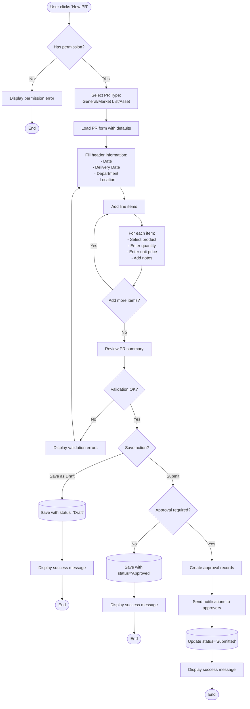
```mermaid
flowchart TD
    Start([User clicks 'New PR']) --> CheckPerm{Has permission?}
    CheckPerm -->|No| ErrorPerm[Display permission error]
    ErrorPerm --> End1([End])

    CheckPerm -->|Yes| SelectType[Select PR Type:<br/>General/Market List/Asset]
    SelectType --> LoadForm[Load PR form with defaults]
    LoadForm --> FillHeader[Fill header information:<br/>- Date<br/>- Delivery Date<br/>- Department<br/>- Location]

    FillHeader --> AddItems[Add line items]
    AddItems --> FillItem[For each item:<br/>- Select product<br/>- Enter quantity<br/>- Enter unit price<br/>- Add notes]

    FillItem --> MoreItems{Add more items?}
    MoreItems -->|Yes| AddItems
    MoreItems -->|No| Review[Review PR summary]

    Review --> Validate{Validation OK?}
    Validate -->|No| ShowErrors[Display validation errors]
    ShowErrors --> FillHeader

    Validate -->|Yes| SaveOption{Save action?}
    SaveOption -->|Save as Draft| SaveDraft[(Save with status='Draft')]
    SaveOption -->|Submit| CheckApproval{Approval required?}

    SaveDraft --> Success1[Display success message]
    Success1 --> End2([End])

    CheckApproval -->|No| DirectApprove[(Save with status='Approved')]
    DirectApprove --> Success2[Display success message]
    Success2 --> End3([End])

    CheckApproval -->|Yes| CreateApprovals[Create approval records]
    CreateApprovals --> SendNotifications[Send notifications to approvers]
    SendNotifications --> UpdateStatus[(Update status='Submitted')]
    UpdateStatus --> Success3[Display success message]
    Success3 --> End4([End])
```

### 2.2 Use Template to Create PR

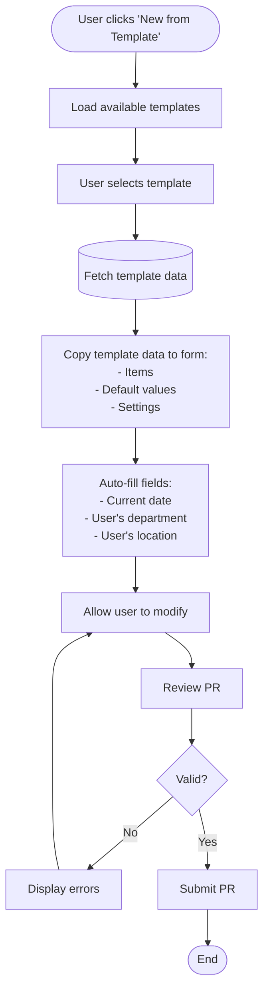
```mermaid
flowchart TD
    Start([User clicks 'New from Template']) --> LoadTemplates[Load available templates]
    LoadTemplates --> SelectTemplate[User selects template]
    SelectTemplate --> LoadTemplate[(Fetch template data)]

    LoadTemplate --> CopyData[Copy template data to form:<br/>- Items<br/>- Default values<br/>- Settings]

    CopyData --> AutoFill[Auto-fill fields:<br/>- Current date<br/>- User's department<br/>- User's location]

    AutoFill --> AllowEdit[Allow user to modify]
    AllowEdit --> Review[Review PR]
    Review --> Validate{Valid?}

    Validate -->|No| ShowErrors[Display errors]
    ShowErrors --> AllowEdit

    Validate -->|Yes| Submit[Submit PR]
    Submit --> End([End])
```

### 2.3 Edit Purchase Request

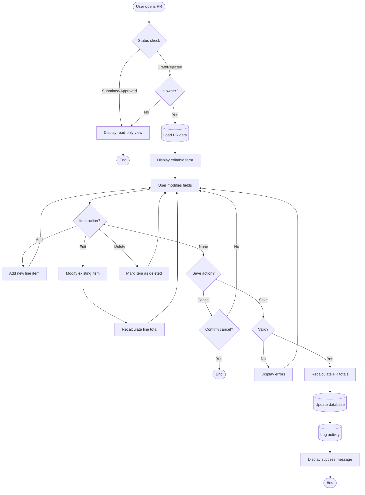
```mermaid
flowchart TD
    Start([User opens PR]) --> CheckStatus{Status check}
    CheckStatus -->|Submitted/Approved| ShowReadOnly[Display read-only view]
    ShowReadOnly --> End1([End])

    CheckStatus -->|Draft/Rejected| CheckOwner{Is owner?}
    CheckOwner -->|No| ShowReadOnly

    CheckOwner -->|Yes| LoadPR[(Load PR data)]
    LoadPR --> DisplayForm[Display editable form]
    DisplayForm --> EditFields[User modifies fields]

    EditFields --> ItemActions{Item action?}
    ItemActions -->|Add| AddItem[Add new line item]
    AddItem --> EditFields

    ItemActions -->|Edit| ModifyItem[Modify existing item]
    ModifyItem --> RecalcLine[Recalculate line total]
    RecalcLine --> EditFields

    ItemActions -->|Delete| DeleteItem[Mark item as deleted]
    DeleteItem --> EditFields

    ItemActions -->|None| SaveAction{Save action?}
    SaveAction -->|Cancel| ConfirmCancel{Confirm cancel?}
    ConfirmCancel -->|Yes| End2([End])
    ConfirmCancel -->|No| EditFields

    SaveAction -->|Save| Validate{Valid?}
    Validate -->|No| ShowErrors[Display errors]
    ShowErrors --> EditFields

    Validate -->|Yes| RecalcTotals[Recalculate PR totals]
    RecalcTotals --> UpdateDB[(Update database)]
    UpdateDB --> LogActivity[(Log activity)]
    LogActivity --> Success[Display success message]
    Success --> End3([End])
```

---

## 3. Data Flow Diagrams

### 3.1 Level 0 - Context Diagram

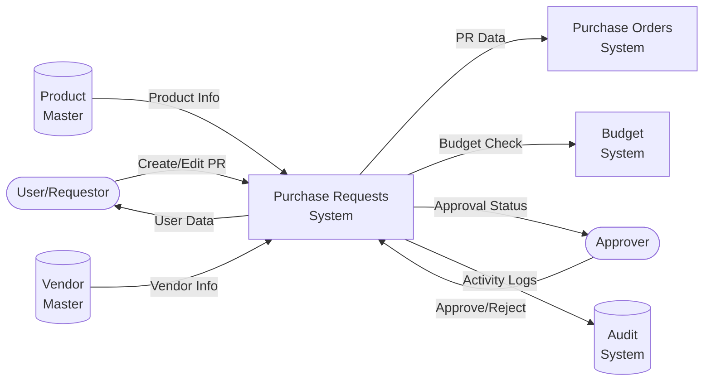
```mermaid
flowchart LR
    User([User/Requestor]) -->|Create/Edit PR| PR[Purchase Requests<br/>System]
    Approver([Approver]) -->|Approve/Reject| PR
    PR -->|PR Data| PO[Purchase Orders<br/>System]
    PR -->|Budget Check| Budget[Budget<br/>System]
    PR -->|User Data| User
    PR -->|Approval Status| Approver
    Products[(Product<br/>Master)] -->|Product Info| PR
    Vendors[(Vendor<br/>Master)] -->|Vendor Info| PR
    PR -->|Activity Logs| Audit[(Audit<br/>System)]
```

### 3.2 Level 1 - Main Processes

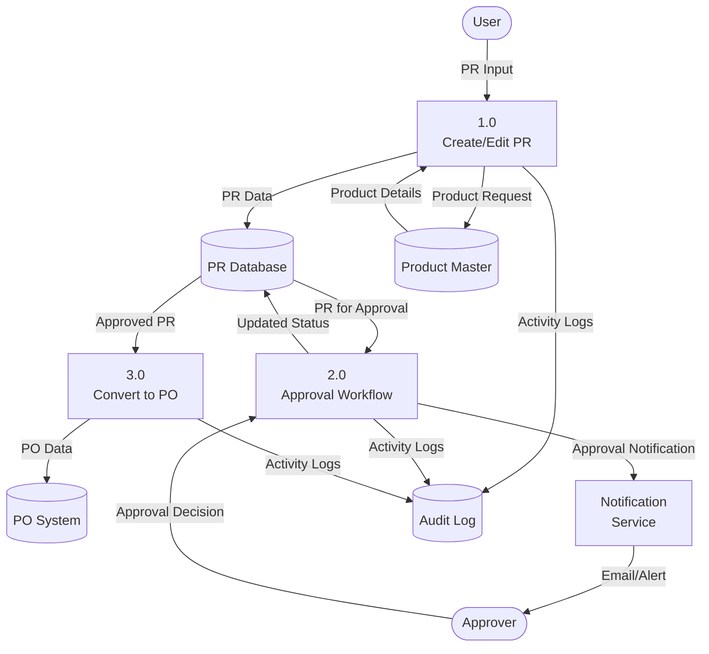
```mermaid
flowchart TD
    User([User]) -->|PR Input| P1[1.0<br/>Create/Edit PR]
    P1 -->|PR Data| DS1[(PR Database)]

    DS1 -->|PR for Approval| P2[2.0<br/>Approval Workflow]
    Approver([Approver]) -->|Approval Decision| P2
    P2 -->|Updated Status| DS1

    DS1 -->|Approved PR| P3[3.0<br/>Convert to PO]
    P3 -->|PO Data| PO[(PO System)]

    P1 -->|Product Request| Products[(Product Master)]
    Products -->|Product Details| P1

    P2 -->|Approval Notification| Notify[Notification<br/>Service]
    Notify -->|Email/Alert| Approver

    P1 & P2 & P3 -->|Activity Logs| Audit[(Audit Log)]
```

### 3.3 Level 2 - Create PR Process Detail

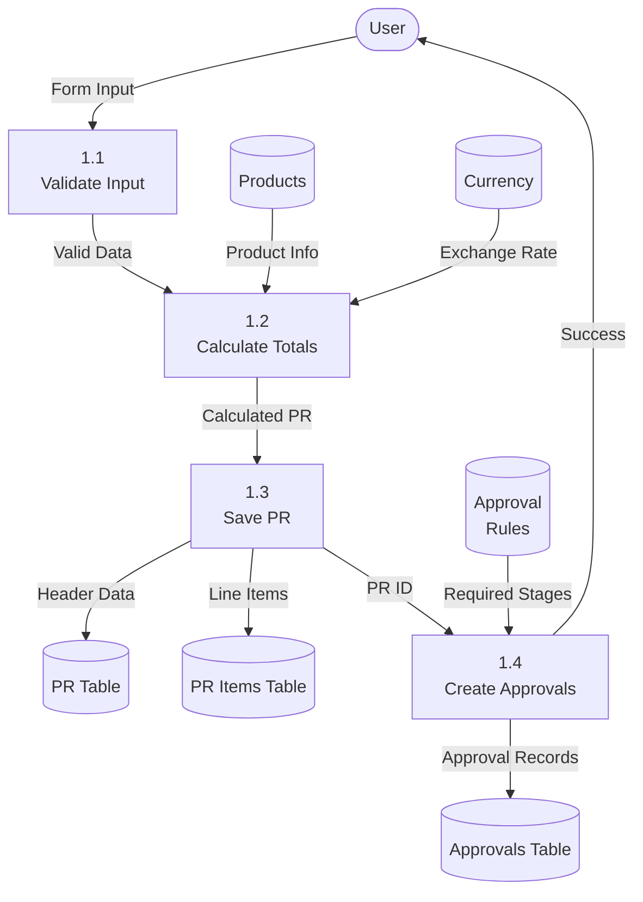
```mermaid
flowchart TD
    User([User]) -->|Form Input| P11[1.1<br/>Validate Input]
    P11 -->|Valid Data| P12[1.2<br/>Calculate Totals]

    Products[(Products)] -->|Product Info| P12
    Currency[(Currency)] -->|Exchange Rate| P12

    P12 -->|Calculated PR| P13[1.3<br/>Save PR]
    P13 -->|Header Data| DS1[(PR Table)]
    P13 -->|Line Items| DS2[(PR Items Table)]

    P13 -->|PR ID| P14[1.4<br/>Create Approvals]
    ApprovalRules[(Approval<br/>Rules)] -->|Required Stages| P14
    P14 -->|Approval Records| DS3[(Approvals Table)]

    P14 -->|Success| User
```

---

## 4. Sequence Diagrams

### 4.1 Create and Submit Purchase Request

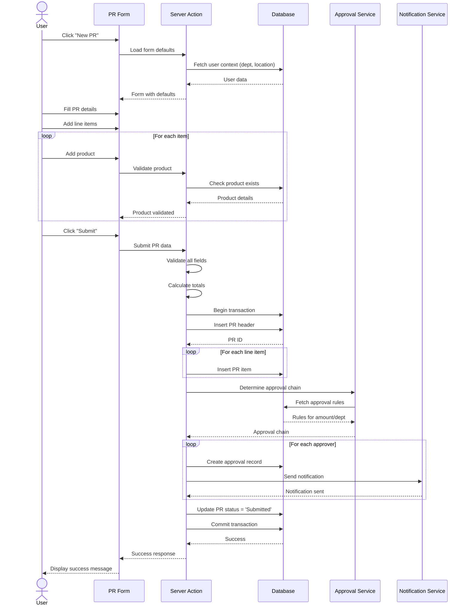
```mermaid
sequenceDiagram
    actor User
    participant UI as PR Form
    participant API as Server Action
    participant DB as Database
    participant Approval as Approval Service
    participant Notify as Notification Service

    User->>UI: Click "New PR"
    UI->>API: Load form defaults
    API->>DB: Fetch user context (dept, location)
    DB-->>API: User data
    API-->>UI: Form with defaults

    User->>UI: Fill PR details
    User->>UI: Add line items

    loop For each item
        User->>UI: Add product
        UI->>API: Validate product
        API->>DB: Check product exists
        DB-->>API: Product details
        API-->>UI: Product validated
    end

    User->>UI: Click "Submit"
    UI->>API: Submit PR data

    API->>API: Validate all fields
    API->>API: Calculate totals

    API->>DB: Begin transaction
    API->>DB: Insert PR header
    DB-->>API: PR ID

    loop For each line item
        API->>DB: Insert PR item
    end

    API->>Approval: Determine approval chain
    Approval->>DB: Fetch approval rules
    DB-->>Approval: Rules for amount/dept
    Approval-->>API: Approval chain

    loop For each approver
        API->>DB: Create approval record
        API->>Notify: Send notification
        Notify-->>API: Notification sent
    end

    API->>DB: Update PR status = 'Submitted'
    API->>DB: Commit transaction
    DB-->>API: Success

    API-->>UI: Success response
    UI-->>User: Display success message
```

### 4.2 Approve Purchase Request

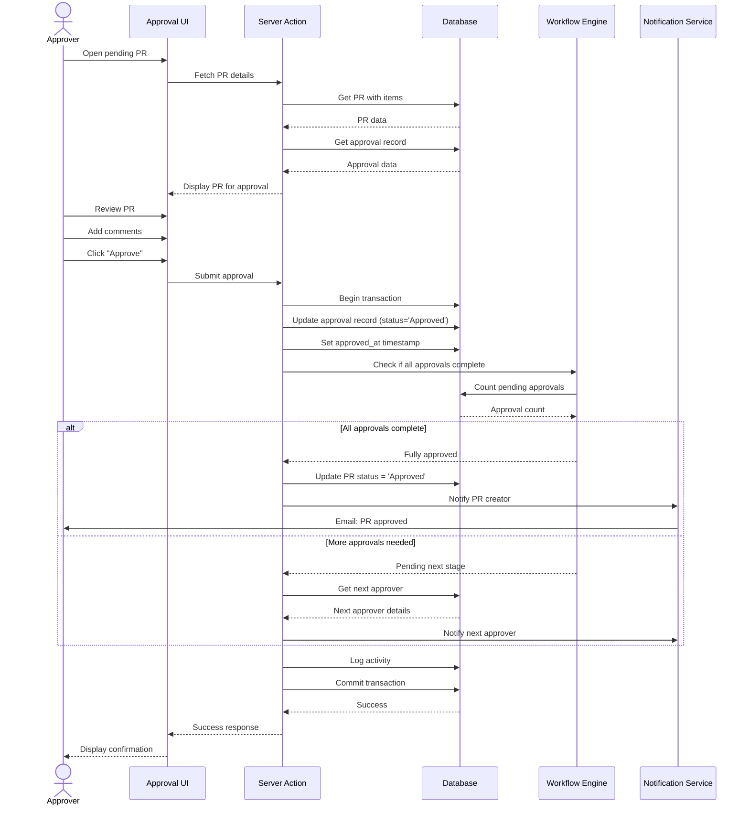
```mermaid
sequenceDiagram
    actor Approver
    participant UI as Approval UI
    participant API as Server Action
    participant DB as Database
    participant Workflow as Workflow Engine
    participant Notify as Notification Service

    Approver->>UI: Open pending PR
    UI->>API: Fetch PR details
    API->>DB: Get PR with items
    DB-->>API: PR data
    API->>DB: Get approval record
    DB-->>API: Approval data
    API-->>UI: Display PR for approval

    Approver->>UI: Review PR
    Approver->>UI: Add comments
    Approver->>UI: Click "Approve"

    UI->>API: Submit approval
    API->>DB: Begin transaction

    API->>DB: Update approval record (status='Approved')
    API->>DB: Set approved_at timestamp

    API->>Workflow: Check if all approvals complete
    Workflow->>DB: Count pending approvals
    DB-->>Workflow: Approval count

    alt All approvals complete
        Workflow-->>API: Fully approved
        API->>DB: Update PR status = 'Approved'
        API->>Notify: Notify PR creator
        Notify->>Approver: Email: PR approved
    else More approvals needed
        Workflow-->>API: Pending next stage
        API->>DB: Get next approver
        DB-->>API: Next approver details
        API->>Notify: Notify next approver
    end

    API->>DB: Log activity
    API->>DB: Commit transaction
    DB-->>API: Success

    API-->>UI: Success response
    UI-->>Approver: Display confirmation
```

### 4.3 Convert PR to Purchase Order

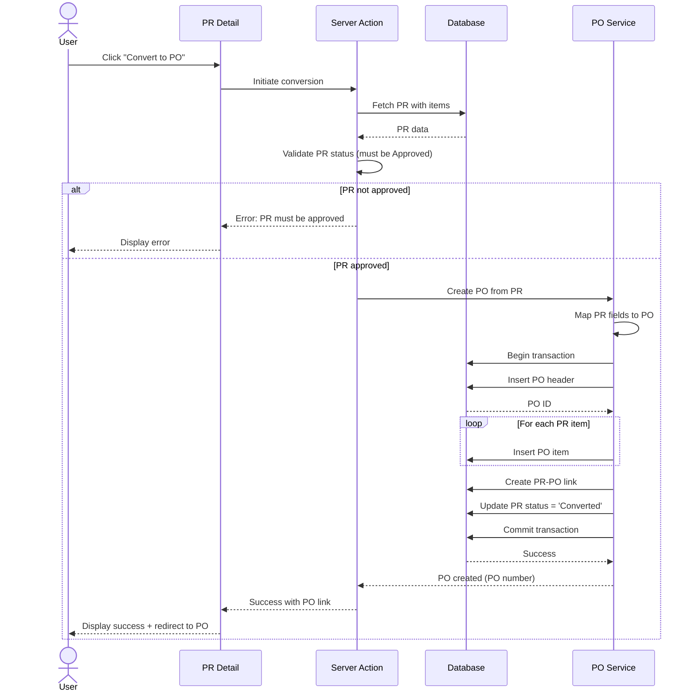
```mermaid
sequenceDiagram
    actor User
    participant UI as PR Detail
    participant API as Server Action
    participant DB as Database
    participant PO as PO Service

    User->>UI: Click "Convert to PO"
    UI->>API: Initiate conversion

    API->>DB: Fetch PR with items
    DB-->>API: PR data

    API->>API: Validate PR status (must be Approved)

    alt PR not approved
        API-->>UI: Error: PR must be approved
        UI-->>User: Display error
    else PR approved
        API->>PO: Create PO from PR

        PO->>PO: Map PR fields to PO
        PO->>DB: Begin transaction
        PO->>DB: Insert PO header
        DB-->>PO: PO ID

        loop For each PR item
            PO->>DB: Insert PO item
        end

        PO->>DB: Create PR-PO link
        PO->>DB: Update PR status = 'Converted'
        PO->>DB: Commit transaction
        DB-->>PO: Success

        PO-->>API: PO created (PO number)
        API-->>UI: Success with PO link
        UI-->>User: Display success + redirect to PO
    end
```

---

## 5. State Diagrams

### 5.1 Purchase Request Status Lifecycle

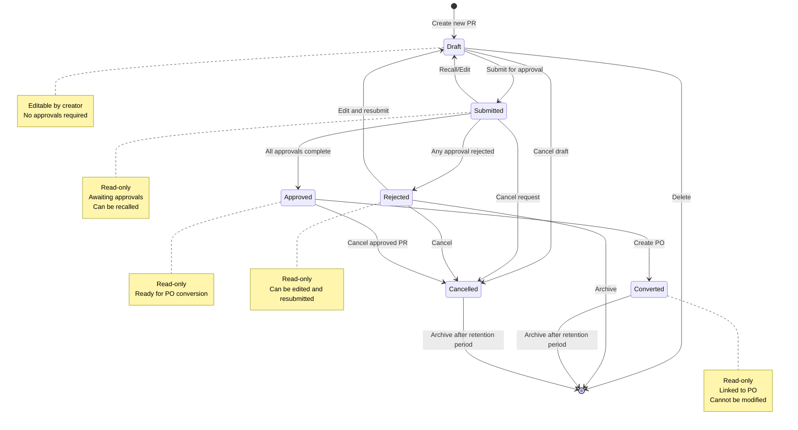
```mermaid
stateDiagram-v2
    [*] --> Draft: Create new PR

    Draft --> Submitted: Submit for approval
    Draft --> Cancelled: Cancel draft
    Draft --> [*]: Delete

    Submitted --> Approved: All approvals complete
    Submitted --> Rejected: Any approval rejected
    Submitted --> Draft: Recall/Edit
    Submitted --> Cancelled: Cancel request

    Rejected --> Draft: Edit and resubmit
    Rejected --> Cancelled: Cancel
    Rejected --> [*]: Archive

    Approved --> Converted: Create PO
    Approved --> Cancelled: Cancel approved PR

    Converted --> [*]: Archive after retention period
    Cancelled --> [*]: Archive after retention period

    note right of Draft
        Editable by creator
        No approvals required
    end note

    note right of Submitted
        Read-only
        Awaiting approvals
        Can be recalled
    end note

    note right of Approved
        Read-only
        Ready for PO conversion
    end note

    note right of Rejected
        Read-only
        Can be edited and resubmitted
    end note

    note right of Converted
        Read-only
        Linked to PO
        Cannot be modified
    end note
```

### 5.2 Approval Status Lifecycle

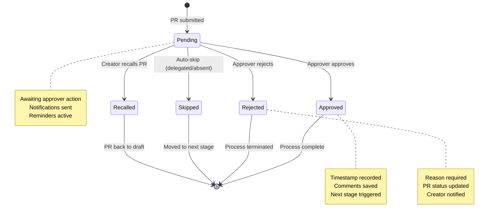
```mermaid
stateDiagram-v2
    [*] --> Pending: PR submitted

    Pending --> Approved: Approver approves
    Pending --> Rejected: Approver rejects
    Pending --> Skipped: Auto-skip (delegated/absent)
    Pending --> Recalled: Creator recalls PR

    Approved --> [*]: Process complete
    Rejected --> [*]: Process terminated
    Skipped --> [*]: Moved to next stage
    Recalled --> [*]: PR back to draft

    note right of Pending
        Awaiting approver action
        Notifications sent
        Reminders active
    end note

    note right of Approved
        Timestamp recorded
        Comments saved
        Next stage triggered
    end note

    note right of Rejected
        Reason required
        PR status updated
        Creator notified
    end note
```

---

## 6. Workflow Diagrams

### 6.1 Multi-Stage Approval Workflow

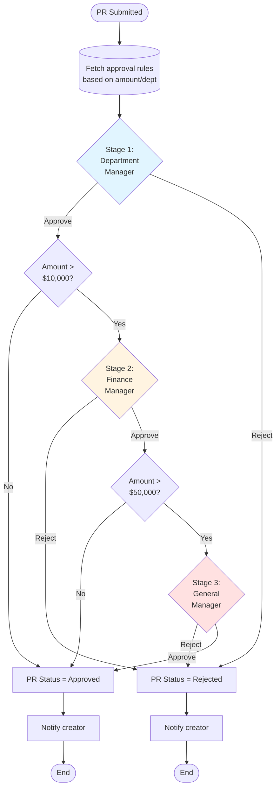
```mermaid
flowchart TD
    Start([PR Submitted]) --> GetRules[(Fetch approval rules<br/>based on amount/dept)]
    GetRules --> Stage1{Stage 1:<br/>Department<br/>Manager}

    Stage1 -->|Approve| CheckAmount{Amount ><br/>$10,000?}
    Stage1 -->|Reject| Rejected[PR Status = Rejected]
    Rejected --> NotifyCreator1[Notify creator]
    NotifyCreator1 --> End1([End])

    CheckAmount -->|No| Approved[PR Status = Approved]
    Approved --> NotifyCreator2[Notify creator]
    NotifyCreator2 --> End2([End])

    CheckAmount -->|Yes| Stage2{Stage 2:<br/>Finance<br/>Manager}
    Stage2 -->|Reject| Rejected
    Stage2 -->|Approve| CheckAmount2{Amount ><br/>$50,000?}

    CheckAmount2 -->|No| Approved
    CheckAmount2 -->|Yes| Stage3{Stage 3:<br/>General<br/>Manager}

    Stage3 -->|Reject| Rejected
    Stage3 -->|Approve| Approved

    style Stage1 fill:#e1f5ff
    style Stage2 fill:#fff4e1
    style Stage3 fill:#ffe1e1
```

### 6.2 Parallel Approval Workflow

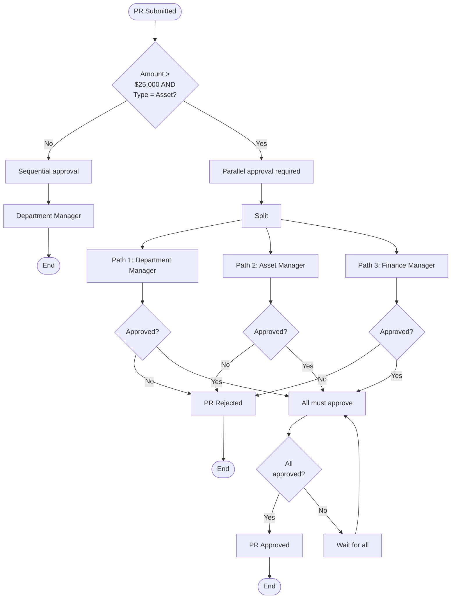
```mermaid
flowchart TD
    Start([PR Submitted]) --> Split{Amount ><br/>$25,000 AND<br/>Type = Asset?}

    Split -->|No| Sequential[Sequential approval]
    Sequential --> Stage1[Department Manager]
    Stage1 --> End1([End])

    Split -->|Yes| Parallel[Parallel approval required]
    Parallel --> Fork[Split]

    Fork --> Path1[Path 1: Department Manager]
    Fork --> Path2[Path 2: Asset Manager]
    Fork --> Path3[Path 3: Finance Manager]

    Path1 --> Check1{Approved?}
    Path2 --> Check2{Approved?}
    Path3 --> Check3{Approved?}

    Check1 -->|No| Rejected[PR Rejected]
    Check2 -->|No| Rejected
    Check3 -->|No| Rejected

    Check1 -->|Yes| Join[All must approve]
    Check2 -->|Yes| Join
    Check3 -->|Yes| Join

    Join --> AllApproved{All<br/>approved?}
    AllApproved -->|Yes| Approved[PR Approved]
    AllApproved -->|No| Wait[Wait for all]
    Wait --> Join

    Approved --> End2([End])
    Rejected --> End3([End])
```

---

## 7. System Integration Diagrams

### 7.1 Budget System Integration

```mermaid
flowchart LR
    PR[Purchase Request<br/>System] -->|Check budget| Budget[Budget<br/>System]
    Budget -->|Budget available| PR
    Budget -->|Insufficient funds| PR

    PR -->|Reserve funds| Budget
    Budget -->|Funds reserved| PR

    PR -->|Release funds<br/>(cancelled/rejected)| Budget
    Budget -->|Funds released| PR

    PR -->|Commit funds<br/>(converted to PO)| Budget
    Budget -->|Funds committed| PR

    style PR fill:#e1f5ff
    style Budget fill:#fff4e1
```

### 7.2 Product Master Integration

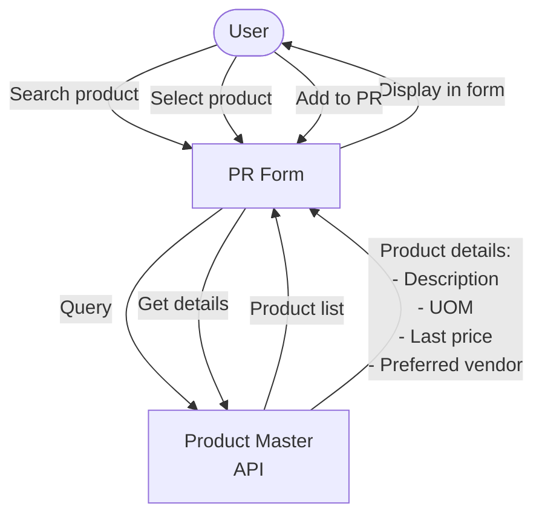
```mermaid
flowchart TD
    User([User]) -->|Search product| PR[PR Form]
    PR -->|Query| PM[Product Master<br/>API]
    PM -->|Product list| PR

    User -->|Select product| PR
    PR -->|Get details| PM
    PM -->|Product details:<br/>- Description<br/>- UOM<br/>- Last price<br/>- Preferred vendor| PR

    PR -->|Display in form| User
    User -->|Add to PR| PR
```

### 7.3 Approval Notification Flow

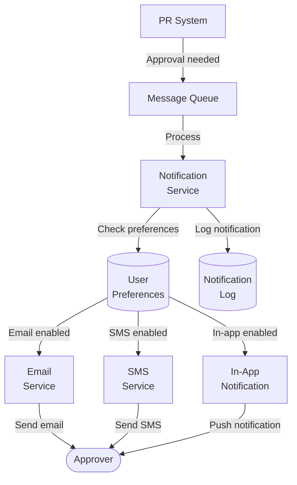
```mermaid
flowchart TD
    PR[PR System] -->|Approval needed| Queue[Message Queue]
    Queue -->|Process| Notify[Notification<br/>Service]

    Notify -->|Check preferences| UserPref[(User<br/>Preferences)]
    UserPref -->|Email enabled| Email[Email<br/>Service]
    UserPref -->|SMS enabled| SMS[SMS<br/>Service]
    UserPref -->|In-app enabled| InApp[In-App<br/>Notification]

    Email -->|Send email| Approver([Approver])
    SMS -->|Send SMS| Approver
    InApp -->|Push notification| Approver

    Notify -->|Log notification| Log[(Notification<br/>Log)]
```

---

## 8. Swimlane Diagrams

### 8.1 End-to-End PR Process

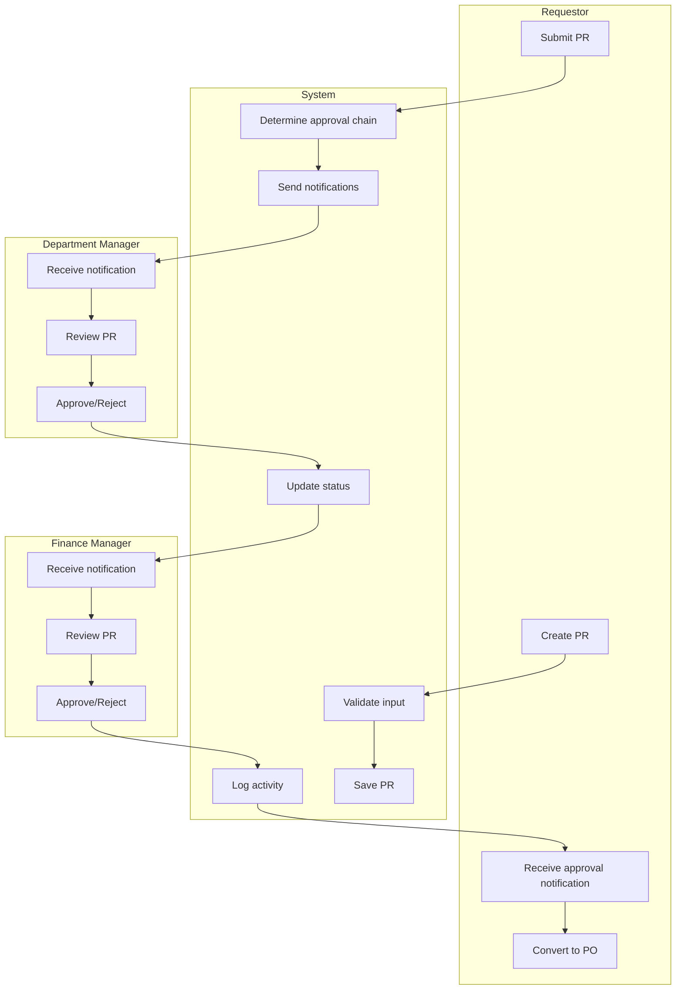
```mermaid
flowchart TD
    subgraph Requestor
        R1[Create PR]
        R2[Submit PR]
        R7[Receive approval notification]
        R8[Convert to PO]
    end

    subgraph System
        S1[Validate input]
        S2[Save PR]
        S3[Determine approval chain]
        S4[Send notifications]
        S5[Update status]
        S6[Log activity]
    end

    subgraph "Department Manager"
        D1[Receive notification]
        D2[Review PR]
        D3[Approve/Reject]
    end

    subgraph "Finance Manager"
        F1[Receive notification]
        F2[Review PR]
        F3[Approve/Reject]
    end

    R1 --> S1
    S1 --> S2
    R2 --> S3
    S3 --> S4
    S4 --> D1
    D1 --> D2
    D2 --> D3
    D3 --> S5
    S5 --> F1
    F1 --> F2
    F2 --> F3
    F3 --> S6
    S6 --> R7
    R7 --> R8
```

---

## 9. Decision Trees

### 9.1 Approval Routing Logic

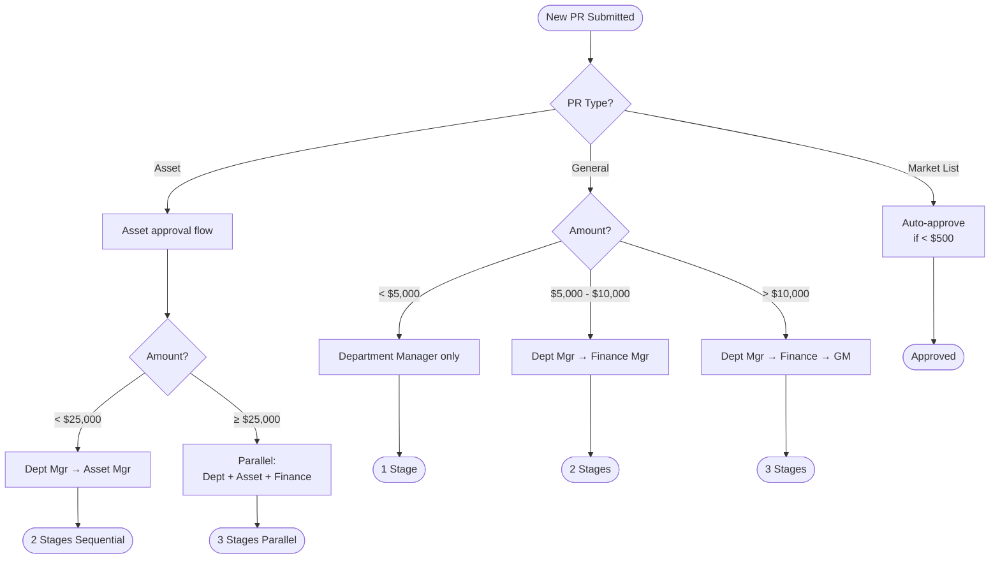
```mermaid
flowchart TD
    Start([New PR Submitted]) --> CheckType{PR Type?}

    CheckType -->|General| CheckAmount{Amount?}
    CheckType -->|Market List| DirectApprove[Auto-approve<br/>if < $500]
    CheckType -->|Asset| AssetFlow[Asset approval flow]

    CheckAmount -->|< $5,000| DeptMgr[Department Manager only]
    CheckAmount -->|$5,000 - $10,000| TwoStage[Dept Mgr → Finance Mgr]
    CheckAmount -->|> $10,000| ThreeStage[Dept Mgr → Finance → GM]

    AssetFlow --> AssetAmount{Amount?}
    AssetAmount -->|< $25,000| AssetSimple[Dept Mgr → Asset Mgr]
    AssetAmount -->|≥ $25,000| AssetComplex[Parallel:<br/>Dept + Asset + Finance]

    DirectApprove --> End1([Approved])
    DeptMgr --> End2([1 Stage])
    TwoStage --> End3([2 Stages])
    ThreeStage --> End4([3 Stages])
    AssetSimple --> End5([2 Stages Sequential])
    AssetComplex --> End6([3 Stages Parallel])
```

### 9.2 Status Transition Logic

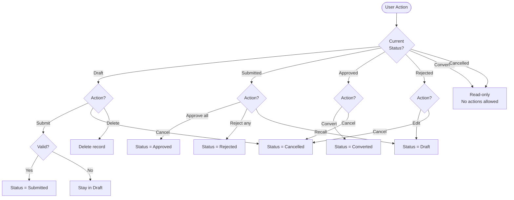
```mermaid
flowchart TD
    Start([User Action]) --> CurrentStatus{Current<br/>Status?}

    CurrentStatus -->|Draft| DraftActions{Action?}
    DraftActions -->|Submit| CheckValid{Valid?}
    CheckValid -->|Yes| ToSubmitted[Status = Submitted]
    CheckValid -->|No| StayDraft[Stay in Draft]
    DraftActions -->|Cancel| ToCancelled[Status = Cancelled]
    DraftActions -->|Delete| DeletePR[Delete record]

    CurrentStatus -->|Submitted| SubmitActions{Action?}
    SubmitActions -->|Approve all| ToApproved[Status = Approved]
    SubmitActions -->|Reject any| ToRejected[Status = Rejected]
    SubmitActions -->|Recall| ToDraft[Status = Draft]

    CurrentStatus -->|Approved| ApproveActions{Action?}
    ApproveActions -->|Convert| ToConverted[Status = Converted]
    ApproveActions -->|Cancel| ToCancelled

    CurrentStatus -->|Rejected| RejectActions{Action?}
    RejectActions -->|Edit| ToDraft
    RejectActions -->|Cancel| ToCancelled

    CurrentStatus -->|Converted| NoAction[Read-only<br/>No actions allowed]
    CurrentStatus -->|Cancelled| NoAction
```

---

## 10. Activity Diagrams

### 10.1 Concurrent Item Processing

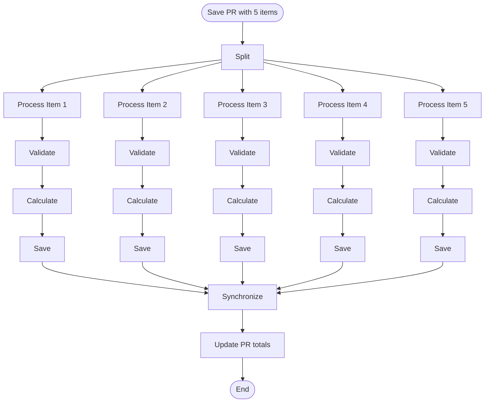
```mermaid
flowchart TD
    Start([Save PR with 5 items]) --> Fork[Split]

    Fork --> Item1[Process Item 1]
    Fork --> Item2[Process Item 2]
    Fork --> Item3[Process Item 3]
    Fork --> Item4[Process Item 4]
    Fork --> Item5[Process Item 5]

    Item1 --> V1[Validate]
    Item2 --> V2[Validate]
    Item3 --> V3[Validate]
    Item4 --> V4[Validate]
    Item5 --> V5[Validate]

    V1 --> C1[Calculate]
    V2 --> C2[Calculate]
    V3 --> C3[Calculate]
    V4 --> C4[Calculate]
    V5 --> C5[Calculate]

    C1 --> S1[Save]
    C2 --> S2[Save]
    C3 --> S3[Save]
    C4 --> S4[Save]
    C5 --> S5[Save]

    S1 --> Join[Synchronize]
    S2 --> Join
    S3 --> Join
    S4 --> Join
    S5 --> Join

    Join --> UpdateTotals[Update PR totals]
    UpdateTotals --> End([End])
```

### 10.2 Batch Approval Processing

```mermaid
flowchart TD
    Start([Approver selects multiple PRs]) --> CheckAll{All PRs<br/>valid?}

    CheckAll -->|No| ShowError[Show validation errors]
    ShowError --> End1([End])

    CheckAll -->|Yes| ConfirmBatch{Confirm<br/>batch action?}
    ConfirmBatch -->|No| End2([End])

    ConfirmBatch -->|Yes| BeginTx[Begin transaction]
    BeginTx --> ProcessLoop[For each PR]

    ProcessLoop --> ValidatePR{PR can be<br/>approved?}
    ValidatePR -->|No| SkipPR[Skip this PR]
    ValidatePR -->|Yes| ApprovePR[Approve PR]

    ApprovePR --> UpdateStatus[Update status]
    UpdateStatus --> LogActivity[Log activity]
    LogActivity --> QueueNotify[Queue notification]

    SkipPR --> MorePRs{More PRs?}
    QueueNotify --> MorePRs

    MorePRs -->|Yes| ProcessLoop
    MorePRs -->|No| CommitTx[Commit transaction]

    CommitTx --> SendNotifications[Send all notifications]
    SendNotifications --> ShowResults[Display results summary]
    ShowResults --> End3([End])
```

---

## 11. Error Handling Flows

### 11.1 PR Submission Error Handling

```mermaid
flowchart TD
    Start([Submit PR]) --> TrySubmit{Try submit}

    TrySubmit -->|Success| UpdateStatus[Update status]
    UpdateStatus --> End1([Success])

    TrySubmit -->|Validation Error| ValidError[Validation failed]
    ValidError --> ShowValidation[Show field errors]
    ShowValidation --> AllowFix[Allow user to fix]
    AllowFix --> Retry1{Retry?}
    Retry1 -->|Yes| TrySubmit
    Retry1 -->|No| End2([Cancelled])

    TrySubmit -->|Database Error| DBError[Database error]
    DBError --> Rollback[Rollback transaction]
    Rollback --> LogError1[Log error details]
    LogError1 --> CheckRetry{Transient<br/>error?}
    CheckRetry -->|Yes| Retry2[Retry with backoff]
    Retry2 --> TrySubmit
    CheckRetry -->|No| ShowDBError[Show user-friendly error]
    ShowDBError --> End3([Error])

    TrySubmit -->|Network Error| NetError[Network timeout]
    NetError --> LogError2[Log error]
    LogError2 --> RetryPrompt{Retry?}
    RetryPrompt -->|Yes| TrySubmit
    RetryPrompt -->|No| End4([Error])

    TrySubmit -->|Approval Service Error| ApprError[Approval service down]
    ApprError --> SaveDraft[Save as draft instead]
    SaveDraft --> NotifyAdmin[Notify admin]
    NotifyAdmin --> ShowWarning[Show warning to user]
    ShowWarning --> End5([Saved as draft])
```

### 11.2 Concurrent Edit Conflict Resolution

```mermaid
flowchart TD
    Start([User saves changes]) --> CheckVersion{Version<br/>matches?}

    CheckVersion -->|Yes| SaveChanges[Save changes]
    SaveChanges --> IncrementVersion[Increment version]
    IncrementVersion --> End1([Success])

    CheckVersion -->|No| Conflict[Conflict detected]
    Conflict --> FetchLatest[Fetch latest version]
    FetchLatest --> ShowConflict[Show conflict dialog]

    ShowConflict --> UserChoice{User choice?}
    UserChoice -->|Discard mine| UseTheirs[Use latest version]
    UseTheirs --> End2([Changes discarded])

    UserChoice -->|Keep mine| Merge{Can auto-merge?}
    Merge -->|Yes| AutoMerge[Merge changes]
    AutoMerge --> SaveMerged[Save merged version]
    SaveMerged --> End3([Merged success])

    Merge -->|No| ManualMerge[Show manual merge UI]
    ManualMerge --> UserResolves[User resolves conflicts]
    UserResolves --> SaveResolved[Save resolved version]
    SaveResolved --> End4([Conflict resolved])

    UserChoice -->|Cancel| End5([Cancelled])
```

---

## 12. Performance Optimization Flows

### 12.1 Lazy Loading PR List

```mermaid
flowchart TD
    Start([User opens PR list]) --> InitialLoad[Load first page<br/>20 records]
    InitialLoad --> Display1[Display with skeleton]

    Display1 --> ScrollCheck{User scrolls<br/>near bottom?}
    ScrollCheck -->|No| Wait[Wait]
    Wait --> ScrollCheck

    ScrollCheck -->|Yes| LoadMore[Load next page]
    LoadMore --> AppendData[Append to list]
    AppendData --> Display2[Update display]

    Display2 --> MoreData{More data<br/>available?}
    MoreData -->|Yes| ScrollCheck
    MoreData -->|No| ShowEnd[Show "End of list"]
    ShowEnd --> End([End])
```

### 12.2 Caching Strategy

```mermaid
flowchart TD
    Start([Request PR data]) --> CheckCache{Data in<br/>cache?}

    CheckCache -->|Yes| ValidCache{Cache<br/>valid?}
    ValidCache -->|Yes| ReturnCache[Return cached data]
    ReturnCache --> End1([Fast response])

    ValidCache -->|No| InvalidateCache[Invalidate cache]
    InvalidateCache --> FetchDB

    CheckCache -->|No| FetchDB[Fetch from database]
    FetchDB --> StoreCache[Store in cache]
    StoreCache --> ReturnData[Return data]
    ReturnData --> End2([Slower response])

    UpdateEvent([Data updated]) --> InvalidateRelated[Invalidate related caches]
    InvalidateRelated --> End3([Cache invalidated])
```

---

## 13. Related Documents

- **Business Requirements**: [BR-purchase-requests.md](../../business-requirements/procurement/BR-purchase-requests.md)
- **Use Cases**: [UC-purchase-requests.md](../../use-cases/procurement/UC-purchase-requests.md)
- **Data Definition**: [DS-purchase-requests.md](./DS-purchase-requests.md)
- **Validations**: [VAL-purchase-requests.md](./VAL-purchase-requests.md)
- **API Documentation**: [API-purchase-requests.md](./API-purchase-requests.md)

---

**Document Control**:
- **Created**: 2025-01-30
- **Author**: System Architect
- **Reviewed By**: Development Lead, Business Analyst
- **Next Review**: 2025-04-30
