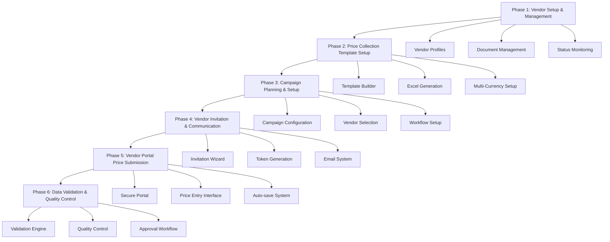
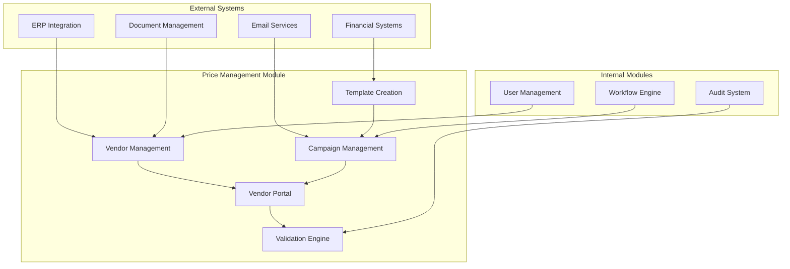

# Vendor Pricelist Management - Design Document

## Overview

The Price Management Module provides centralized pricing capabilities including vendor management, vendor pricelist collection, and standardized price collection processes. The system operates as part of the larger system at `app/(main)/vendor-management/`, leveraging existing vendor profiles, currency, and product information from mock data.

This module implements a **6-Phase Sequential Process** for vendor price collection and management, designed to streamline pricing operations, reduce manual workload, and improve procurement decision-making through systematic vendor management and intelligent price assignment to Purchase Requests (PRs).

## Architecture

### 6-Phase Process Flow Architecture



### System Integration Architecture



## Components and Interfaces

### Phase 1: Vendor Setup & Management

**Location**: `app/(main)/vendor-management/`

**Purpose**: Establish and maintain vendor relationships

**Key Components**:
- **VendorProfileManager**: Complete vendor CRUD operations
- **DocumentUploadSystem**: Handle vendor certifications and documents
- **CategoryAssignmentTool**: Manage vendor-product category relationships
- **ComplianceMonitor**: Track vendor status and performance

**API Endpoints**:
```typescript
GET    /api/vendor-management/vendors
POST   /api/vendor-management/vendors
GET    /api/vendor-management/vendors/[id]
PUT    /api/vendor-management/vendors/[id]
DELETE /api/vendor-management/vendors/[id]
POST   /api/vendor-management/vendors/[id]/documents
GET    /api/vendor-management/vendors/[id]/performance
```

### Phase 2: Price Collection Template Setup

**Location**: `app/(main)/vendor-management/templates/`

**Purpose**: Create standardized templates for price collection

**Key Components**:
- **TemplateBuilder**: Interactive template creation interface
- **ProductSelector**: Multi-level category/subcategory selection
- **ExcelGenerator**: Generate downloadable Excel templates
- **ValidationRuleEngine**: Define and enforce template validation rules

**Features**:
- Product selection via category, subcategory, item group, or search
- Multi-currency template support
- Vendor-specific template customization
- Template versioning and history

### Phase 3: Campaign Planning & Setup

**Location**: `app/(main)/vendor-management/campaigns/`

**Purpose**: Plan and configure price collection campaigns

**Key Components**:
- **CampaignWizard**: Step-by-step campaign creation
- **VendorSelector**: Multi-vendor selection with filtering
- **ScheduleManager**: Campaign timing and deadline management
- **WorkflowConfigurator**: Approval and escalation setup

**Campaign Types**:
- One-time campaigns
- Recurring campaigns
- Event-based campaigns

### Phase 4: Vendor Invitation & Communication

**Location**: `app/(main)/vendor-management/invitations/`

**Purpose**: Invite vendors and manage communication

**Key Components**:
- **InvitationWizard**: Multi-step invitation creation process
- **TokenGenerator**: Secure portal access token creation
- **EmailTemplateEngine**: Personalized email generation
- **DeliveryTracker**: Monitor email delivery and responses
- **ReminderScheduler**: Automated follow-up system

**Security Features**:
- Cryptographically secure token generation
- Time-limited access links
- IP address tracking
- Session monitoring

### Phase 5: Vendor Portal Price Submission

**Location**: `app/(main)/vendor-portal/[token]/`

**Purpose**: Vendors submit pricing through secure portal

**Key Components**:
- **PortalAuthentication**: Token-based secure access
- **PriceEntryInterface**: Single-page pricing form
- **FileUploadProcessor**: Excel template upload and processing
- **AutoSaveManager**: Automatic progress preservation
- **ProgressTracker**: Submission completion monitoring

**Submission Methods**:
1. **Direct Online Entry**: Single-page interface with inline MOQ expansion
2. **Excel Upload**: Drag-and-drop file processing
3. **Email Submission**: Download template and email to purchasing staff

### Phase 6: Data Validation & Quality Control

**Location**: `lib/services/validation/`

**Purpose**: Ensure data accuracy and completeness

**Key Components**:
- **ValidationEngine**: Real-time data validation
- **QualityScorer**: Data quality assessment
- **ErrorReporter**: Detailed error messaging with correction guidance
- **ApprovalWorkflow**: Manual review and approval process

**Validation Types**:
- Format validation (price formats, currency consistency)
- Business rule validation (MOQ logic, price reasonableness)
- Completeness validation (required fields, missing data)
- Quality scoring (data consistency, vendor reliability)

## Data Models

### Core Data Models

```typescript
// Vendor Model (extends existing vendor data)
interface VendorPriceManagement {
  id: string;
  baseVendorId: string; // Reference to existing vendor
  priceCollectionPreferences: {
    preferredCurrency: string;
    defaultLeadTime: number;
    communicationLanguage: string;
    notificationPreferences: NotificationSettings;
  };
  performanceMetrics: {
    responseRate: number;
    averageResponseTime: number;
    dataQualityScore: number;
    lastSubmissionDate?: Date;
  };
  assignedCategories: string[];
  status: 'active' | 'inactive' | 'suspended';
}

// Price Collection Template
interface PriceCollectionTemplate {
  id: string;
  name: string;
  description: string;
  productSelection: {
    categories: string[];
    subcategories: string[];
    itemGroups: string[];
    specificItems: string[];
    selectionCriteria: 'include' | 'exclude';
  };
  templateSettings: {
    supportedCurrencies: string[];
    requiredFields: string[];
    validityPeriod: number; // days
    maxMOQTiers: number;
  };
  validationRules: ValidationRule[];
  createdAt: Date;
  updatedAt: Date;
  createdBy: string;
  status: 'draft' | 'active' | 'archived';
}

// Collection Campaign
interface CollectionCampaign {
  id: string;
  name: string;
  templateId: string;
  vendorIds: string[];
  schedule: {
    type: 'one-time' | 'recurring' | 'event-based';
    startDate: Date;
    endDate: Date;
    reminderSchedule: ReminderConfig[];
  };
  invitations: VendorInvitation[];
  status: 'draft' | 'active' | 'paused' | 'completed' | 'cancelled';
  analytics: CampaignAnalytics;
  createdAt: Date;
  createdBy: string;
}

// Vendor Invitation
interface VendorInvitation {
  id: string;
  campaignId: string;
  vendorId: string;
  token: string;
  pricelistId: string;
  emailDetails: {
    sentAt?: Date;
    deliveredAt?: Date;
    openedAt?: Date;
    clickedAt?: Date;
  };
  portalAccess: {
    firstAccessAt?: Date;
    lastAccessAt?: Date;
    sessionCount: number;
    ipAddresses: string[];
  };
  submissionStatus: 'pending' | 'in-progress' | 'submitted' | 'approved' | 'expired';
  expiresAt: Date;
}

// Vendor Pricelist
interface VendorPricelist {
  id: string;
  vendorId: string;
  campaignId: string;
  templateId: string;
  currency: string;
  items: PricelistItem[];
  submissionMethod: 'online' | 'upload' | 'email';
  status: 'draft' | 'submitted' | 'under-review' | 'approved' | 'rejected';
  qualityScore: number;
  validationResults: ValidationResult[];
  submittedAt?: Date;
  approvedAt?: Date;
  validFrom: Date;
  validTo: Date;
}

// Pricelist Item with Multi-MOQ Support
interface PricelistItem {
  id: string;
  productId: string;
  productCode: string;
  productName: string;
  category: string;
  subcategory: string;
  pricing: MOQPricing[];
  leadTime?: number;
  notes?: string;
  validationStatus: 'valid' | 'warning' | 'error';
  validationMessages: string[];
}

// Multi-MOQ Pricing Structure
interface MOQPricing {
  moq: number;
  unit: string;
  unitPrice: number;
  conversionFactor: number; // e.g., 1 Box = 50 Each
  effectiveUnitPrice: number; // calculated price per base unit
  leadTime?: number;
  notes?: string;
}
```

## User Interface Design

### Purchasing Staff Interface

**Template Management View**:
```
┌─────────────────────────────────────────────────────────────┐
│ Price Collection Templates                                   │
├─────────────────────────────────────────────────────────────┤
│ [+ New Template] [Import] [Export]                          │
│                                                             │
│ Template Name: Office Supplies Q1 2024                     │
│ Products: 45 items across 3 categories                     │
│ Status: Active                                              │
│ [Quick Actions: Generate Links | Send Invitations | Edit]  │
│                                                             │
│ Template Name: IT Equipment Annual                          │
│ Products: 120 items across 5 categories                    │
│ Status: Draft                                               │
│ [Quick Actions: Generate Links | Send Invitations | Edit]  │
└─────────────────────────────────────────────────────────────┘
```

**Campaign Dashboard**:
```
┌─────────────────────────────────────────────────────────────┐
│ Campaign: Office Supplies Q1 2024                          │
├─────────────────────────────────────────────────────────────┤
│ Progress: ████████░░ 80% (8/10 vendors responded)          │
│                                                             │
│ Vendor Status:                                              │
│ ✓ ABC Office Supplies    - Submitted (Quality: 95%)        │
│ ✓ XYZ Stationery        - Submitted (Quality: 88%)         │
│ ⏳ Quick Print Solutions - In Progress (60% complete)       │
│ ❌ Office Depot         - Not Started (Reminder sent)      │
│                                                             │
│ [Send Reminders] [Extend Deadline] [Export Results]        │
└─────────────────────────────────────────────────────────────┘
```

### Vendor Portal Interface

**Welcome Dashboard**:
```
┌─────────────────────────────────────────────────────────────┐
│ Welcome, ABC Office Supplies                               │
├─────────────────────────────────────────────────────────────┤
│ Price Collection: Office Supplies Q1 2024                  │
│ Deadline: March 15, 2024 (5 days remaining)               │
│ Progress: ████████░░ 80% complete                          │
│                                                             │
│ Choose your submission method:                              │
│                                                             │
│ 🖥️  [Enter Prices Online]                                  │
│     Quick and easy - enter prices directly                 │
│                                                             │
│ 📊 [Download Excel Template]                               │
│     Work offline and upload when ready                     │
│                                                             │
│ 📧 [Email Submission]                                       │
│     Download template and email to purchasing              │
└─────────────────────────────────────────────────────────────┘
```

**Single-Page Price Entry**:
```
┌─────────────────────────────────────────────────────────────┐
│ Price Entry - Office Supplies Q1 2024          💾 Auto-saved│
├─────────────────────────────────────────────────────────────┤
│ Currency: [USD ▼]                    Progress: 15/20 items  │
│                                                             │
│ 1. A4 Copy Paper (Ream)                                    │
│    MOQ 1: $4.50 [+] Lead Time: 3 days                     │
│                                                             │
│ 2. Blue Ballpoint Pens (Box of 50)                        │
│    MOQ 1: $12.00 [+] Lead Time: 2 days                    │
│    MOQ 10: $10.50 [-] Lead Time: 2 days                   │
│    MOQ 50: $9.75 [-] Lead Time: 5 days                    │
│                                                             │
│ 3. Stapler (Heavy Duty)                                    │
│    MOQ 1: [Enter Price] [+] Lead Time: [Enter Days]       │
│                                                             │
│ [Continue] [Save Draft] [Submit All]                       │
└─────────────────────────────────────────────────────────────┘
```

## Error Handling and Validation

### Validation Framework

```typescript
interface ValidationRule {
  field: string;
  type: 'required' | 'format' | 'range' | 'business-rule';
  parameters: any;
  errorMessage: string;
  severity: 'error' | 'warning' | 'info';
}

interface ValidationResult {
  isValid: boolean;
  errors: ValidationError[];
  warnings: ValidationError[];
  qualityScore: number;
  suggestions: string[];
}

interface ValidationError {
  field: string;
  code: string;
  message: string;
  severity: 'error' | 'warning' | 'info';
  correctionGuidance?: string;
  suggestedValue?: any;
}
```

### Business Rules Validation

1. **Price Logic Validation**:
   - Higher MOQ should generally have lower unit prices
   - Prices should be within reasonable market ranges
   - Currency consistency across all items

2. **MOQ Validation**:
   - No duplicate MOQ values for same item
   - MOQ values should be logical (1, 10, 50, 100, etc.)
   - Unit conversions should be mathematically correct

3. **Completeness Validation**:
   - All required fields populated
   - Minimum number of MOQ tiers provided
   - Lead times specified where required

## Testing Strategy

### Phase-Based Testing Approach

**Phase 1 Testing - Vendor Management**:
- Vendor CRUD operations
- Document upload functionality
- Performance metrics calculation
- Status management workflows

**Phase 2 Testing - Template System**:
- Template creation and editing
- Product selection logic
- Excel generation accuracy
- Validation rule enforcement

**Phase 3 Testing - Campaign Management**:
- Campaign workflow testing
- Vendor selection and filtering
- Schedule management
- Status transitions

**Phase 4 Testing - Invitation System**:
- Token generation security
- Email delivery tracking
- Reminder scheduling
- Multi-language support

**Phase 5 Testing - Vendor Portal**:
- Portal authentication
- Price entry interface usability
- Auto-save functionality
- Mobile responsiveness
- File upload processing

**Phase 6 Testing - Validation System**:
- Real-time validation accuracy
- Error message clarity
- Quality scoring algorithms
- Approval workflow testing

### Integration Testing

- End-to-end campaign workflow
- Multi-vendor concurrent access
- Large dataset performance
- Email system integration
- File processing reliability

## Security Implementation

### Token-Based Authentication

```typescript
interface PortalToken {
  token: string;
  vendorId: string;
  campaignId: string;
  pricelistId: string;
  permissions: string[];
  expiresAt: Date;
  ipRestrictions?: string[];
  sessionLimits: {
    maxConcurrent: number;
    maxDuration: number;
  };
}
```

### Security Measures

1. **Token Security**:
   - Cryptographically secure random token generation
   - Time-limited access with configurable expiration
   - IP address tracking and optional restrictions
   - Session monitoring and concurrent access limits

2. **Data Protection**:
   - Encryption of sensitive vendor data
   - Secure file upload with virus scanning
   - Audit logging for all data access
   - Role-based access control for staff

3. **Communication Security**:
   - HTTPS enforcement for all communications
   - Email security with SPF/DKIM validation
   - Secure file transfer protocols
   - API rate limiting and abuse prevention

## Performance Optimization

### Frontend Performance

- **Virtual Scrolling**: Handle large item lists efficiently
- **Debounced Auto-save**: Reduce server load while maintaining data safety
- **Optimistic Updates**: Immediate UI feedback for better user experience
- **Lazy Loading**: Load components and data as needed
- **Caching Strategy**: Cache frequently accessed data locally

### Backend Performance

- **Database Optimization**: Proper indexing for common queries
- **Batch Processing**: Handle bulk operations efficiently
- **Asynchronous Processing**: Non-blocking file uploads and processing
- **Caching Layer**: Redis for frequently accessed data
- **Connection Pooling**: Efficient database connection management

## Monitoring and Analytics

### System Monitoring

- Application performance metrics
- Database query performance
- Error rate tracking and alerting
- Resource utilization monitoring
- User session analytics

### Business Analytics

- Vendor response rates by campaign
- Average completion times
- Data quality trends
- Price submission patterns
- Campaign effectiveness metrics

### Audit and Compliance

- Complete audit trail for all operations
- Compliance reporting capabilities
- Data retention policies
- Regular security assessments
- Change management tracking


## Simplified Vendor Price Entry Interface

### Clean List View - All 20 Items

```
┌─────────────────────────────────────────────────────────────┐
│ Price Submission Portal - Vendor A                          │
├─────────────────────────────────────────────────────────────┤
│ Currency: [EUR ▼]  |  Status: DRAFT  |  Progress: 0/20     │
├─────────────────────────────────────────────────────────────┤
│ Search: [🔍 Filter items...]                                │
│                                                             │
│ Code      | Description          | Unit | Price  | Lead | + │
│ ─────────────────────────────────────────────────────────── │
│ ELEC-001  | USB Cable Type-C    | Each | €[___] | [5]d |[+]│
│ ELEC-002  | USB Cable Type-A    | Each | €[___] | [5]d |[+]│
│ ELEC-003  | HDMI Cable 2.0      | Each | €[___] | [5]d |[+]│
│ ELEC-004  | HDMI Cable 4K       | Each | €[___] | [5]d |[+]│
│ ELEC-005  | Network Cable Cat6  | Each | €[___] | [5]d |[+]│
│ ELEC-006  | Network Cable Cat7  | Each | €[___] | [5]d |[+]│
│ ELEC-007  | Power Cable 3-Pin   | Each | €[___] | [5]d |[+]│
│ ELEC-008  | Extension Cable 5m  | Each | €[___] | [5]d |[+]│
│ PWR-001   | Laptop Charger 65W  | Each | €[___] | [5]d |[+]│
│ PWR-002   | Laptop Charger 90W  | Each | €[___] | [5]d |[+]│
│ PWR-003   | USB Charger 20W     | Each | €[___] | [5]d |[+]│
│ PWR-004   | USB Charger 45W     | Each | €[___] | [5]d |[+]│
│ PWR-005   | Power Bank 10000mAh | Each | €[___] | [5]d |[+]│
│ ACC-001   | Wireless Mouse      | Each | €[___] | [5]d |[+]│
│ ACC-002   | USB Hub 4-Port      | Each | €[___] | [5]d |[+]│
│ ACC-003   | Webcam HD           | Each | €[___] | [5]d |[+]│
│ ACC-004   | Mouse Pad           | Each | €[___] | [5]d |[+]│
│ ACC-005   | Cable Organizer     | Pack | €[___] | [5]d |[+]│
│ ACC-006   | Screen Cleaner      | Each | €[___] | [5]d |[+]│
│ ACC-007   | Keyboard Wireless   | Each | €[___] | [5]d |[+]│
│                                                             │
│ * All prices shown are for MOQ: 1 unit                     │
│ [Save Draft] [Submit Prices]                                │
└─────────────────────────────────────────────────────────────┘
```

### After Clicking [+] - Simple Inline Expansion

```
┌─────────────────────────────────────────────────────────────┐
│ Code      | Description          | Unit | Price  | Lead | + │
│ ─────────────────────────────────────────────────────────── │
│ ELEC-001  | USB Cable Type-C    | Each | €12.50 | 5d   |[-]│
│           | MOQ: 100            | Each | €[___] | [5]d | ✓ │
│           | MOQ: [___]          | Each | €[___] | [_]d |[+]│
│ ─────────────────────────────────────────────────────────── │
│ ELEC-002  | USB Cable Type-A    | Each | €11.50 | 5d   |[+]│
│ ELEC-003  | HDMI Cable 2.0      | Each | €18.00 | 5d   |[+]│
```

### View with Some Prices Entered

```
┌─────────────────────────────────────────────────────────────┐
│ Price Submission Portal - Vendor A                          │
├─────────────────────────────────────────────────────────────┤
│ Currency: EUR  |  Status: DRAFT  |  Progress: 15/20 ✓      │
├─────────────────────────────────────────────────────────────┤
│                                                             │
│ Code      | Description          | Unit | Price  | Lead | + │
│ ─────────────────────────────────────────────────────────── │
│ ELEC-001  | USB Cable Type-C    | Each | €12.50 | 5d   |[+]│
│ ELEC-002  | USB Cable Type-A    | Each | €11.50 | 5d   |[+]│
│ ELEC-003  | HDMI Cable 2.0      | Each | €18.00 | 5d   |[-]│
│           | MOQ: 50             | Each | €16.50 | 5d   | ✓ │
│           | MOQ: 100            | Each | €15.00 | 7d   | ✓ │
│ ─────────────────────────────────────────────────────────── │
│ ELEC-004  | HDMI Cable 4K       | Each | €25.00 | 5d   |[+]│
│ ELEC-005  | Network Cable Cat6  | Each | €8.50  | 5d   |[+]│
│ ELEC-006  | Network Cable Cat7  | Each | €[___] | [5]d |[+]│
```

### Collapsed View Showing Items with Multiple Prices

```
┌─────────────────────────────────────────────────────────────┐
│ Code      | Description          | Unit | Price  | Lead | + │
│ ─────────────────────────────────────────────────────────── │
│ ELEC-001  | USB Cable Type-C    | Each | €12.50 | 5d   |[+]│
│           | (3 price tiers)                             │   │
│ ELEC-002  | USB Cable Type-A    | Each | €11.50 | 5d   |[+]│
│ ELEC-003  | HDMI Cable 2.0      | Each | €18.00 | 5d   |[+]│
│           | (2 price tiers)                             │   │
│ ELEC-004  | HDMI Cable 4K       | Each | €25.00 | 5d   |[+]│
│ ELEC-005  | Network Cable Cat6  | Each | €8.50  | 5d   |[+]│
```

### Keyboard-Only Entry Flow

```
Type price → Tab → Type lead time → Tab → Next item
Type price → Tab → Type lead time → Space → Add MOQ tier

│ ELEC-001  | USB Cable Type-C    | Each | €12.50↵| 5d   |[+]│
│                                          ↓ Tab              │
│ ELEC-002  | USB Cable Type-A    | Each | €[____]| [5]d |[+]│
│                                          ↑ Focus here       │
```

### Simple Mobile View

```
┌─────────────────────────────────────────────────────────────┐
│ Price Entry - Vendor A                          15/20 ✓     │
├─────────────────────────────────────────────────────────────┤
│                                                             │
│ ELEC-001 - USB Cable Type-C                                │
│ €[12.50] per Each | Lead: [5] days              [+ Add]   │
├─────────────────────────────────────────────────────────────┤
│ ELEC-002 - USB Cable Type-A                                │
│ €[11.50] per Each | Lead: [5] days              [+ Add]   │
├─────────────────────────────────────────────────────────────┤
│ ELEC-003 - HDMI Cable 2.0                                  │
│ €[____] per Each | Lead: [_] days               [+ Add]   │
├─────────────────────────────────────────────────────────────┤
│                                                             │
│                    [Save] [Submit]                          │
└─────────────────────────────────────────────────────────────┘
```

### Clean Summary Before Submit

```
┌─────────────────────────────────────────────────────────────┐
│ Ready to Submit                                             │
├─────────────────────────────────────────────────────────────┤
│                                                             │
│ ✓ 18 items with prices                                      │
│ ⚠️ 2 items without prices:                                  │
│   - ACC-006: Screen Cleaner                                 │
│   - ACC-007: Keyboard Wireless                              │
│                                                             │
│ Total price entries: 31                                     │
│ - 18 base prices (MOQ 1)                                    │
│ - 13 bulk pricing tiers                                     │
│                                                             │
│ [Back to Edit] [Submit 18 Items]                            │
└─────────────────────────────────────────────────────────────┘
```

This clean, simple interface focuses on:
- Direct inline editing for base prices
- Simple [+] button to add MOQ tiers
- Clear visual hierarchy
- Fast keyboard navigation
- No unnecessary menus or options
- Everything visible on one screen