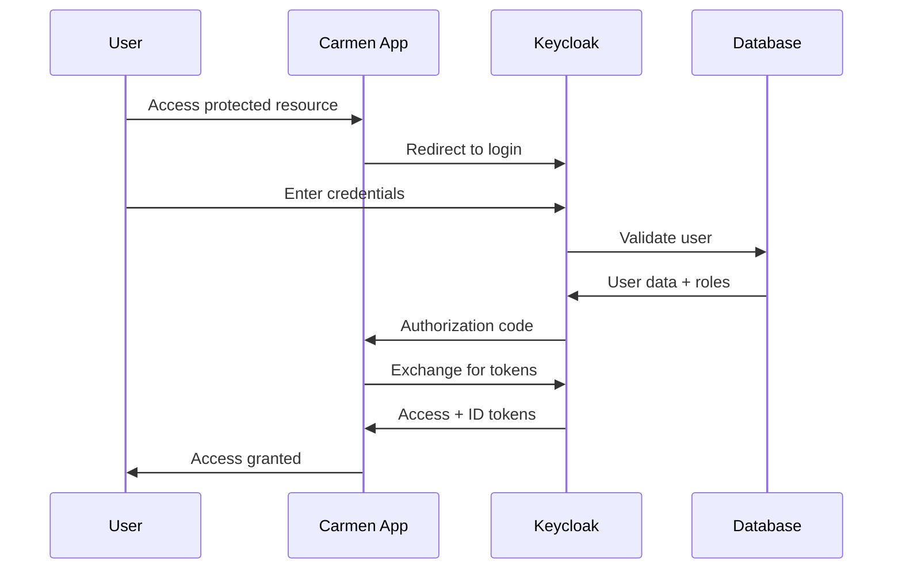
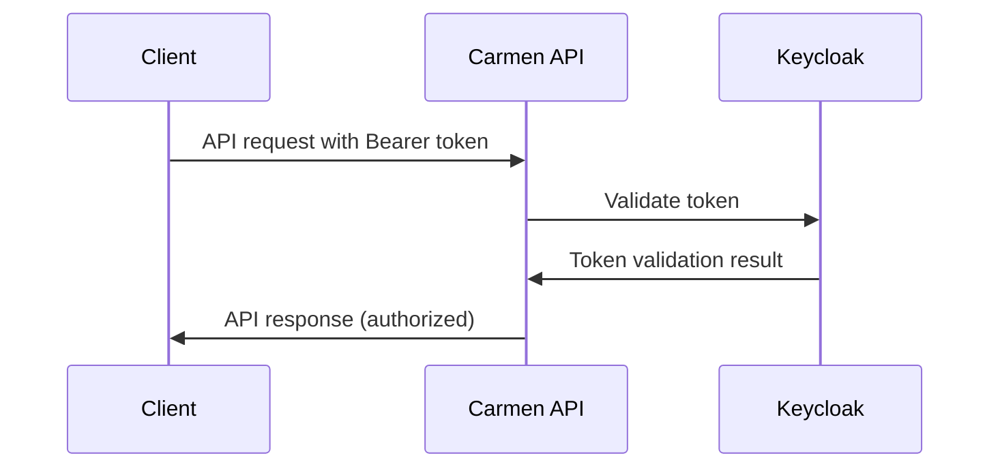

# Keycloak Integration for Carmen ERP

This directory contains the complete Keycloak authentication and authorization setup for Carmen ERP, providing enterprise-grade identity management with OIDC integration.

## 🏗️ Architecture Overview

Carmen ERP uses Keycloak as its primary identity provider, implementing:

- **OpenID Connect (OIDC)** authentication
- **Role-based access control (RBAC)** with Carmen-specific roles
- **Group-based organization** for departments and locations
- **Multi-environment support** (development, staging, production)
- **High availability** with clustering and backup strategies

## 📁 Directory Structure

```
keycloak/
├── realm-exports/                 # Keycloak realm configurations
│   ├── carmen-realm-config.json   # Main realm configuration
│   └── carmen-roles-groups.json   # Roles and groups definitions
├── clients/                       # OIDC client configurations
│   ├── development-client.json    # Development environment client
│   ├── staging-client.json        # Staging environment client
│   ├── production-client.json     # Production environment client
│   └── service-account-client.json # API service account
├── test-users/                    # Test user configurations
│   └── development-users.json     # Development test users
├── docker/                        # Docker deployment configurations
│   ├── docker-compose.development.yml
│   ├── docker-compose.production.yml
│   ├── .env.development
│   └── .env.production
├── scripts/                       # Automation and maintenance scripts
│   ├── setup-keycloak.sh         # Automated setup script
│   ├── backup.sh                 # Database backup script
│   └── health-check.sh           # Health monitoring script
├── tests/                         # Integration test suites
│   ├── auth-integration.test.ts   # Authentication flow tests
│   └── api-protection.test.ts     # API protection tests
└── docs/                          # Documentation
    └── DEPLOYMENT_GUIDE.md        # Complete deployment guide
```

## 🚀 Quick Start

### Development Environment

1. **Start Keycloak services:**
   ```bash
   cd keycloak/docker
   docker-compose -f docker-compose.development.yml up -d
   ```

2. **Initialize realm and users:**
   ```bash
   cd ../scripts
   ENVIRONMENT=development ./setup-keycloak.sh
   ```

3. **Access admin console:**
   - URL: http://localhost:8080/admin/
   - Username: admin
   - Password: admin123

4. **Test authentication:**
   ```bash
   cd ../tests
   npm run test:integration
   ```

### Production Deployment

See the comprehensive [Deployment Guide](docs/DEPLOYMENT_GUIDE.md) for production setup.

## 🔐 Authentication Flow

### 1. User Authentication


### 2. API Protection


## 👥 User Roles and Permissions

### Carmen ERP Roles

| Keycloak Role | Carmen Role | Description | Permissions |
|---------------|-------------|-------------|-------------|
| `carmen-super-admin` | `super-admin` | System Super Administrator | Full system access |
| `carmen-admin` | `admin` | System Administrator | System configuration, user management |
| `carmen-financial-manager` | `financial-manager` | Financial Manager | Financial oversight, unlimited approvals |
| `carmen-department-manager` | `department-manager` | Department Manager | Department oversight, limited approvals |
| `carmen-purchasing-staff` | `purchasing-staff` | Purchasing Staff | Procurement operations, vendor management |
| `carmen-chef` | `chef` | Chef | Kitchen operations, recipe management |
| `carmen-counter` | `counter` | Counter Staff | POS operations, inventory counting |
| `carmen-staff` | `staff` | General Staff | Basic system access |

### Group Hierarchy

- **Departments**
  - Administration
  - Procurement
  - Finance
  - Kitchen
  - Food & Beverage
  - Housekeeping

- **Locations**
  - Main Hotel
    - Main Kitchen
    - Hotel Restaurant
  - Central Warehouse
  - Administrative Office

- **Clearance Levels**
  - Public
  - Internal
  - Confidential
  - Restricted

## 🔧 Configuration

### Environment Variables

**Development:**
```bash
KEYCLOAK_URL=http://localhost:8080
KEYCLOAK_REALM=carmen
KEYCLOAK_CLIENT_ID=carmen-web-dev
KEYCLOAK_CLIENT_SECRET=dev-client-secret-change-in-production
```

**Production:**
```bash
KEYCLOAK_URL=https://auth.carmen-erp.com
KEYCLOAK_REALM=carmen
KEYCLOAK_CLIENT_ID=carmen-web-prod
KEYCLOAK_CLIENT_SECRET=production-client-secret-must-be-very-secure
```

### NextAuth.js Integration

Carmen ERP uses NextAuth.js for seamless OIDC integration:

```typescript
// lib/auth/next-auth.config.ts
export const authOptions: NextAuthOptions = {
  providers: [
    {
      id: 'keycloak',
      name: 'Keycloak',
      type: 'oauth',
      wellKnown: `${getKeycloakConfig().issuer}/.well-known/openid_configuration`,
      clientId: getKeycloakConfig().clientId,
      clientSecret: getKeycloakConfig().clientSecret,
      // ... additional configuration
    }
  ],
  // ... callbacks and session configuration
}
```

## 🧪 Testing

### Running Integration Tests

```bash
# Install dependencies
npm install

# Run authentication tests
npm run test:auth

# Run API protection tests  
npm run test:api

# Run all integration tests
npm run test:integration

# Run with coverage
npm run test:coverage
```

### Test Users (Development Only)

| Username | Password | Role | Department |
|----------|----------|------|------------|
| admin | admin123! | Admin | Administration |
| dept.manager | manager123! | Department Manager | Procurement |
| purchasing.staff | purchasing123! | Purchasing Staff | Procurement |
| head.chef | chef123! | Chef | Kitchen |
| counter.staff | counter123! | Counter | Food & Beverage |
| general.staff | staff123! | Staff | Housekeeping |

## 📊 Monitoring and Health Checks

### Health Endpoints

- **Keycloak Ready:** `http://localhost:8080/health/ready`
- **Keycloak Live:** `http://localhost:8080/health/live`
- **Realm Config:** `http://localhost:8080/realms/carmen/.well-known/openid_configuration`

### Automated Health Monitoring

```bash
# Run health checks
./scripts/health-check.sh

# Continuous monitoring (every 60 seconds)
./scripts/health-check.sh monitor

# Send alerts to webhook
WEBHOOK_URL=https://hooks.slack.com/... ./scripts/health-check.sh
```

### Metrics and Monitoring

Keycloak exposes metrics at `/metrics` endpoint for Prometheus integration:

- Authentication success/failure rates
- Token issuance metrics
- Session statistics
- Database connection metrics
- JVM performance metrics

## 🔄 Backup and Recovery

### Automated Backups

```bash
# Daily automated backup
./scripts/backup.sh

# Backup with S3 upload
BACKUP_S3_BUCKET=carmen-backups ./scripts/backup.sh

# Restore from backup
./scripts/restore-keycloak.sh /path/to/backup.sql
```

### Backup Strategy

- **Database backups:** Daily at 2 AM UTC
- **Configuration backups:** Weekly
- **Retention:** 30 days local, 365 days in S3
- **Recovery time objective (RTO):** < 30 minutes
- **Recovery point objective (RPO):** < 24 hours

## 🔒 Security Considerations

### Production Security Checklist

- [ ] SSL/TLS certificates configured and auto-renewal setup
- [ ] Strong passwords for all service accounts
- [ ] Database connections encrypted
- [ ] Rate limiting enabled (100 requests/minute)
- [ ] Brute force protection enabled
- [ ] Security headers configured
- [ ] Regular security updates scheduled
- [ ] Audit logging enabled and monitored
- [ ] Access logs configured for compliance
- [ ] Network segmentation implemented

### Security Features

- **Password Policy:** 8+ characters, mixed case, numbers, special characters
- **Session Management:** 24-hour access tokens, refresh token rotation
- **Brute Force Protection:** Account lockout after 5 failed attempts
- **Rate Limiting:** 100 requests per minute per IP
- **Audit Logging:** All authentication events logged
- **CORS Configuration:** Restricted to authorized origins

## 🚨 Troubleshooting

### Common Issues

**Keycloak won't start:**
```bash
# Check database connectivity
docker-compose exec keycloak-db pg_isready -U keycloak

# Check logs for errors
docker-compose logs keycloak

# Verify environment variables
docker-compose config
```

**Authentication failures:**
```bash
# Enable debug logging
KC_LOG_LEVEL=DEBUG docker-compose up keycloak

# Check token validation
curl -H "Authorization: Bearer $TOKEN" \
  http://localhost:8080/realms/carmen/protocol/openid-connect/userinfo
```

**Database connection issues:**
```bash
# Test database connection
psql -h localhost -p 5433 -U keycloak -d keycloak

# Check connection pool status
docker-compose exec keycloak /opt/keycloak/bin/kc.sh show-config
```

### Support

For issues and support:
1. Check the [troubleshooting section](docs/DEPLOYMENT_GUIDE.md#troubleshooting) in the deployment guide
2. Review application logs: `docker-compose logs`
3. Run health checks: `./scripts/health-check.sh`
4. Contact the development team

## 📚 Additional Resources

- [Keycloak Documentation](https://www.keycloak.org/documentation)
- [NextAuth.js Keycloak Provider](https://next-auth.js.org/providers/keycloak)
- [Carmen ERP Authentication Guide](../docs/authentication.md)
- [API Protection Middleware](../lib/auth/README.md)

## 🤝 Contributing

When contributing to the Keycloak configuration:

1. Test changes in development environment first
2. Update relevant documentation
3. Add appropriate test cases
4. Follow security best practices
5. Update version information

## 📄 License

This Keycloak configuration is part of the Carmen ERP project and follows the same licensing terms.