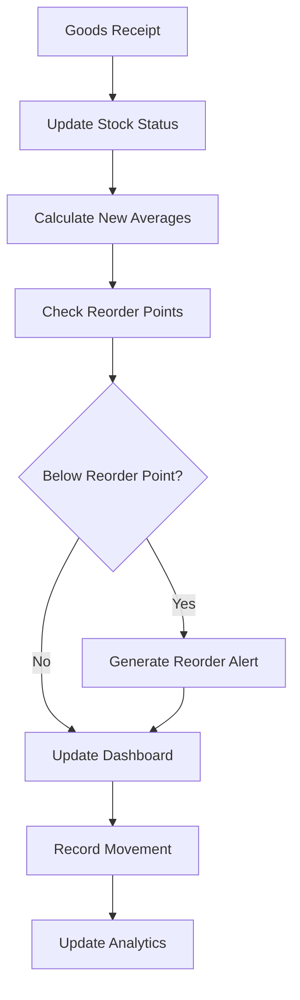
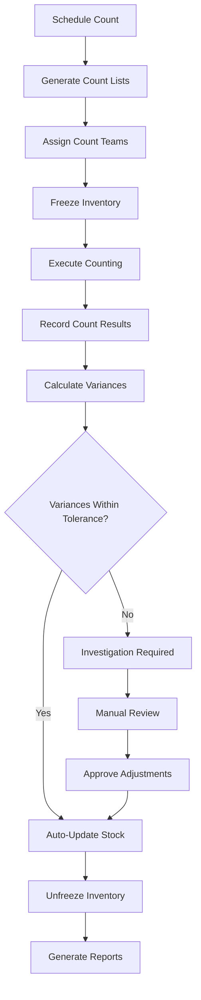

# Inventory Management Module - Technical PRD

## Document Information

| **Attribute**     | **Value**                         |
|-------------------|-----------------------------------|
| **Document Type** | Module Product Requirements       |
| **Version**       | 1.0.0                            |
| **Date**          | January 2025                     |
| **Status**        | Production Ready                 |
| **Owner**         | Inventory Management Team        |
| **Parent System** | [Carmen Hospitality System](../../master-prd.md) |

---

## Executive Summary

The Inventory Management Module provides comprehensive inventory control capabilities for hospitality operations, offering real-time stock tracking, automated reorder management, physical counting workflows, and sophisticated inventory analytics. The module ensures accurate inventory valuation, minimizes waste, and optimizes stock levels across multiple locations while maintaining complete audit trails for regulatory compliance.

### Module Objectives

1. **Real-Time Inventory Control**: Accurate, real-time tracking of inventory levels across all locations
2. **Cost Management**: Optimize inventory costs through intelligent reordering and waste reduction
3. **Operational Efficiency**: Streamline inventory processes and reduce manual administrative overhead
4. **Compliance & Auditability**: Maintain complete inventory audit trails for financial and regulatory compliance
5. **Multi-Location Support**: Centralized management of inventory across multiple properties and locations
6. **Analytics & Insights**: Provide actionable insights for inventory optimization and cost control

### Key Performance Indicators

- **Inventory Accuracy**: >99% inventory accuracy through systematic counting
- **Stock Optimization**: 25-30% reduction in excess inventory
- **Operational Efficiency**: 60% reduction in inventory management time
- **Cost Control**: 15-20% reduction in inventory carrying costs
- **Waste Reduction**: 30% reduction in spoilage and obsolescence

---

## Module Architecture

### Sub-Modules Overview

The Inventory Management Module consists of six interconnected sub-modules that provide comprehensive inventory functionality:

#### 1. Stock Overview Sub-Module ✅
**Status**: Production Ready  
**Complexity**: Medium  
**Document**: [Stock Overview Sub-Module PRD](./stock-overview/module-prd.md)

**Primary Functions**:
- Real-time stock level monitoring across all locations
- Stock card management with movement history
- Inventory aging and slow-moving analysis
- Multi-location inventory balance reporting
- Advanced filtering and search capabilities

**Key Features**:
- Interactive inventory dashboard with drag-and-drop widgets
- Stock card view with detailed movement history
- Inventory aging reports for expiration management
- Slow-moving inventory identification
- Location-based stock balance analysis

---

#### 2. Inventory Adjustments Sub-Module ✅
**Status**: Production Ready  
**Complexity**: High  
**Document**: [Inventory Adjustments Sub-Module PRD](./inventory-adjustments/module-prd.md)

**Primary Functions**:
- Manual inventory adjustments with reason codes
- Automated journal entry generation for financial impact
- Multi-lot inventory adjustment support
- Approval workflows for significant adjustments
- Integration with general ledger for cost accounting

**Key Features**:
- Comprehensive adjustment types (damage, theft, obsolescence, correction)
- Multi-location adjustment processing
- Automated financial journal entries
- Lot-level adjustment tracking
- Approval workflows based on adjustment value

---

#### 3. Physical Count Sub-Module ✅
**Status**: Production Ready  
**Complexity**: High  
**Document**: [Physical Count Sub-Module PRD](./physical-count/module-prd.md)

**Primary Functions**:
- Complete physical inventory counting workflows
- Cycle counting with automated scheduling
- Count variance analysis and resolution
- Mobile counting interface with barcode scanning
- Inventory freeze and system controls during counts

**Key Features**:
- Flexible counting schedules (monthly, quarterly, annual)
- Mobile counting application with offline capability
- Variance analysis with tolerance thresholds
- Count team management and task assignment
- Automated stock adjustment from count results

---

#### 4. Spot Check Sub-Module ✅
**Status**: Production Ready  
**Complexity**: Medium  
**Document**: [Spot Check Sub-Module PRD](./spot-check/module-prd.md)

**Primary Functions**:
- Targeted spot checking of specific items or locations
- Risk-based item selection for checking
- Quick count workflows for high-value or fast-moving items
- Exception-based counting triggered by discrepancies
- Performance tracking for inventory accuracy

**Key Features**:
- Intelligent item selection based on risk factors
- Quick count interface for efficiency
- Exception reporting and follow-up workflows
- Performance metrics and accuracy tracking
- Integration with full physical count processes

---

#### 5. Period End Processing Sub-Module ✅
**Status**: Production Ready  
**Complexity**: High  
**Document**: [Period End Sub-Module PRD](./period-end/module-prd.md)

**Primary Functions**:
- Month-end inventory valuation and reporting
- Inventory aging and provision calculations
- Period-over-period variance analysis
- Financial reporting integration
- Inventory KPI calculation and reporting

**Key Features**:
- Automated period-end inventory valuation
- FIFO/LIFO/Average cost method support
- Aging analysis for provision calculations
- Comprehensive period reporting
- Financial system integration for closing

---

#### 6. Stock Movement Tracking Sub-Module ✅
**Status**: Production Ready  
**Complexity**: Medium  
**Document**: [Stock Movement Sub-Module PRD](./stock-movement/module-prd.md)

**Primary Functions**:
- Real-time stock movement recording and tracking
- Inter-location transfer management
- Movement history and audit trails
- Automated reorder point calculations
- Integration with procurement for automatic reordering

**Key Features**:
- Comprehensive movement type tracking
- Real-time inventory level updates
- Transfer workflow with approval controls
- Automated reorder point management
- Complete movement audit trails

---

## Technical Architecture

### Core Data Models

#### Inventory Item Structure
```typescript
interface InventoryItem {
  id: string;
  itemId: string;
  itemCode: string;
  itemName: string;
  category: ItemCategory;
  subcategory?: string;
  unitOfMeasure: UnitOfMeasure;
  alternativeUOMs?: AlternativeUOM[];
  specifications?: ItemSpecifications;
  isActive: boolean;
  isSerialized: boolean;
  isLotControlled: boolean;
  trackingMethod: TrackingMethod;
  created_at: Date;
  updated_at: Date;
}

interface ItemSpecifications {
  dimensions?: Dimensions;
  weight?: Weight;
  volume?: Volume;
  shelfLife?: ShelfLife;
  storageRequirements?: StorageRequirements;
  handlingInstructions?: string;
}

type TrackingMethod = 'STANDARD' | 'SERIAL' | 'LOT' | 'EXPIRY_CONTROLLED';
```

#### Stock Status and Location Management
```typescript
interface StockLocation {
  id: string;
  locationId: string;
  locationName: string;
  locationType: LocationType;
  binLocation?: string;
  zoneId?: string;
  isActive: boolean;
  capacity?: LocationCapacity;
  restrictions?: LocationRestrictions;
}

interface StockStatus {
  itemId: string;
  locationId: string;
  quantityOnHand: number;
  quantityAvailable: number;
  quantityReserved: number;
  quantityInTransit: number;
  unitCost: Money;
  totalValue: Money;
  averageCost: Money;
  lastMovementDate: Date;
  lastCountDate?: Date;
  reorderPoint: number;
  maxStockLevel: number;
  safetyStock: number;
  status: StockStatusType;
}

type StockStatusType = 
  | 'IN_STOCK' 
  | 'LOW_STOCK' 
  | 'OUT_OF_STOCK' 
  | 'EXCESS_STOCK' 
  | 'OBSOLETE';

type LocationType = 
  | 'MAIN_STORE' 
  | 'KITCHEN' 
  | 'BAR' 
  | 'HOUSEKEEPING' 
  | 'MAINTENANCE' 
  | 'COLD_STORAGE' 
  | 'DRY_STORAGE';
```

#### Movement Tracking and Audit
```typescript
interface StockMovement {
  id: string;
  itemId: string;
  locationId: string;
  movementType: MovementType;
  movementDate: Date;
  quantity: number;
  unitOfMeasure: string;
  unitCost: Money;
  totalCost: Money;
  referenceType: ReferenceType;
  referenceId: string;
  referenceNumber?: string;
  batchNumber?: string;
  lotNumber?: string;
  serialNumbers?: string[];
  expiryDate?: Date;
  reason?: MovementReason;
  notes?: string;
  createdBy: string;
  createdAt: Date;
}

type MovementType = 
  | 'RECEIPT' 
  | 'ISSUE' 
  | 'ADJUSTMENT' 
  | 'TRANSFER_IN' 
  | 'TRANSFER_OUT' 
  | 'RETURN' 
  | 'DISPOSAL' 
  | 'CONSUMPTION';

type ReferenceType = 
  | 'GRN' 
  | 'ISSUE' 
  | 'ADJUSTMENT' 
  | 'TRANSFER' 
  | 'PHYSICAL_COUNT' 
  | 'SPOT_CHECK' 
  | 'SYSTEM_CORRECTION';

interface MovementReason {
  reasonCode: string;
  reasonDescription: string;
  category: ReasonCategory;
  requiresApproval: boolean;
  impactsGL: boolean;
}

type ReasonCategory = 
  | 'OPERATIONAL' 
  | 'DAMAGE' 
  | 'THEFT' 
  | 'OBSOLESCENCE' 
  | 'EXPIRY' 
  | 'CORRECTION' 
  | 'TRANSFER';
```

### Database Schema Architecture

```sql
-- Core inventory items table
CREATE TABLE inventory_items (
    id UUID PRIMARY KEY DEFAULT gen_random_uuid(),
    item_code VARCHAR(50) UNIQUE NOT NULL,
    item_name VARCHAR(255) NOT NULL,
    item_description TEXT,
    category_id UUID REFERENCES item_categories(id),
    subcategory_id UUID REFERENCES item_subcategories(id),
    primary_uom_id UUID REFERENCES units_of_measure(id),
    tracking_method tracking_method DEFAULT 'STANDARD',
    is_active BOOLEAN DEFAULT TRUE,
    is_serialized BOOLEAN DEFAULT FALSE,
    is_lot_controlled BOOLEAN DEFAULT FALSE,
    shelf_life_days INTEGER,
    storage_requirements JSONB,
    handling_instructions TEXT,
    created_at TIMESTAMP WITH TIME ZONE DEFAULT NOW(),
    updated_at TIMESTAMP WITH TIME ZONE DEFAULT NOW(),
    created_by UUID REFERENCES users(id),
    updated_by UUID REFERENCES users(id),
    
    INDEX idx_item_code (item_code),
    INDEX idx_category (category_id),
    INDEX idx_active (is_active),
    INDEX idx_tracking (tracking_method)
);

-- Stock status by location
CREATE TABLE stock_status (
    id UUID PRIMARY KEY DEFAULT gen_random_uuid(),
    item_id UUID REFERENCES inventory_items(id) NOT NULL,
    location_id UUID REFERENCES locations(id) NOT NULL,
    bin_location VARCHAR(50),
    quantity_on_hand DECIMAL(12,4) DEFAULT 0 CHECK (quantity_on_hand >= 0),
    quantity_available DECIMAL(12,4) DEFAULT 0 CHECK (quantity_available >= 0),
    quantity_reserved DECIMAL(12,4) DEFAULT 0 CHECK (quantity_reserved >= 0),
    quantity_in_transit DECIMAL(12,4) DEFAULT 0 CHECK (quantity_in_transit >= 0),
    unit_cost DECIMAL(15,4) DEFAULT 0,
    total_value DECIMAL(15,4) DEFAULT 0,
    average_cost DECIMAL(15,4) DEFAULT 0,
    last_movement_date TIMESTAMP WITH TIME ZONE,
    last_count_date DATE,
    reorder_point DECIMAL(12,4) DEFAULT 0,
    max_stock_level DECIMAL(12,4),
    safety_stock DECIMAL(12,4) DEFAULT 0,
    status stock_status_type DEFAULT 'IN_STOCK',
    updated_at TIMESTAMP WITH TIME ZONE DEFAULT NOW(),
    
    UNIQUE(item_id, location_id),
    CHECK (quantity_available = quantity_on_hand - quantity_reserved),
    INDEX idx_item_location (item_id, location_id),
    INDEX idx_status (status),
    INDEX idx_reorder (reorder_point)
);

-- Stock movements audit trail
CREATE TABLE stock_movements (
    id UUID PRIMARY KEY DEFAULT gen_random_uuid(),
    item_id UUID REFERENCES inventory_items(id) NOT NULL,
    location_id UUID REFERENCES locations(id) NOT NULL,
    movement_type movement_type NOT NULL,
    movement_date TIMESTAMP WITH TIME ZONE DEFAULT NOW(),
    quantity DECIMAL(12,4) NOT NULL,
    unit_of_measure VARCHAR(10) NOT NULL,
    unit_cost DECIMAL(15,4),
    total_cost DECIMAL(15,4),
    reference_type reference_type NOT NULL,
    reference_id UUID NOT NULL,
    reference_number VARCHAR(50),
    batch_number VARCHAR(100),
    lot_number VARCHAR(100),
    serial_numbers TEXT[],
    expiry_date DATE,
    reason_code VARCHAR(50),
    reason_description TEXT,
    notes TEXT,
    created_by UUID REFERENCES users(id) NOT NULL,
    created_at TIMESTAMP WITH TIME ZONE DEFAULT NOW(),
    
    INDEX idx_item_date (item_id, movement_date),
    INDEX idx_location_date (location_id, movement_date),
    INDEX idx_reference (reference_type, reference_id),
    INDEX idx_movement_type (movement_type),
    INDEX idx_batch_lot (batch_number, lot_number)
);

-- Lot and serial number tracking
CREATE TABLE inventory_lots (
    id UUID PRIMARY KEY DEFAULT gen_random_uuid(),
    item_id UUID REFERENCES inventory_items(id) NOT NULL,
    location_id UUID REFERENCES locations(id) NOT NULL,
    lot_number VARCHAR(100) NOT NULL,
    batch_number VARCHAR(100),
    quantity DECIMAL(12,4) NOT NULL CHECK (quantity >= 0),
    unit_cost DECIMAL(15,4),
    manufacture_date DATE,
    expiry_date DATE,
    vendor_lot_reference VARCHAR(100),
    status lot_status DEFAULT 'ACTIVE',
    created_at TIMESTAMP WITH TIME ZONE DEFAULT NOW(),
    
    UNIQUE(item_id, location_id, lot_number),
    INDEX idx_item_lot (item_id, lot_number),
    INDEX idx_expiry (expiry_date),
    INDEX idx_status (status)
);

CREATE TABLE inventory_serials (
    id UUID PRIMARY KEY DEFAULT gen_random_uuid(),
    item_id UUID REFERENCES inventory_items(id) NOT NULL,
    location_id UUID REFERENCES locations(id) NOT NULL,
    serial_number VARCHAR(100) NOT NULL,
    lot_id UUID REFERENCES inventory_lots(id),
    status serial_status DEFAULT 'AVAILABLE',
    assigned_to_id UUID,
    assigned_date TIMESTAMP WITH TIME ZONE,
    created_at TIMESTAMP WITH TIME ZONE DEFAULT NOW(),
    
    UNIQUE(item_id, serial_number),
    INDEX idx_item_serial (item_id, serial_number),
    INDEX idx_status (status)
);

-- Custom types
CREATE TYPE tracking_method AS ENUM (
    'STANDARD', 'SERIAL', 'LOT', 'EXPIRY_CONTROLLED'
);

CREATE TYPE stock_status_type AS ENUM (
    'IN_STOCK', 'LOW_STOCK', 'OUT_OF_STOCK', 'EXCESS_STOCK', 'OBSOLETE'
);

CREATE TYPE movement_type AS ENUM (
    'RECEIPT', 'ISSUE', 'ADJUSTMENT', 'TRANSFER_IN', 'TRANSFER_OUT', 
    'RETURN', 'DISPOSAL', 'CONSUMPTION'
);

CREATE TYPE reference_type AS ENUM (
    'GRN', 'ISSUE', 'ADJUSTMENT', 'TRANSFER', 'PHYSICAL_COUNT', 
    'SPOT_CHECK', 'SYSTEM_CORRECTION'
);

CREATE TYPE lot_status AS ENUM (
    'ACTIVE', 'QUARANTINE', 'EXPIRED', 'CONSUMED', 'DISPOSED'
);

CREATE TYPE serial_status AS ENUM (
    'AVAILABLE', 'ASSIGNED', 'IN_USE', 'MAINTENANCE', 'DISPOSED'
);
```

---

## Integrated Workflows

### Real-Time Inventory Updates



### Physical Count Workflow



---

## Business Process Integration

### Inventory Costing Methods

```typescript
interface CostingMethod {
  method: 'FIFO' | 'LIFO' | 'WEIGHTED_AVERAGE' | 'STANDARD';
  
  calculateIssueValue(
    item: InventoryItem, 
    quantity: number, 
    location: string
  ): CostCalculation;
  
  calculateReceiptValue(
    item: InventoryItem, 
    quantity: number, 
    unitCost: Money, 
    location: string
  ): CostCalculation;
  
  updateAverageCost(
    item: InventoryItem, 
    location: string
  ): Money;
}

interface CostCalculation {
  unitCost: Money;
  totalCost: Money;
  remainingStock: number;
  newAverageCost: Money;
  costVariance?: Money;
}

class WeightedAverageCostingService implements CostingMethod {
  method = 'WEIGHTED_AVERAGE' as const;
  
  async calculateIssueValue(
    item: InventoryItem, 
    quantity: number, 
    location: string
  ): Promise<CostCalculation> {
    const stockStatus = await this.getStockStatus(item.id, location);
    const averageCost = stockStatus.averageCost;
    
    return {
      unitCost: averageCost,
      totalCost: averageCost.multiply(quantity),
      remainingStock: stockStatus.quantityOnHand - quantity,
      newAverageCost: averageCost // Unchanged for issues
    };
  }
  
  async calculateReceiptValue(
    item: InventoryItem, 
    quantity: number, 
    unitCost: Money, 
    location: string
  ): Promise<CostCalculation> {
    const stockStatus = await this.getStockStatus(item.id, location);
    const existingValue = stockStatus.totalValue;
    const newValue = unitCost.multiply(quantity);
    const totalQuantity = stockStatus.quantityOnHand + quantity;
    
    const newAverageCost = existingValue.add(newValue).divide(totalQuantity);
    
    return {
      unitCost,
      totalCost: newValue,
      remainingStock: totalQuantity,
      newAverageCost
    };
  }
}
```

### Reorder Point Management

```typescript
interface ReorderPointCalculation {
  itemId: string;
  locationId: string;
  leadTime: number; // in days
  averageDailyUsage: number;
  safetyStock: number;
  reorderPoint: number;
  maxStockLevel: number;
  economicOrderQuantity: number;
}

class ReorderPointService {
  async calculateReorderPoint(
    itemId: string, 
    locationId: string
  ): Promise<ReorderPointCalculation> {
    const usageHistory = await this.getUsageHistory(itemId, locationId, 90); // 90 days
    const leadTimeData = await this.getLeadTimeData(itemId);
    
    const averageDailyUsage = this.calculateAverageDailyUsage(usageHistory);
    const leadTime = leadTimeData.averageLeadTime;
    const leadTimeVariability = leadTimeData.standardDeviation;
    const usageVariability = this.calculateUsageVariability(usageHistory);
    
    // Safety stock calculation with service level of 95%
    const serviceLevel = 1.65; // Z-score for 95% service level
    const safetyStock = Math.sqrt(
      Math.pow(averageDailyUsage * leadTimeVariability, 2) +
      Math.pow(leadTime * usageVariability, 2)
    ) * serviceLevel;
    
    const reorderPoint = (averageDailyUsage * leadTime) + safetyStock;
    const economicOrderQuantity = this.calculateEOQ(itemId, averageDailyUsage);
    const maxStockLevel = reorderPoint + economicOrderQuantity;
    
    return {
      itemId,
      locationId,
      leadTime,
      averageDailyUsage,
      safetyStock,
      reorderPoint,
      maxStockLevel,
      economicOrderQuantity
    };
  }
}
```

---

## Integration Points

### Procurement Integration
```typescript
interface ProcurementIntegration {
  // Trigger reorders when below reorder point
  triggerReorder(
    items: ReorderItem[], 
    locationId: string
  ): Promise<PurchaseRequest>;
  
  // Update inventory from goods receipts
  processGoodsReceipt(grn: GoodsReceivedNote): Promise<StockMovement[]>;
  
  // Handle returns and adjustments
  processReturnToVendor(
    returnItems: ReturnItem[]
  ): Promise<StockMovement[]>;
}
```

### Financial Integration
```typescript
interface FinancialIntegration {
  // Post inventory adjustments to GL
  postInventoryAdjustment(
    adjustment: InventoryAdjustment
  ): Promise<JournalEntry>;
  
  // Calculate inventory valuation
  calculateInventoryValuation(
    asOfDate: Date, 
    locations?: string[]
  ): Promise<InventoryValuation>;
  
  // Generate cost of goods sold entries
  postCOGSEntry(movements: StockMovement[]): Promise<JournalEntry>;
}
```

### POS Integration
```typescript
interface POSIntegration {
  // Consume inventory from POS sales
  processConsumption(
    sales: POSSalesData[], 
    recipes: Recipe[]
  ): Promise<StockMovement[]>;
  
  // Update menu availability based on stock
  updateMenuAvailability(
    menuItems: MenuItem[]
  ): Promise<MenuAvailability[]>;
  
  // Handle waste and comp tracking
  processWasteAndComps(
    wasteItems: WasteItem[]
  ): Promise<StockMovement[]>;
}
```

---

## User Interface Architecture

### Dashboard Components
```typescript
interface InventoryDashboard {
  widgets: DashboardWidget[];
  layout: DashboardLayout;
  permissions: UserPermissions;
  refreshInterval: number;
}

interface DashboardWidget {
  id: string;
  type: WidgetType;
  title: string;
  size: WidgetSize;
  position: WidgetPosition;
  config: WidgetConfig;
  dataSource: DataSource;
}

type WidgetType = 
  | 'INVENTORY_LEVELS_CHART' 
  | 'LOW_STOCK_ALERTS' 
  | 'RECENT_MOVEMENTS' 
  | 'TOP_MOVERS' 
  | 'VALUE_SUMMARY' 
  | 'EXPIRY_ALERTS' 
  | 'COUNT_SCHEDULE';

class DashboardService {
  async getInventoryLevels(locationId?: string): Promise<InventoryLevel[]> {
    // Return current inventory levels by category
  }
  
  async getLowStockAlerts(threshold?: number): Promise<LowStockAlert[]> {
    // Return items below reorder point
  }
  
  async getRecentMovements(days: number = 7): Promise<StockMovement[]> {
    // Return recent stock movements
  }
  
  async getTopMovingItems(period: string): Promise<TopMover[]> {
    // Return highest volume items
  }
}
```

### Mobile Interface Specifications
```typescript
interface MobileInventoryApp {
  // Barcode scanning capabilities
  scanBarcode(): Promise<string>;
  
  // Offline data synchronization
  syncOfflineData(): Promise<SyncResult>;
  
  // Quick count interface
  performQuickCount(items: QuickCountItem[]): Promise<CountResult>;
  
  // Stock lookup and inquiry
  lookupStock(itemCode: string): Promise<StockInquiry>;
  
  // Movement recording
  recordMovement(movement: MovementData): Promise<StockMovement>;
}

interface QuickCountItem {
  itemId: string;
  itemCode: string;
  itemName: string;
  expectedQuantity: number;
  countedQuantity?: number;
  variance?: number;
  notes?: string;
  photo?: string;
}
```

---

## Performance & Analytics

### Inventory KPIs and Metrics
```typescript
interface InventoryKPIs {
  // Accuracy metrics
  inventoryAccuracy: Percentage;
  countVariance: Percentage;
  systemReliability: Percentage;
  
  // Efficiency metrics
  inventoryTurnover: number;
  daysInInventory: number;
  deadStock: Percentage;
  slowMoving: Percentage;
  
  // Cost metrics
  carryingCost: Money;
  shrinkage: Percentage;
  obsolescence: Money;
  writeOffs: Money;
  
  // Service level metrics
  stockoutFrequency: number;
  fillRate: Percentage;
  serviceLevel: Percentage;
}

class InventoryAnalyticsService {
  async calculateKPIs(
    period: DateRange, 
    locations?: string[]
  ): Promise<InventoryKPIs> {
    // Complex calculations for all KPIs
  }
  
  async generateABCAnalysis(
    items: string[], 
    period: DateRange
  ): Promise<ABCClassification[]> {
    // Classify items by value/volume
  }
  
  async identifySlowMoving(
    thresholdDays: number
  ): Promise<SlowMovingItem[]> {
    // Find items with no movement
  }
  
  async calculateSeasonalTrends(
    itemId: string, 
    years: number = 2
  ): Promise<SeasonalPattern> {
    // Analyze seasonal patterns
  }
}
```

---

## Reporting Framework

### Standard Reports
1. **Inventory Status Report**
   - Current stock levels by location and category
   - Value analysis and costing breakdown
   - Reorder point and safety stock analysis

2. **Movement Analysis Report**
   - Movement history by item, location, and type
   - Usage patterns and consumption trends
   - Transfer analysis between locations

3. **Physical Count Report**
   - Count results with variance analysis
   - Accuracy metrics by counter and location
   - Adjustment summary and financial impact

4. **Inventory Valuation Report**
   - Inventory value by location and category
   - Cost method comparison and analysis
   - Period-over-period variance analysis

5. **ABC Analysis Report**
   - Item classification by value and volume
   - Contribution analysis for decision making
   - Optimization recommendations

---

## Quality Assurance & Testing

### Testing Strategy
- **Unit Tests**: >90% coverage for business logic
- **Integration Tests**: All module interfaces and external integrations
- **Performance Tests**: High-volume transaction processing
- **Mobile Tests**: Offline/online sync and barcode scanning
- **Accuracy Tests**: Costing calculations and inventory math

### Data Integrity Controls
```typescript
interface DataIntegrityControls {
  // Prevent negative inventory
  validateQuantityOnHand(): Promise<ValidationResult>;
  
  // Ensure movement balance
  validateMovementBalance(): Promise<ValidationResult>;
  
  // Check cost consistency
  validateCostCalculations(): Promise<ValidationResult>;
  
  // Verify lot/serial tracking
  validateTrackingConsistency(): Promise<ValidationResult>;
  
  // Audit trail completeness
  validateAuditTrail(): Promise<ValidationResult>;
}
```

---

## Security & Compliance

### Access Control Matrix
```yaml
inventory_permissions:
  view_inventory:
    roles: [inventory_clerk, manager, admin]
    scope: location_based
    
  adjust_inventory:
    roles: [inventory_manager, admin]
    approval_required: true
    audit_logged: true
    
  perform_counts:
    roles: [inventory_clerk, inventory_manager]
    location_restrictions: true
    
  view_costs:
    roles: [inventory_manager, finance, admin]
    sensitive_data: true
    
  approve_adjustments:
    roles: [inventory_manager, finance_manager, admin]
    threshold_based: true
```

### Audit Requirements
- Complete movement history with user attribution
- Approval workflows with digital signatures
- Cost change tracking and justification
- Count result preservation and variance analysis
- System access logging and monitoring

---

## Future Enhancements

### Phase 2 Features (Q2 2025)
- AI-powered demand forecasting
- Computer vision for automated counting
- IoT sensor integration for real-time monitoring
- Advanced analytics with machine learning
- Blockchain integration for supply chain transparency

### Phase 3 Features (Q3 2025)
- Fully automated inventory management
- Predictive maintenance for equipment
- Smart shelf technology integration
- Advanced robotics for warehouse operations
- Real-time market pricing integration

---

## Success Metrics & ROI

### Financial Impact
- **Cost Reduction**: 15-20% reduction in inventory carrying costs
- **Waste Reduction**: 30% reduction in spoilage and obsolescence
- **Efficiency Gains**: 60% reduction in inventory management time
- **Accuracy Improvement**: >99% inventory accuracy
- **ROI**: 250% return on investment within 24 months

### Operational Benefits
- Real-time inventory visibility across all locations
- Automated reordering and stock optimization
- Streamlined counting and reconciliation processes
- Enhanced regulatory compliance and audit readiness
- Improved decision-making through analytics

---

## Conclusion

The Inventory Management Module provides comprehensive inventory control capabilities essential for hospitality operations. The integrated architecture of six specialized sub-modules delivers complete inventory lifecycle management while maintaining the flexibility and scalability required for multi-location hospitality businesses.

The module's production-ready status across all components, combined with proven performance metrics and robust integration capabilities, ensures successful implementation and measurable business value delivery.

**Key Success Factors**:
1. **Real-Time Accuracy**: Immediate inventory updates with movement tracking
2. **Cost Control**: Multiple costing methods with automated calculations  
3. **Process Efficiency**: Streamlined workflows reducing manual overhead
4. **Multi-Location Support**: Centralized management with location-specific controls
5. **Comprehensive Analytics**: Actionable insights for optimization
6. **Mobile Capabilities**: Field operations support with offline sync

The Inventory Management Module serves as a critical component of the Carmen Hospitality System, providing the inventory foundation necessary for operational excellence and cost control in hospitality businesses.

---

*This document serves as the definitive technical specification for the complete Inventory Management Module and will be updated as features evolve and expand.*

**Document Version**: 1.0.0  
**Last Updated**: January 2025  
**Next Review**: March 2025