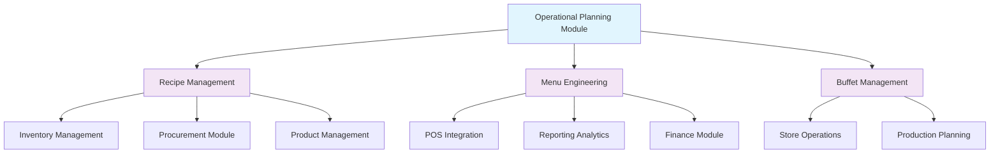

# Operational Planning Module - Technical PRD

## Document Information

| **Attribute**     | **Value**                         |
|-------------------|-----------------------------------|
| **Document Type** | Module Product Requirements       |
| **Version**       | 1.0.0                            |
| **Date**          | January 2025                     |
| **Status**        | Production Ready                 |
| **Owner**         | Operations Planning Team         |
| **Module Code**   | OPPLAN                           |
| **Parent System** | [Carmen Hospitality System](../../README.md) |

---

## Executive Summary

The Operational Planning Module is the strategic heart of the Carmen Hospitality System, providing comprehensive capabilities for recipe management, menu engineering, and buffet planning. This module enables foodservice operations to optimize menu performance, control food costs, manage nutritional requirements, and maintain operational efficiency through data-driven decision making.

### Key Objectives

1. **Recipe Management**: Maintain standardized recipes with cost control and nutritional analysis
2. **Menu Engineering**: Optimize menu performance through data-driven analysis and profitability insights
3. **Buffet Management**: Plan and execute efficient buffet operations with yield management
4. **Cost Control**: Monitor and optimize food costs through detailed recipe costing
5. **Nutritional Compliance**: Ensure menu items meet dietary requirements and regulations
6. **Operational Efficiency**: Streamline kitchen operations through standardized procedures

---

## Module Architecture Overview

### Core Components

The Operational Planning Module consists of three integrated sub-modules:

1. **[Recipe Management](./recipe-management/module-prd.md)** - Comprehensive recipe lifecycle management
2. **[Menu Engineering](./menu-engineering/module-prd.md)** - Data-driven menu optimization and analysis
3. **[Buffet Management](./buffet-management/module-prd.md)** - Buffet planning and execution management

### System Integration



---

## Business Requirements

### High-Level Functional Requirements

#### OP-001: Recipe Standardization and Management
**Priority**: Critical  
**Complexity**: High

**User Story**: As a head chef, I want to maintain standardized recipes with accurate costing and nutritional information, so that I can ensure consistency, control costs, and meet dietary requirements across all menu items.

**Acceptance Criteria**:
- ✅ Complete recipe lifecycle management from creation to retirement
- ✅ Ingredient-level costing with real-time cost updates
- ✅ Nutritional analysis and allergen tracking
- ✅ Recipe versioning and approval workflows
- ✅ Yield calculations and portion cost analysis
- ✅ Integration with inventory and procurement systems

---

#### OP-002: Menu Performance Analysis
**Priority**: High  
**Complexity**: Medium

**User Story**: As a restaurant manager, I want to analyze menu item performance and profitability, so that I can optimize the menu mix and maximize revenue.

**Acceptance Criteria**:
- ✅ Menu engineering analysis with performance categories
- ✅ Profitability analysis by item, category, and location
- ✅ Sales mix analysis and trend identification
- ✅ ABC analysis for menu optimization
- ✅ Pricing strategy recommendations
- ✅ Competitive analysis and market positioning

---

#### OP-003: Buffet Operations Management
**Priority**: Medium  
**Complexity**: Medium

**User Story**: As a buffet manager, I want to plan and execute buffet operations efficiently, so that I can minimize waste, maintain food quality, and optimize guest satisfaction.

**Acceptance Criteria**:
- ✅ Buffet menu planning with capacity management
- ✅ Production forecasting based on historical data
- ✅ Real-time monitoring of buffet levels
- ✅ Waste tracking and cost analysis
- ✅ Guest count management and yield optimization
- ✅ Quality control and food safety compliance

---

### Non-Functional Requirements

#### Performance Requirements
- **Recipe Cost Calculation**: <2 seconds for complex recipes with 50+ ingredients
- **Menu Analysis**: <5 seconds for comprehensive menu performance analysis
- **Buffet Planning**: <3 seconds for buffet capacity planning with 100+ items
- **Nutritional Calculation**: <1 second for recipe nutritional analysis
- **Report Generation**: <10 seconds for detailed operational reports

#### Scalability Requirements
- **Recipe Volume**: Support 10,000+ active recipes
- **Menu Items**: Handle 1,000+ menu items across multiple locations
- **Concurrent Users**: Support 200+ simultaneous users
- **Historical Data**: Maintain 5+ years of menu performance data
- **Buffet Operations**: Support 50+ simultaneous buffet operations

#### Security Requirements
- **Recipe Protection**: Encrypted storage of proprietary recipes
- **Access Control**: Role-based permissions for recipe and menu management
- **Audit Trail**: Complete audit logging for all recipe and menu changes
- **Data Backup**: Automated backup of all operational planning data

---

## Technical Architecture

### System Architecture

The Operational Planning Module follows a microservices architecture with dedicated services for each core function:

```typescript
interface OperationalPlanningArchitecture {
  // Core Services
  recipeService: RecipeManagementService;
  menuService: MenuEngineeringService;
  buffetService: BuffetManagementService;
  
  // Shared Services
  costingService: CostCalculationService;
  nutritionService: NutritionalAnalysisService;
  yieldService: YieldManagementService;
  
  // Integration Services
  inventoryIntegration: InventoryIntegrationService;
  procurementIntegration: ProcurementIntegrationService;
  posIntegration: POSIntegrationService;
}
```

### Data Models

#### Core Recipe Entity
```typescript
interface Recipe {
  id: string;
  code: string;
  name: string;
  description: string;
  category: RecipeCategory;
  cuisine: CuisineType;
  status: RecipeStatus;
  version: number;
  
  // Yield Information
  yield: number;
  yieldUnit: string;
  portionSize: number;
  portionUnit: string;
  
  // Timing
  prepTime: number; // minutes
  cookTime: number; // minutes
  totalTime: number; // minutes
  difficulty: DifficultyLevel;
  
  // Cost Information
  ingredients: RecipeIngredient[];
  totalCost: Money;
  costPerPortion: Money;
  laborCostPercentage: Percentage;
  overheadPercentage: Percentage;
  
  // Pricing
  suggestedPrice: Money;
  targetFoodCostPercentage: Percentage;
  grossMargin: Percentage;
  
  // Nutritional Information
  nutritionalInfo: NutritionalInfo;
  allergens: Allergen[];
  dietaryRestrictions: DietaryRestriction[];
  
  // Preparation
  steps: PreparationStep[];
  equipment: Equipment[];
  specialInstructions: string[];
  
  // Metadata
  tags: string[];
  photos: RecipePhoto[];
  videos: RecipeVideo[];
  createdBy: User;
  createdAt: Date;
  updatedBy: User;
  updatedAt: Date;
  approvedBy?: User;
  approvedAt?: Date;
}

interface RecipeIngredient {
  id: string;
  item: InventoryItem | Recipe; // Can reference products or sub-recipes
  quantity: number;
  unit: string;
  wastagePercentage: Percentage;
  costPerUnit: Money;
  totalCost: Money;
  isOptional: boolean;
  substitutes: IngredientSubstitute[];
  notes?: string;
}

interface NutritionalInfo {
  servingSize: number;
  servingUnit: string;
  calories: number;
  totalFat: number;
  saturatedFat: number;
  transFat: number;
  cholesterol: number;
  sodium: number;
  totalCarbohydrates: number;
  dietaryFiber: number;
  sugars: number;
  addedSugars: number;
  protein: number;
  vitaminD: number;
  calcium: number;
  iron: number;
  potassium: number;
}

type RecipeStatus = 
  | 'DRAFT'
  | 'PENDING_APPROVAL'
  | 'APPROVED'
  | 'PUBLISHED'
  | 'ARCHIVED'
  | 'RETIRED';

type DifficultyLevel = 'EASY' | 'MEDIUM' | 'HARD' | 'EXPERT';
```

#### Menu Engineering Entity
```typescript
interface MenuEngineering {
  id: string;
  menuId: string;
  analysisDate: Date;
  period: AnalysisPeriod;
  location: Location;
  
  // Performance Metrics
  menuMix: MenuMixAnalysis[];
  profitabilityAnalysis: ProfitabilityAnalysis;
  abcAnalysis: ABCAnalysis;
  
  // Menu Categories
  stars: MenuItem[]; // High profit, high popularity
  plowhorses: MenuItem[]; // Low profit, high popularity
  puzzles: MenuItem[]; // High profit, low popularity
  dogs: MenuItem[]; // Low profit, low popularity
  
  // Recommendations
  recommendations: MenuRecommendation[];
  
  createdAt: Date;
  updatedAt: Date;
}

interface MenuMixAnalysis {
  menuItem: MenuItem;
  salesQuantity: number;
  salesRevenue: Money;
  foodCost: Money;
  grossProfit: Money;
  grossProfitMargin: Percentage;
  menuMixPercentage: Percentage;
  popularity: PopularityRating;
  profitability: ProfitabilityRating;
  category: MenuCategory;
}

type MenuCategory = 'STAR' | 'PLOWHORSE' | 'PUZZLE' | 'DOG';
type PopularityRating = 'HIGH' | 'MEDIUM' | 'LOW';
type ProfitabilityRating = 'HIGH' | 'MEDIUM' | 'LOW';
```

#### Buffet Management Entity
```typescript
interface BuffetPlan {
  id: string;
  name: string;
  date: Date;
  serviceTime: TimeRange;
  location: Location;
  expectedGuests: number;
  
  // Menu Configuration
  stations: BuffetStation[];
  menuItems: BuffetMenuItem[];
  
  // Capacity Planning
  totalCapacity: number;
  peakHourCapacity: number;
  turnoverRate: number;
  
  // Cost Analysis
  totalFoodCost: Money;
  costPerGuest: Money;
  targetFoodCostPercentage: Percentage;
  
  // Production Planning
  productionSchedule: ProductionSchedule[];
  replenishmentSchedule: ReplenishmentSchedule[];
  
  status: BuffetStatus;
  createdBy: User;
  createdAt: Date;
}

interface BuffetStation {
  id: string;
  name: string;
  type: StationType;
  capacity: number;
  items: BuffetMenuItem[];
  equipment: Equipment[];
  staffRequirement: StaffRequirement;
}

interface BuffetMenuItem {
  recipe: Recipe;
  plannedQuantity: number;
  actualQuantity?: number;
  replenishmentThreshold: number;
  maxDisplayQuantity: number;
  holdingTime: number; // minutes
  temperature: TemperatureRange;
  servingUtensils: string[];
}

type BuffetStatus = 
  | 'PLANNED'
  | 'IN_PREPARATION'
  | 'ACTIVE'
  | 'COMPLETED'
  | 'CANCELLED';

type StationType = 
  | 'HOT_FOOD'
  | 'COLD_FOOD'
  | 'SALAD_BAR'
  | 'DESSERT'
  | 'BEVERAGE'
  | 'GRILL_STATION'
  | 'CARVING_STATION';
```

---

### Database Schema

```sql
-- Recipes table
CREATE TABLE recipes (
    id UUID PRIMARY KEY DEFAULT gen_random_uuid(),
    code VARCHAR(20) UNIQUE NOT NULL,
    name VARCHAR(255) NOT NULL,
    description TEXT,
    category_id UUID REFERENCES recipe_categories(id),
    cuisine_type VARCHAR(50) NOT NULL,
    status recipe_status DEFAULT 'DRAFT',
    version INTEGER DEFAULT 1,
    yield_quantity DECIMAL(10,4) NOT NULL,
    yield_unit VARCHAR(50) NOT NULL,
    portion_size DECIMAL(10,4) NOT NULL,
    portion_unit VARCHAR(50) NOT NULL,
    prep_time INTEGER NOT NULL, -- minutes
    cook_time INTEGER NOT NULL, -- minutes
    total_time INTEGER GENERATED ALWAYS AS (prep_time + cook_time) STORED,
    difficulty difficulty_level NOT NULL,
    total_cost DECIMAL(15,4) DEFAULT 0,
    cost_per_portion DECIMAL(15,4) DEFAULT 0,
    labor_cost_percentage DECIMAL(5,2) DEFAULT 0,
    overhead_percentage DECIMAL(5,2) DEFAULT 0,
    suggested_price DECIMAL(15,4),
    target_food_cost_percentage DECIMAL(5,2),
    gross_margin DECIMAL(5,2),
    nutritional_info JSONB,
    allergens TEXT[],
    dietary_restrictions TEXT[],
    tags TEXT[],
    special_instructions TEXT[],
    photos TEXT[],
    videos TEXT[],
    created_by UUID REFERENCES users(id) NOT NULL,
    created_at TIMESTAMP WITH TIME ZONE DEFAULT NOW(),
    updated_by UUID REFERENCES users(id),
    updated_at TIMESTAMP WITH TIME ZONE DEFAULT NOW(),
    approved_by UUID REFERENCES users(id),
    approved_at TIMESTAMP WITH TIME ZONE,
    
    INDEX idx_recipe_code (code),
    INDEX idx_recipe_category (category_id),
    INDEX idx_recipe_cuisine (cuisine_type),
    INDEX idx_recipe_status (status),
    INDEX idx_recipe_cost (cost_per_portion),
    FULLTEXT INDEX idx_recipe_search (name, description)
);

-- Recipe ingredients table
CREATE TABLE recipe_ingredients (
    id UUID PRIMARY KEY DEFAULT gen_random_uuid(),
    recipe_id UUID REFERENCES recipes(id) ON DELETE CASCADE,
    line_number INTEGER NOT NULL,
    item_id UUID, -- References inventory_items or recipes
    item_type item_type_enum NOT NULL, -- 'PRODUCT' or 'RECIPE'
    quantity DECIMAL(12,4) NOT NULL,
    unit VARCHAR(50) NOT NULL,
    wastage_percentage DECIMAL(5,2) DEFAULT 0,
    cost_per_unit DECIMAL(15,6) NOT NULL,
    total_cost DECIMAL(15,4) NOT NULL,
    is_optional BOOLEAN DEFAULT FALSE,
    notes TEXT,
    created_at TIMESTAMP WITH TIME ZONE DEFAULT NOW(),
    
    UNIQUE(recipe_id, line_number),
    INDEX idx_recipe_ingredient_recipe (recipe_id),
    INDEX idx_recipe_ingredient_item (item_id, item_type)
);

-- Recipe preparation steps table
CREATE TABLE recipe_steps (
    id UUID PRIMARY KEY DEFAULT gen_random_uuid(),
    recipe_id UUID REFERENCES recipes(id) ON DELETE CASCADE,
    step_number INTEGER NOT NULL,
    description TEXT NOT NULL,
    duration INTEGER, -- minutes
    temperature DECIMAL(5,2), -- celsius
    equipment TEXT[],
    images TEXT[],
    created_at TIMESTAMP WITH TIME ZONE DEFAULT NOW(),
    
    UNIQUE(recipe_id, step_number),
    INDEX idx_recipe_steps_recipe (recipe_id)
);

-- Menu engineering analysis table
CREATE TABLE menu_engineering (
    id UUID PRIMARY KEY DEFAULT gen_random_uuid(),
    menu_id UUID REFERENCES menus(id) NOT NULL,
    analysis_date DATE NOT NULL,
    period_start DATE NOT NULL,
    period_end DATE NOT NULL,
    location_id UUID REFERENCES locations(id) NOT NULL,
    total_sales_quantity INTEGER DEFAULT 0,
    total_sales_revenue DECIMAL(15,4) DEFAULT 0,
    total_food_cost DECIMAL(15,4) DEFAULT 0,
    total_gross_profit DECIMAL(15,4) DEFAULT 0,
    average_gross_margin DECIMAL(5,2) DEFAULT 0,
    analysis_data JSONB,
    recommendations JSONB,
    created_by UUID REFERENCES users(id) NOT NULL,
    created_at TIMESTAMP WITH TIME ZONE DEFAULT NOW(),
    
    UNIQUE(menu_id, analysis_date, location_id),
    INDEX idx_menu_engineering_menu (menu_id),
    INDEX idx_menu_engineering_location (location_id),
    INDEX idx_menu_engineering_date (analysis_date)
);

-- Buffet plans table
CREATE TABLE buffet_plans (
    id UUID PRIMARY KEY DEFAULT gen_random_uuid(),
    name VARCHAR(255) NOT NULL,
    plan_date DATE NOT NULL,
    service_start_time TIME NOT NULL,
    service_end_time TIME NOT NULL,
    location_id UUID REFERENCES locations(id) NOT NULL,
    expected_guests INTEGER NOT NULL,
    total_capacity INTEGER NOT NULL,
    peak_hour_capacity INTEGER NOT NULL,
    turnover_rate DECIMAL(5,2) DEFAULT 1.0,
    total_food_cost DECIMAL(15,4) DEFAULT 0,
    cost_per_guest DECIMAL(15,4) DEFAULT 0,
    target_food_cost_percentage DECIMAL(5,2),
    status buffet_status DEFAULT 'PLANNED',
    created_by UUID REFERENCES users(id) NOT NULL,
    created_at TIMESTAMP WITH TIME ZONE DEFAULT NOW(),
    updated_at TIMESTAMP WITH TIME ZONE DEFAULT NOW(),
    
    INDEX idx_buffet_plan_date (plan_date),
    INDEX idx_buffet_plan_location (location_id),
    INDEX idx_buffet_plan_status (status)
);

-- Buffet stations table
CREATE TABLE buffet_stations (
    id UUID PRIMARY KEY DEFAULT gen_random_uuid(),
    buffet_plan_id UUID REFERENCES buffet_plans(id) ON DELETE CASCADE,
    station_number INTEGER NOT NULL,
    name VARCHAR(255) NOT NULL,
    type station_type NOT NULL,
    capacity INTEGER NOT NULL,
    equipment TEXT[],
    staff_requirement JSONB,
    created_at TIMESTAMP WITH TIME ZONE DEFAULT NOW(),
    
    UNIQUE(buffet_plan_id, station_number),
    INDEX idx_buffet_station_plan (buffet_plan_id),
    INDEX idx_buffet_station_type (type)
);

-- Buffet menu items table
CREATE TABLE buffet_menu_items (
    id UUID PRIMARY KEY DEFAULT gen_random_uuid(),
    buffet_plan_id UUID REFERENCES buffet_plans(id) ON DELETE CASCADE,
    station_id UUID REFERENCES buffet_stations(id),
    recipe_id UUID REFERENCES recipes(id) NOT NULL,
    planned_quantity DECIMAL(12,4) NOT NULL,
    actual_quantity DECIMAL(12,4),
    replenishment_threshold DECIMAL(12,4) NOT NULL,
    max_display_quantity DECIMAL(12,4) NOT NULL,
    holding_time INTEGER NOT NULL, -- minutes
    temperature_min DECIMAL(5,2), -- celsius
    temperature_max DECIMAL(5,2), -- celsius
    serving_utensils TEXT[],
    created_at TIMESTAMP WITH TIME ZONE DEFAULT NOW(),
    
    INDEX idx_buffet_item_plan (buffet_plan_id),
    INDEX idx_buffet_item_recipe (recipe_id),
    INDEX idx_buffet_item_station (station_id)
);

-- Custom enums
CREATE TYPE recipe_status AS ENUM (
    'DRAFT', 'PENDING_APPROVAL', 'APPROVED', 'PUBLISHED', 'ARCHIVED', 'RETIRED'
);

CREATE TYPE difficulty_level AS ENUM (
    'EASY', 'MEDIUM', 'HARD', 'EXPERT'
);

CREATE TYPE item_type_enum AS ENUM (
    'PRODUCT', 'RECIPE'
);

CREATE TYPE buffet_status AS ENUM (
    'PLANNED', 'IN_PREPARATION', 'ACTIVE', 'COMPLETED', 'CANCELLED'
);

CREATE TYPE station_type AS ENUM (
    'HOT_FOOD', 'COLD_FOOD', 'SALAD_BAR', 'DESSERT', 'BEVERAGE', 'GRILL_STATION', 'CARVING_STATION'
);
```

---

### API Endpoints

#### Recipe Management APIs
```typescript
// Get all recipes with filtering and pagination
GET /api/operational-planning/recipes
Query Parameters:
  - search: string
  - category: string[]
  - cuisine: string[]
  - status: recipe_status[]
  - difficulty: difficulty_level[]
  - costRange: { min: number, max: number }
  - page: number
  - limit: number
  - sortBy: 'name' | 'cost' | 'createdAt' | 'updatedAt'
  - sortOrder: 'asc' | 'desc'

// Create new recipe
POST /api/operational-planning/recipes
Content-Type: application/json
Authorization: Bearer {jwt_token}

{
  "name": "Grilled Salmon with Herb Butter",
  "description": "Fresh Atlantic salmon grilled to perfection with aromatic herb butter",
  "categoryId": "cat-seafood-001",
  "cuisineType": "CONTEMPORARY",
  "yield": 6,
  "yieldUnit": "portions",
  "portionSize": 180,
  "portionUnit": "g",
  "prepTime": 20,
  "cookTime": 15,
  "difficulty": "MEDIUM",
  "ingredients": [
    {
      "itemId": "salmon-fillet",
      "itemType": "PRODUCT",
      "quantity": 1080,
      "unit": "g",
      "wastagePercentage": 5,
      "notes": "Fresh Atlantic salmon"
    }
  ],
  "steps": [
    {
      "stepNumber": 1,
      "description": "Preheat grill to medium-high heat",
      "duration": 5,
      "equipment": ["grill", "tongs"]
    }
  ],
  "nutritionalInfo": {
    "calories": 320,
    "protein": 28,
    "totalFat": 22,
    "carbohydrates": 2
  },
  "allergens": ["FISH"],
  "tags": ["healthy", "high-protein", "gluten-free"]
}

Response: 201 Created
{
  "id": "recipe-001",
  "code": "RCP-001",
  "status": "DRAFT",
  "totalCost": 28.50,
  "costPerPortion": 4.75,
  "suggestedPrice": 18.99
}
```

#### Menu Engineering APIs
```typescript
// Generate menu engineering analysis
POST /api/operational-planning/menu-engineering/analyze
Content-Type: application/json
Authorization: Bearer {jwt_token}

{
  "menuId": "menu-001",
  "locationId": "loc-001",
  "periodStart": "2025-01-01",
  "periodEnd": "2025-01-31",
  "includeRecommendations": true
}

Response: 200 OK
{
  "analysisId": "me-analysis-001",
  "summary": {
    "totalMenuItems": 45,
    "stars": 8,
    "plowhorses": 12,
    "puzzles": 10,
    "dogs": 15,
    "averageGrossMargin": 68.5,
    "totalSalesRevenue": 145250.00
  },
  "recommendations": [
    {
      "type": "PROMOTE_PUZZLE",
      "menuItemId": "item-001",
      "action": "Increase marketing visibility",
      "expectedImpact": "15% sales increase"
    }
  ]
}
```

#### Buffet Management APIs
```typescript
// Create buffet plan
POST /api/operational-planning/buffet-plans
Content-Type: application/json
Authorization: Bearer {jwt_token}

{
  "name": "Sunday Brunch Buffet",
  "planDate": "2025-02-02",
  "serviceStartTime": "10:00:00",
  "serviceEndTime": "14:00:00",
  "locationId": "loc-001",
  "expectedGuests": 150,
  "totalCapacity": 180,
  "stations": [
    {
      "name": "Hot Entrees",
      "type": "HOT_FOOD",
      "capacity": 60,
      "equipment": ["chafing-dishes", "serving-spoons"],
      "staffRequirement": {
        "chefs": 2,
        "servers": 1
      }
    }
  ],
  "menuItems": [
    {
      "recipeId": "recipe-001",
      "stationId": "station-001",
      "plannedQuantity": 25,
      "replenishmentThreshold": 5,
      "maxDisplayQuantity": 15,
      "holdingTime": 120
    }
  ]
}

Response: 201 Created
{
  "id": "buffet-001",
  "totalFoodCost": 425.00,
  "costPerGuest": 2.83,
  "productionSchedule": [
    {
      "recipeId": "recipe-001",
      "startTime": "08:00:00",
      "quantity": 25,
      "station": "Hot Entrees"
    }
  ]
}
```

---

### Integration Points

#### Inventory Management Integration
```typescript
interface InventoryIntegration {
  // Get real-time ingredient costs
  getIngredientCosts(itemIds: string[]): Promise<IngredientCost[]>;
  
  // Check ingredient availability
  checkAvailability(requirements: IngredientRequirement[]): Promise<AvailabilityStatus[]>;
  
  // Update recipe costing based on inventory changes
  updateRecipeCosts(recipeIds: string[]): Promise<CostUpdateResult[]>;
  
  // Create procurement requests for recipe ingredients
  generateProcurementRequests(recipeProduction: RecipeProduction[]): Promise<ProcurementRequest[]>;
}
```

#### POS Integration
```typescript
interface POSIntegration {
  // Sync menu items to POS
  syncMenuItems(menuItems: MenuItem[]): Promise<POSSyncResult>;
  
  // Get sales data for menu engineering
  getSalesData(period: DateRange, locationId: string): Promise<SalesData[]>;
  
  // Update item availability in POS
  updateItemAvailability(itemId: string, available: boolean): Promise<void>;
  
  // Get real-time sales performance
  getRealTimeSales(locationId: string): Promise<RealTimeSalesData>;
}
```

#### Production Integration
```typescript
interface ProductionIntegration {
  // Create production orders from recipes
  createProductionOrders(recipes: Recipe[], quantities: number[]): Promise<ProductionOrder[]>;
  
  // Get production capacity for recipe planning
  getProductionCapacity(date: Date, location: Location): Promise<ProductionCapacity>;
  
  // Update recipe status based on production
  updateRecipeProductionStatus(recipeId: string, status: ProductionStatus): Promise<void>;
}
```

---

### User Interface Specifications

#### Recipe Management Dashboard
```typescript
const RecipeDashboard: React.FC = () => {
  const [recipes, setRecipes] = useState<Recipe[]>([]);
  const [filters, setFilters] = useState<RecipeFilters>({});
  const [viewMode, setViewMode] = useState<'grid' | 'list'>('grid');
  
  return (
    <div className="recipe-dashboard">
      <div className="dashboard-header">
        <h1 className="text-3xl font-bold">Recipe Management</h1>
        <div className="header-actions">
          <Button onClick={() => setShowCreateDialog(true)}>
            <PlusIcon className="w-4 h-4 mr-2" />
            New Recipe
          </Button>
          <Button variant="outline" onClick={() => handleBulkImport()}>
            Import Recipes
          </Button>
        </div>
      </div>
      
      <div className="dashboard-filters">
        <RecipeFilters
          filters={filters}
          onFiltersChange={setFilters}
        />
        
        <div className="view-controls">
          <ToggleGroup
            type="single"
            value={viewMode}
            onValueChange={setViewMode}
          >
            <ToggleGroupItem value="grid">
              <GridIcon className="w-4 h-4" />
            </ToggleGroupItem>
            <ToggleGroupItem value="list">
              <ListIcon className="w-4 h-4" />
            </ToggleGroupItem>
          </ToggleGroup>
        </div>
      </div>
      
      <div className="dashboard-content">
        {viewMode === 'grid' ? (
          <RecipeGridView
            recipes={recipes}
            onRecipeSelect={handleRecipeSelect}
          />
        ) : (
          <RecipeListView
            recipes={recipes}
            onRecipeSelect={handleRecipeSelect}
          />
        )}
      </div>
    </div>
  );
};
```

#### Menu Engineering Analysis Interface
```typescript
const MenuEngineeringAnalysis: React.FC = () => {
  const [analysis, setAnalysis] = useState<MenuEngineering>();
  const [selectedCategory, setSelectedCategory] = useState<MenuCategory>('ALL');
  
  return (
    <div className="menu-engineering-analysis">
      <div className="analysis-header">
        <h2 className="text-2xl font-bold">Menu Engineering Analysis</h2>
        <div className="analysis-controls">
          <DateRangePicker
            value={analysisDateRange}
            onChange={setAnalysisDateRange}
          />
          <Button onClick={handleRunAnalysis}>
            Analyze Menu Performance
          </Button>
        </div>
      </div>
      
      <div className="analysis-summary">
        <div className="summary-cards">
          <MetricCard
            title="Stars"
            value={analysis?.stars?.length || 0}
            description="High profit, high popularity"
            color="green"
          />
          <MetricCard
            title="Plowhorses"
            value={analysis?.plowhorses?.length || 0}
            description="Low profit, high popularity"
            color="blue"
          />
          <MetricCard
            title="Puzzles"
            value={analysis?.puzzles?.length || 0}
            description="High profit, low popularity"
            color="yellow"
          />
          <MetricCard
            title="Dogs"
            value={analysis?.dogs?.length || 0}
            description="Low profit, low popularity"
            color="red"
          />
        </div>
      </div>
      
      <div className="analysis-chart">
        <MenuEngineeringChart
          data={analysis?.menuMix || []}
          selectedCategory={selectedCategory}
          onCategoryChange={setSelectedCategory}
        />
      </div>
      
      <div className="recommendations-section">
        <h3 className="text-xl font-semibold mb-4">Recommendations</h3>
        <RecommendationsList
          recommendations={analysis?.recommendations || []}
        />
      </div>
    </div>
  );
};
```

---

### Reporting & Analytics

#### Standard Reports
1. **Recipe Cost Analysis Report**
   - Cost breakdown by ingredient and category
   - Cost trend analysis over time
   - Price sensitivity analysis

2. **Menu Performance Report**
   - Sales performance by menu item
   - Profitability analysis by category
   - Customer preference trends

3. **Buffet Operations Report**
   - Utilization rates and waste analysis
   - Cost per guest analysis
   - Production efficiency metrics

#### Advanced Analytics
```typescript
class OperationalAnalyticsService {
  async analyzeRecipeProfitability(
    period: DateRange
  ): Promise<RecipeProfitabilityAnalysis> {
    // Analyze recipe profitability trends
  }
  
  async forecastBuffetDemand(
    historicalData: BuffetHistoricalData[],
    eventFactors: EventFactor[]
  ): Promise<DemandForecast> {
    // AI-powered buffet demand forecasting
  }
  
  async optimizeMenuMix(
    currentMenu: Menu,
    constraints: MenuConstraints
  ): Promise<MenuOptimization> {
    // Optimize menu mix for maximum profitability
  }
}
```

---

### Future Enhancements

#### Phase 2 Features (Q2 2025)
- AI-powered recipe creation and optimization
- Computer vision for recipe instruction automation
- Voice-controlled recipe execution in kitchen
- Advanced nutritional analysis with allergen prediction
- Dynamic pricing based on cost fluctuations

#### Phase 3 Features (Q3 2025)
- Recipe recommendation engine based on customer preferences
- Automated menu engineering with ML optimization
- IoT integration for real-time buffet monitoring
- Blockchain-based recipe intellectual property protection
- Advanced sustainability metrics and carbon footprint tracking

---

## Conclusion

The Operational Planning Module serves as the strategic foundation for foodservice operations, providing comprehensive tools for recipe management, menu optimization, and buffet operations. The integration of cost control, nutritional analysis, and performance optimization delivers significant value through improved profitability and operational efficiency.

The production-ready architecture supports immediate deployment while maintaining flexibility for future enhancements and technological advancements. The module's deep integration with inventory, procurement, and POS systems ensures seamless operations across the entire Carmen Hospitality System.

---

*This document serves as the definitive technical specification for the Operational Planning Module and will be updated as features evolve.*

**Document Version**: 1.0.0  
**Last Updated**: January 2025  
**Next Review**: March 2025