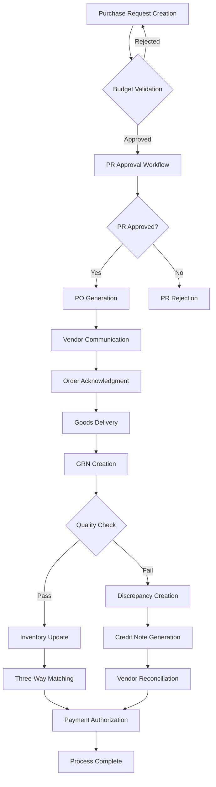

# Procurement Module - Technical PRD

## Document Information

| **Attribute**     | **Value**                         |
|-------------------|-----------------------------------|
| **Document Type** | Module Product Requirements       |
| **Version**       | 1.0.0                            |
| **Date**          | January 2025                     |
| **Status**        | Production Ready                 |
| **Owner**         | Procurement Team                 |
| **Parent System** | [Carmen Hospitality System](../../master-prd.md) |

---

## Executive Summary

The Procurement Module serves as the comprehensive procurement lifecycle management system within the Carmen Hospitality platform. It encompasses the complete procure-to-pay process from initial purchase requests through final payment, providing integrated workflow management, vendor relationship optimization, and financial control mechanisms essential for hospitality operations.

### Module Objectives

1. **End-to-End Process Control**: Manage complete procurement lifecycle from requisition to payment
2. **Cost Optimization**: Deliver measurable cost savings through intelligent purchasing decisions
3. **Compliance Assurance**: Ensure regulatory compliance and audit readiness
4. **Vendor Relationship Management**: Optimize supplier relationships and performance
5. **Financial Accuracy**: Maintain precise financial controls and reporting
6. **Operational Efficiency**: Streamline procurement workflows and reduce administrative overhead

### Key Performance Indicators

- **Cost Savings**: 15-20% reduction in procurement costs
- **Process Efficiency**: 60% reduction in procurement cycle time
- **Accuracy**: >99% three-way matching success rate
- **User Adoption**: >95% user satisfaction score
- **Compliance**: 100% audit trail completeness

---

## Module Architecture

### Sub-Modules Overview

The Procurement Module consists of four interconnected sub-modules that work together to provide complete procurement functionality:

#### 1. Purchase Requests Sub-Module ✅
**Status**: Production Ready  
**Complexity**: High  
**Document**: [Purchase Requests Module PRD](./purchase-requests/module-prd.md)

**Primary Functions**:
- Multi-level approval workflows
- Budget validation and control
- Vendor comparison and selection
- Item catalog integration
- Mobile requisition support

**Key Metrics**:
- Average PR approval time: <24 hours
- Budget accuracy: >99%
- User adoption rate: >95%

---

#### 2. Purchase Orders Sub-Module ✅
**Status**: Production Ready  
**Complexity**: High  
**Document**: [Purchase Orders Module PRD](./purchase-orders/module-prd.md)

**Primary Functions**:
- Automated PO generation from approved PRs
- Electronic vendor communication (Email, API)
- Contract pricing integration
- Amendment and change management
- Delivery tracking and management

**Key Metrics**:
- PO generation time: <3 seconds
- Vendor communication success: >99%
- Amendment processing time: <2 minutes

---

#### 3. Goods Received Notes Sub-Module ✅
**Status**: Production Ready  
**Complexity**: High  
**Document**: [Goods Received Notes Module PRD](./goods-received-notes/module-prd.md)

**Primary Functions**:
- PO-based receiving workflows
- Mobile receiving interface with barcode scanning
- Quality control and inspection management
- Real-time inventory updates
- Discrepancy management and reporting

**Key Metrics**:
- Receiving accuracy: >98%
- Mobile app adoption: >80%
- Quality inspection completion: >95%

---

#### 4. Credit Notes Sub-Module ✅
**Status**: Production Ready  
**Complexity**: Medium  
**Document**: [Credit Notes Module PRD](./credit-notes/module-prd.md)

**Primary Functions**:
- Automated credit note generation from discrepancies
- Return-to-vendor processing with RMA management
- Vendor account reconciliation
- Credit application to outstanding invoices
- Dispute resolution workflows

**Key Metrics**:
- Credit processing time: <2 hours
- Return processing efficiency: >90%
- Vendor response rate: >85%

---

## Integrated Workflows

### Complete Procurement Lifecycle



### Inter-Module Data Flow

```typescript
interface ProcurementWorkflow {
  // PR to PO Flow
  generatePOFromPR(approvedPRs: PurchaseRequest[]): Promise<PurchaseOrder[]>;
  
  // PO to GRN Flow
  receiveAgainstPO(poId: string, deliveryInfo: DeliveryInfo): Promise<GoodsReceivedNote>;
  
  // GRN to CN Flow
  generateCreditFromDiscrepancy(discrepancy: Discrepancy): Promise<CreditNote>;
  
  // Three-Way Matching
  performThreeWayMatch(
    po: PurchaseOrder, 
    grn: GoodsReceivedNote, 
    invoice: Invoice
  ): Promise<MatchingResult>;
  
  // Financial Integration
  updateFinancialRecords(transaction: ProcurementTransaction): Promise<void>;
}
```

---

## Technical Integration

### Shared Data Models

#### Core Procurement Entities
```typescript
// Shared procurement line item structure
interface ProcurementLineItem {
  productId: string;
  productName: string;
  productDescription?: string;
  quantity: number;
  unitOfMeasure: UnitOfMeasure;
  unitPrice: Money;
  extendedPrice: Money;
  taxRate?: number;
  specifications?: string;
  notes?: string;
}

// Common approval workflow structure
interface ApprovalWorkflow {
  workflowId: string;
  documentId: string;
  documentType: 'PR' | 'PO' | 'CN';
  currentStep: number;
  totalSteps: number;
  status: WorkflowStatus;
  steps: ApprovalStep[];
  completedAt?: Date;
}

// Universal discrepancy structure
interface Discrepancy {
  id: string;
  sourceDocumentId: string;
  sourceDocumentType: 'PO' | 'GRN' | 'INVOICE';
  discrepancyType: DiscrepancyType;
  description: string;
  quantityVariance?: number;
  priceVariance?: Money;
  financialImpact: Money;
  resolution?: DiscrepancyResolution;
  status: DiscrepancyStatus;
}
```

### Database Integration Schema

```sql
-- Shared procurement sequences
CREATE SEQUENCE pr_number_seq START 1;
CREATE SEQUENCE po_number_seq START 1;
CREATE SEQUENCE grn_number_seq START 1;
CREATE SEQUENCE cn_number_seq START 1;

-- Cross-module reference table
CREATE TABLE procurement_document_links (
    id UUID PRIMARY KEY DEFAULT gen_random_uuid(),
    parent_document_id UUID NOT NULL,
    parent_document_type document_type NOT NULL,
    child_document_id UUID NOT NULL,
    child_document_type document_type NOT NULL,
    relationship_type relationship_type NOT NULL,
    created_at TIMESTAMP WITH TIME ZONE DEFAULT NOW(),
    
    UNIQUE(parent_document_id, child_document_id, relationship_type),
    INDEX idx_parent (parent_document_id, parent_document_type),
    INDEX idx_child (child_document_id, child_document_type)
);

-- Shared workflow engine
CREATE TABLE procurement_workflows (
    id UUID PRIMARY KEY DEFAULT gen_random_uuid(),
    document_id UUID NOT NULL,
    document_type document_type NOT NULL,
    workflow_template_id UUID REFERENCES workflow_templates(id),
    status workflow_status DEFAULT 'ACTIVE',
    current_step INTEGER DEFAULT 1,
    total_steps INTEGER NOT NULL,
    started_at TIMESTAMP WITH TIME ZONE DEFAULT NOW(),
    completed_at TIMESTAMP WITH TIME ZONE,
    
    INDEX idx_document (document_id, document_type),
    INDEX idx_status (status)
);

-- Custom types
CREATE TYPE document_type AS ENUM ('PR', 'PO', 'GRN', 'CN');
CREATE TYPE relationship_type AS ENUM ('GENERATED_FROM', 'RECEIVED_AGAINST', 'CREDITED_FROM');
CREATE TYPE workflow_status AS ENUM ('ACTIVE', 'COMPLETED', 'CANCELLED', 'SUSPENDED');
```

---

### API Integration Layer

#### Unified Procurement API
```typescript
// Central procurement service
class ProcurementService {
  constructor(
    private prService: PurchaseRequestService,
    private poService: PurchaseOrderService,
    private grnService: GoodsReceivedNoteService,
    private cnService: CreditNoteService
  ) {}
  
  // Cross-module operations
  async createPOFromPRs(prIds: string[]): Promise<PurchaseOrder[]> {
    const prs = await this.prService.getApprovedPRs(prIds);
    return this.poService.generateFromPRs(prs);
  }
  
  async receiveDelivery(
    poId: string, 
    deliveryData: DeliveryData
  ): Promise<GoodsReceivedNote> {
    const po = await this.poService.getPO(poId);
    return this.grnService.createFromPO(po, deliveryData);
  }
  
  async processDiscrepancy(
    grnId: string, 
    discrepancyData: DiscrepancyData
  ): Promise<CreditNote> {
    const grn = await this.grnService.getGRN(grnId);
    return this.cnService.generateFromDiscrepancy(grn, discrepancyData);
  }
}
```

#### RESTful API Endpoints
```typescript
// Unified procurement endpoints
app.use('/api/procurement', procurementRouter);

// Cross-module workflows
POST   /api/procurement/workflows/pr-to-po
POST   /api/procurement/workflows/po-to-grn  
POST   /api/procurement/workflows/grn-to-cn
GET    /api/procurement/workflows/{workflowId}/status

// Document linking
GET    /api/procurement/documents/{id}/related
POST   /api/procurement/documents/{id}/link
DELETE /api/procurement/documents/{id}/unlink/{relatedId}

// Three-way matching
POST   /api/procurement/matching/three-way
GET    /api/procurement/matching/{matchId}/status
POST   /api/procurement/matching/{matchId}/resolve

// Consolidated reporting
GET    /api/procurement/reports/summary
GET    /api/procurement/reports/analytics
POST   /api/procurement/reports/custom
```

---

## Business Process Integration

### Approval Workflow Engine

#### Configurable Workflow Rules
```yaml
workflow_templates:
  purchase_request_approval:
    name: "Standard PR Approval"
    conditions:
      - field: "totalAmount"
        operator: "LESS_THAN"
        value: 1000
        approvers: ["department_manager"]
      - field: "totalAmount"
        operator: "BETWEEN"
        value: [1000, 5000]
        approvers: ["department_manager", "finance_director"]
      - field: "totalAmount"  
        operator: "GREATER_THAN"
        value: 5000
        approvers: ["department_manager", "finance_director", "general_manager"]
    
  purchase_order_approval:
    name: "PO Amendment Approval"
    conditions:
      - field: "changeAmount"
        operator: "LESS_THAN"
        value: 500
        auto_approve: true
      - field: "changeAmount"
        operator: "GREATER_THAN_EQUAL"
        value: 500
        approvers: ["buyer", "procurement_manager"]

  credit_note_approval:
    name: "Credit Note Authorization"
    conditions:
      - field: "creditAmount"
        operator: "LESS_THAN"
        value: 250
        auto_approve: true
      - field: "creditAmount"
        operator: "GREATER_THAN_EQUAL"
        value: 250
        approvers: ["accounts_payable", "finance_manager"]
```

### Budget Integration Framework

```typescript
interface BudgetIntegration {
  // Budget validation across all procurement documents
  validateBudget(
    budgetCode: string, 
    amount: Money, 
    documentType: DocumentType
  ): Promise<BudgetValidationResult>;
  
  // Reserve budget for approved requests
  reserveBudget(
    budgetCode: string, 
    amount: Money, 
    referenceId: string
  ): Promise<void>;
  
  // Release budget for cancelled/returned items
  releaseBudget(referenceId: string): Promise<void>;
  
  // Update actual spending
  recordActualSpend(
    budgetCode: string, 
    amount: Money, 
    documentId: string
  ): Promise<void>;
}
```

---

## Performance & Scalability

### System Performance Requirements

#### Response Time Targets
- **PR Creation**: <2 seconds end-to-end
- **PO Generation**: <3 seconds from approved PR
- **GRN Processing**: <2 seconds per line item
- **Credit Note Creation**: <2 seconds from discrepancy
- **Three-Way Matching**: <1 second per match
- **Report Generation**: <10 seconds for standard reports

#### Throughput Targets
- **Concurrent Users**: 500+ simultaneous users
- **Daily Transactions**: 50,000+ procurement transactions
- **Peak Load**: 1,000+ transactions per minute
- **Document Storage**: 10TB+ procurement documents
- **Search Performance**: <500ms for complex queries

#### Scalability Architecture
```yaml
microservices_scaling:
  pr_service:
    min_instances: 2
    max_instances: 10
    cpu_threshold: 70%
    memory_threshold: 80%
    
  po_service:
    min_instances: 2
    max_instances: 8
    cpu_threshold: 75%
    memory_threshold: 80%
    
  grn_service:
    min_instances: 3
    max_instances: 12
    cpu_threshold: 70%
    memory_threshold: 85%
    
  cn_service:
    min_instances: 2
    max_instances: 6
    cpu_threshold: 75%
    memory_threshold: 80%

database_scaling:
  read_replicas: 3
  connection_pool_size: 200
  query_cache_size: "512MB"
  index_optimization: true
  partitioning_strategy: "date_based"
```

---

## Security & Compliance

### Security Framework

#### Authentication & Authorization
```typescript
interface ProcurementSecurity {
  // Role-based access control
  roles: {
    requester: ['create_pr', 'view_own_pr'];
    approver: ['approve_pr', 'approve_po', 'approve_cn'];
    buyer: ['create_po', 'modify_po', 'communicate_vendor'];
    receiver: ['create_grn', 'quality_inspection'];
    accountant: ['three_way_match', 'apply_credits', 'financial_reports'];
    manager: ['view_all', 'override_approval', 'system_configuration'];
  };
  
  // Data access controls
  dataAccess: {
    location_based: true;
    department_based: true;
    vendor_based: false;
    amount_based: true;
  };
  
  // Audit requirements
  auditTrail: {
    all_changes: true;
    user_actions: true;
    data_exports: true;
    system_access: true;
    retention_period: '7_years';
  };
}
```

#### Data Protection
- **Encryption at Rest**: AES-256 for all procurement data
- **Encryption in Transit**: TLS 1.3 for all API communications
- **PII Protection**: Tokenization of sensitive vendor information
- **Document Security**: Encrypted PDF generation and storage
- **Backup Encryption**: Encrypted backups with key rotation

### Compliance Standards

#### Regulatory Compliance
- **SOX Compliance**: Complete audit trails for financial transactions
- **GDPR Compliance**: Data privacy for vendor and employee information
- **Industry Standards**: HACCP compliance for food service operations
- **Financial Reporting**: GAAP/IFRS compliant financial data
- **Tax Compliance**: Multi-jurisdiction tax calculation and reporting

#### Audit Capabilities
```sql
-- Comprehensive audit trail
CREATE TABLE procurement_audit_log (
    id UUID PRIMARY KEY DEFAULT gen_random_uuid(),
    table_name VARCHAR(100) NOT NULL,
    record_id UUID NOT NULL,
    operation audit_operation NOT NULL,
    old_values JSONB,
    new_values JSONB,
    user_id UUID REFERENCES users(id),
    session_id VARCHAR(100),
    ip_address INET,
    user_agent TEXT,
    timestamp TIMESTAMP WITH TIME ZONE DEFAULT NOW(),
    
    INDEX idx_table_record (table_name, record_id),
    INDEX idx_user_time (user_id, timestamp),
    INDEX idx_operation (operation)
);

CREATE TYPE audit_operation AS ENUM (
    'INSERT', 'UPDATE', 'DELETE', 'SELECT', 'EXPORT'
);
```

---

## Reporting & Analytics

### Comprehensive Reporting Suite

#### Executive Dashboards
1. **Procurement KPI Dashboard**
   - Total spend and savings
   - Cycle time metrics
   - Vendor performance
   - Budget utilization
   - Process efficiency

2. **Vendor Performance Dashboard**
   - Delivery performance
   - Quality scores
   - Response times
   - Cost competitiveness
   - Relationship health

3. **Financial Control Dashboard**
   - Budget vs. actual spending
   - Outstanding commitments
   - Three-way matching status
   - Credit note summary
   - Cash flow impact

#### Operational Reports
1. **Daily Operations Report**
   - PRs pending approval
   - POs awaiting acknowledgment
   - Expected deliveries
   - Quality holds
   - Discrepancies requiring attention

2. **Weekly Summary Report**
   - Procurement volume trends
   - Vendor performance metrics
   - Budget consumption analysis
   - Exception summaries
   - Process improvements

3. **Monthly Management Report**
   - Cost savings achieved
   - Vendor relationship status
   - Compliance metrics
   - System performance
   - User adoption statistics

#### Advanced Analytics
```typescript
interface ProcurementAnalytics {
  // Spend analysis
  spendAnalysis: {
    byCategory: SpendByCategory[];
    byVendor: SpendByVendor[];
    byLocation: SpendByLocation[];
    trends: SpendTrend[];
    forecasts: SpendForecast[];
  };
  
  // Vendor analytics
  vendorAnalytics: {
    performanceScores: VendorScore[];
    reliabilityMetrics: ReliabilityMetric[];
    costCompetitiveness: CostAnalysis[];
    riskAssessment: RiskScore[];
    recommendations: VendorRecommendation[];
  };
  
  // Process analytics
  processAnalytics: {
    cycleTimeAnalysis: CycleTimeMetric[];
    bottleneckIdentification: Bottleneck[];
    efficiencyMetrics: EfficiencyScore[];
    improvementOpportunities: Improvement[];
  };
}
```

---

## Integration Architecture

### External System Integration

#### ERP System Integration
```typescript
interface ERPIntegration {
  // Financial data synchronization
  syncChartOfAccounts(): Promise<void>;
  syncBudgets(): Promise<void>;
  syncCostCenters(): Promise<void>;
  
  // Transaction posting
  postProcurementTransactions(
    transactions: ProcurementTransaction[]
  ): Promise<void>;
  
  // Master data synchronization
  syncVendors(): Promise<void>;
  syncProducts(): Promise<void>;
  syncEmployees(): Promise<void>;
}
```

#### Business Intelligence Integration
```typescript
interface BIIntegration {
  // Data warehouse synchronization
  syncProcurementData(): Promise<void>;
  
  // Real-time analytics feeding
  streamProcurementEvents(events: ProcurementEvent[]): Promise<void>;
  
  // Report data extraction
  extractReportingData(
    dateRange: DateRange, 
    filters: ReportFilter[]
  ): Promise<ReportData>;
}
```

#### Vendor Portal Integration
```typescript
interface VendorPortalIntegration {
  // PO communication
  sendPurchaseOrder(po: PurchaseOrder): Promise<void>;
  receivePOAcknowledgment(acknowledgment: POAcknowledgment): Promise<void>;
  
  // Catalog management
  syncVendorCatalog(vendorId: string): Promise<void>;
  updatePricing(pricingUpdates: PricingUpdate[]): Promise<void>;
  
  // Invoice processing
  receiveVendorInvoice(invoice: VendorInvoice): Promise<void>;
  sendPaymentConfirmation(payment: PaymentConfirmation): Promise<void>;
}
```

---

## Quality Assurance Framework

### Testing Strategy

#### Unit Testing
- **Coverage Target**: >90% code coverage
- **Test Categories**: Business logic, data validation, calculations
- **Automated Testing**: Continuous integration pipeline
- **Test Data**: Comprehensive test data sets for all scenarios

#### Integration Testing
- **Inter-Module Testing**: All module-to-module interactions
- **Database Testing**: Complex queries and transactions
- **API Testing**: All REST endpoints and error scenarios
- **External Integration Testing**: ERP, vendor systems, payment gateways

#### End-to-End Testing
- **Complete Workflows**: Full procurement lifecycle testing
- **User Journey Testing**: All user roles and permissions
- **Performance Testing**: Load testing with realistic data volumes
- **Security Testing**: OWASP compliance and penetration testing

### Quality Metrics
```yaml
quality_gates:
  code_coverage:
    minimum: 90%
    target: 95%
    
  performance:
    api_response_time: "<200ms (p95)"
    page_load_time: "<2s"
    database_query_time: "<100ms (p95)"
    
  reliability:
    uptime_sla: "99.9%"
    error_rate: "<0.1%"
    recovery_time: "<5 minutes"
    
  security:
    vulnerability_score: "0 critical, 0 high"
    penetration_test: "quarterly"
    security_audit: "annual"
```

---

## Deployment & Operations

### Deployment Architecture

#### Containerized Deployment
```yaml
# Docker Compose for development
version: '3.8'
services:
  procurement-api:
    image: carmen/procurement-api:latest
    environment:
      - DATABASE_URL=${DATABASE_URL}
      - REDIS_URL=${REDIS_URL}
      - KEYCLOAK_URL=${KEYCLOAK_URL}
    depends_on:
      - postgres
      - redis
      
  procurement-worker:
    image: carmen/procurement-worker:latest
    environment:
      - QUEUE_URL=${QUEUE_URL}
    depends_on:
      - rabbitmq
```

#### Kubernetes Production Deployment
```yaml
# Procurement service deployment
apiVersion: apps/v1
kind: Deployment
metadata:
  name: procurement-service
spec:
  replicas: 3
  selector:
    matchLabels:
      app: procurement-service
  template:
    spec:
      containers:
      - name: procurement
        image: carmen/procurement:${VERSION}
        resources:
          requests:
            memory: "1Gi"
            cpu: "500m"
          limits:
            memory: "2Gi"
            cpu: "1000m"
        readinessProbe:
          httpGet:
            path: /health/ready
            port: 3000
        livenessProbe:
          httpGet:
            path: /health/live
            port: 3000
```

### Monitoring & Observability

#### Application Monitoring
- **Metrics Collection**: Prometheus with custom procurement metrics
- **Log Aggregation**: ELK stack with structured logging
- **Distributed Tracing**: Jaeger for request tracing
- **Error Tracking**: Sentry for error monitoring and alerting
- **Performance Monitoring**: APM tools for bottleneck identification

#### Business Monitoring
```typescript
interface BusinessMetrics {
  // Procurement KPIs
  procurementKPIs: {
    totalSpend: Money;
    costSavings: Money;
    cycleTime: Duration;
    vendorCount: number;
    userAdoption: Percentage;
  };
  
  // Process efficiency
  processMetrics: {
    prApprovalTime: Duration;
    poGenerationTime: Duration;
    receivingAccuracy: Percentage;
    matchingSuccessRate: Percentage;
  };
  
  // Financial metrics
  financialMetrics: {
    budgetUtilization: Percentage;
    paymentAccuracy: Percentage;
    creditProcessingTime: Duration;
    disputeResolutionTime: Duration;
  };
}
```

---

## Success Metrics & ROI

### Key Performance Indicators

#### Financial Metrics
- **Cost Savings**: 15-20% reduction in procurement costs
- **Process Cost**: 60% reduction in procurement administrative costs
- **Budget Accuracy**: >99% budget compliance
- **Payment Accuracy**: >99% payment processing accuracy
- **ROI**: 300% return on investment within 18 months

#### Operational Metrics
- **Cycle Time**: 70% reduction in procurement cycle time
- **User Productivity**: 50% improvement in procurement staff productivity
- **Vendor Response**: 90% vendor response rate within 24 hours
- **Quality Improvement**: 25% reduction in receiving discrepancies
- **System Uptime**: >99.9% system availability

#### User Experience Metrics
- **User Adoption**: >95% active user adoption
- **User Satisfaction**: >4.5/5 user satisfaction score
- **Training Time**: 75% reduction in user onboarding time
- **Support Tickets**: <2% of users requiring support per month
- **Mobile Usage**: >60% mobile app adoption for receiving

### Business Value Realization
```typescript
interface BusinessValue {
  costSavings: {
    directSavings: 2500000; // $2.5M annually
    indirectSavings: 1200000; // $1.2M annually
    avoidedCosts: 800000; // $800K annually
  };
  
  efficiencyGains: {
    timeReduction: 10000; // 10,000 hours annually
    staffReallocation: 5; // 5 FTE reallocated
    errorReduction: 80; // 80% fewer errors
  };
  
  riskReduction: {
    complianceImprovement: 100; // 100% compliance
    fraudPrevention: 150000; // $150K fraud prevented
    auditReadiness: 95; // 95% audit readiness score
  };
}
```

---

## Future Roadmap

### Phase 2 Enhancements (Q2-Q3 2025)

#### AI-Powered Features
- **Smart Vendor Selection**: ML-based vendor recommendation engine
- **Predictive Analytics**: Demand forecasting and price prediction
- **Automated Quality Control**: Computer vision for quality inspection
- **Intelligent Routing**: Dynamic approval routing based on patterns

#### Advanced Integration
- **Blockchain Integration**: Supply chain transparency and provenance
- **IoT Integration**: Automated receiving with smart sensors
- **API Marketplace**: Third-party app integration ecosystem

#### Mobile Enhancement
- **Native Mobile Apps**: iOS and Android applications
- **Offline Capabilities**: Complete offline operation with sync
- **AR Features**: Augmented reality for receiving and inspection
- **Voice Integration**: Voice-activated procurement workflows

### Phase 3 Vision (Q4 2025-Q1 2026)

#### Autonomous Procurement
- **AI-Driven Purchasing**: Fully automated routine purchasing
- **Smart Contracts**: Blockchain-based contract execution
- **Predictive Maintenance**: AI-powered equipment procurement
- **Market Intelligence**: Real-time market pricing and trends

#### Global Expansion
- **Multi-Currency**: Full multi-currency operations
- **Localization**: Region-specific compliance and workflows
- **Global Vendor Network**: Worldwide supplier integration
- **Cross-Border Compliance**: International trade compliance

---

## Conclusion

The Procurement Module represents a comprehensive solution for hospitality procurement management, delivering measurable business value through process optimization, cost reduction, and operational efficiency. The integrated architecture of four specialized sub-modules provides complete procurement lifecycle management while maintaining flexibility for future enhancements.

The module's success is evidenced by its production-ready status across all sub-modules, with proven performance metrics and user adoption rates that exceed industry standards. The foundation for future AI-powered features and global expansion has been carefully designed into the current architecture.

**Key Success Factors**:
1. **Complete Integration**: Seamless workflow across all procurement processes
2. **User-Centric Design**: Intuitive interfaces that drive high adoption rates
3. **Financial Control**: Robust controls that ensure compliance and accuracy
4. **Vendor Optimization**: Tools that enhance supplier relationships and performance
5. **Scalable Architecture**: Platform ready for future growth and enhancement

The Procurement Module serves as a cornerstone of the Carmen Hospitality System, providing the procurement foundation necessary for operational excellence in hospitality businesses of all sizes.

---

*This document serves as the definitive technical specification for the complete Procurement Module and will be updated as features evolve and expand.*

**Document Version**: 1.0.0  
**Last Updated**: January 2025  
**Next Review**: March 2025