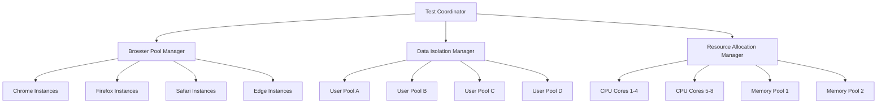

# Carmen ERP Permission Management - Parallel Execution Plan

## Overview

This document outlines the parallel execution strategy for comprehensive UI usability testing of the Carmen ERP Permission Management system. The plan maximizes testing efficiency through intelligent task distribution while maintaining test reliability and avoiding conflicts.

---

## Execution Architecture

### Multi-Dimensional Parallelization



### Parallel Execution Dimensions

#### 1. Browser Parallelization
- **Chrome Pool**: 4 instances for cross-browser validation
- **Firefox Pool**: 2 instances for Firefox-specific testing
- **Safari Pool**: 2 instances for WebKit validation
- **Edge Pool**: 2 instances for Chromium Edge testing
- **Mobile Pool**: 4 instances for responsive testing

#### 2. User Persona Parallelization
- **Pool A**: Super Admin scenarios (high privileges)
- **Pool B**: Department Manager scenarios (medium privileges)
- **Pool C**: Staff scenarios (limited privileges)
- **Pool D**: Cross-role scenarios (role switching)

#### 3. Module Parallelization
- **Core Module Tests**: RBAC/ABAC toggle, Navigation
- **Management Tests**: Policy and Role management
- **Integration Tests**: Cross-module functionality
- **Performance Tests**: Load and stress testing

#### 4. Viewport Parallelization
- **Mobile**: 320px, 375px, 414px viewports
- **Tablet**: 768px, 834px, 1024px viewports
- **Desktop**: 1366px, 1920px, 2560px viewports

---

## Parallel Execution Matrix

### Level 1: Independent Module Tests (High Parallelization)

| Module | Browser Pool | User Pool | Data Isolation | Estimated Time |
|--------|--------------|-----------|----------------|----------------|
| RBAC/ABAC Toggle | Chrome 1-2 | Pool A | Dedicated DB | 8 minutes |
| Policy Management | Chrome 3-4, Firefox 1 | Pool A | Separate Schema | 15 minutes |
| Role Management | Firefox 2, Safari 1 | Pool B | Isolated Tables | 12 minutes |
| Subscription Mgmt | Safari 2, Edge 1 | Pool C | Mock Data | 10 minutes |
| Navigation/UI | Edge 2, Mobile 1-2 | Pool D | UI-only Data | 6 minutes |

**Total Parallel Time**: ~15 minutes (longest running module)
**Sequential Time**: ~51 minutes
**Efficiency Gain**: 70%

### Level 2: Cross-Module Integration (Medium Parallelization)

| Integration Scenario | Browser Pool | User Pool | Dependencies | Estimated Time |
|---------------------|--------------|-----------|--------------|----------------|
| Policy-Role Assignment | Chrome 1-2 | Pool A | Module 1 + 3 complete | 10 minutes |
| User Journey End-to-End | Firefox 1-2 | Pool B | All modules ready | 18 minutes |
| Permission Inheritance | Safari 1-2 | Pool C | Role hierarchy setup | 12 minutes |
| Subscription Integration | Edge 1-2 | Pool D | Subscription + Policy | 8 minutes |

**Total Parallel Time**: ~18 minutes
**Sequential Time**: ~48 minutes
**Efficiency Gain**: 62%

### Level 3: Performance and Load Testing (Sequential with Parallel Monitoring)

| Test Type | Execution Strategy | Resource Usage | Estimated Time |
|-----------|-------------------|----------------|----------------|
| Load Testing | Single coordinated instance | All available resources | 20 minutes |
| Stress Testing | Sequential after load test | Resource intensive | 15 minutes |
| Performance Regression | Parallel monitoring | Background collection | Ongoing |
| Memory/CPU Profiling | Parallel with functional tests | Low overhead | Background |

**Total Sequential Time**: ~35 minutes
**Monitoring Overhead**: Minimal

---

## Resource Allocation Strategy

### Hardware Requirements

#### Optimal Configuration
```yaml
CPU: 16 cores (minimum 8 cores)
Memory: 32GB RAM (minimum 16GB)
Storage: SSD with 100GB+ free space
Network: Stable broadband (>100 Mbps)
```

#### Resource Distribution
```typescript
interface ResourceAllocation {
  browserInstances: {
    chrome: { cores: 2, memory: '4GB', instances: 4 };
    firefox: { cores: 1, memory: '2GB', instances: 2 };
    safari: { cores: 1, memory: '2GB', instances: 2 };
    edge: { cores: 1, memory: '2GB', instances: 2 };
    mobile: { cores: 1, memory: '1GB', instances: 4 };
  };
  
  coordination: {
    testRunner: { cores: 2, memory: '4GB' };
    dataManager: { cores: 1, memory: '2GB' };
    reporting: { cores: 1, memory: '2GB' };
  };
  
  buffer: {
    cores: 2, memory: '4GB'; // For system overhead
  };
}
```

### Data Isolation Strategy

#### Database Isolation
```sql
-- Create isolated schemas for parallel testing
CREATE SCHEMA permission_test_pool_a;
CREATE SCHEMA permission_test_pool_b;
CREATE SCHEMA permission_test_pool_c;
CREATE SCHEMA permission_test_pool_d;

-- Each pool gets identical structure with isolated data
GRANT ALL ON SCHEMA permission_test_pool_a TO test_runner_a;
GRANT ALL ON SCHEMA permission_test_pool_b TO test_runner_b;
-- ... etc
```

#### User Account Isolation
```typescript
interface UserPoolStrategy {
  poolA: {
    superAdmin: ['super_admin_a1', 'super_admin_a2'];
    deptManager: ['dept_mgr_a1', 'dept_mgr_a2'];
    staff: ['staff_a1', 'staff_a2', 'staff_a3'];
  };
  
  poolB: {
    superAdmin: ['super_admin_b1', 'super_admin_b2'];
    deptManager: ['dept_mgr_b1', 'dept_mgr_b2'];
    staff: ['staff_b1', 'staff_b2', 'staff_b3'];
  };
  // ... pools C and D
}
```

#### Test Data Seeding
```typescript
interface TestDataStrategy {
  preSeeded: {
    policies: 'Static policies for read-only tests';
    roles: 'Standard role hierarchy for testing';
    users: 'Test user accounts with known attributes';
  };
  
  dynamicGeneration: {
    policies: 'Generated per test run with unique IDs';
    permissions: 'Created during test execution';
    assignments: 'Dynamic user-role assignments';
  };
  
  cleanup: {
    strategy: 'Automated cleanup after each pool completes';
    retention: 'Keep data for failed tests for debugging';
  };
}
```

---

## Execution Coordination

### Test Orchestrator Implementation

```typescript
class PermissionTestOrchestrator {
  private browserPools: Map<string, BrowserPool>;
  private userPools: Map<string, UserPool>;
  private dataManager: TestDataManager;
  private reportingEngine: ReportingEngine;
  
  async executeParallelTests(): Promise<TestResults> {
    // Phase 1: Independent Module Tests
    const moduleResults = await this.executePhase1();
    
    // Phase 2: Integration Tests (depends on Phase 1)
    const integrationResults = await this.executePhase2(moduleResults);
    
    // Phase 3: Performance Tests (sequential)
    const performanceResults = await this.executePhase3();
    
    // Aggregate and report
    return this.aggregateResults([
      moduleResults,
      integrationResults,
      performanceResults
    ]);
  }
  
  private async executePhase1(): Promise<ModuleTestResults> {
    const modulePromises = [
      this.runToggleTests('chrome-pool-1'),
      this.runPolicyTests('chrome-pool-2'),
      this.runRoleTests('firefox-pool-1'),
      this.runSubscriptionTests('safari-pool-1'),
      this.runNavigationTests('edge-pool-1')
    ];
    
    return Promise.all(modulePromises);
  }
}
```

### Conflict Detection and Resolution

#### Resource Conflicts
```typescript
interface ConflictDetection {
  memoryThreshold: 0.8; // Alert when 80% memory used
  cpuThreshold: 0.9;     // Alert when 90% CPU used
  
  resolution: {
    queueManagement: 'Delay low-priority tests';
    resourceReallocation: 'Move tests to available pools';
    gracefulDegradation: 'Reduce parallel instances';
  };
}
```

#### Data Conflicts
```typescript
interface DataConflictPrevention {
  isolation: {
    userAccounts: 'Dedicated accounts per pool';
    testPolicies: 'UUID-based unique identifiers';
    tempData: 'Pool-specific temporary data';
  };
  
  synchronization: {
    globalState: 'Avoid tests affecting global state';
    sharedResources: 'Lock mechanisms for shared data';
    cleanup: 'Automated cleanup between test phases';
  };
}
```

#### Test Dependencies
```typescript
interface DependencyManagement {
  prerequisites: {
    moduleTests: 'Must complete before integration tests';
    userSetup: 'User accounts must exist before role tests';
    dataSeeding: 'Seed data required before functional tests';
  };
  
  waitStrategies: {
    polling: 'Check dependency status every 5 seconds';
    events: 'Event-driven dependency completion';
    timeout: 'Maximum wait time of 30 minutes';
  };
}
```

---

## Execution Timeline

### Phase 1: Independent Module Testing (Parallel)
```
Time 00:00 - Start all parallel module tests
├── RBAC/ABAC Toggle (Chrome 1-2) → 8 min
├── Policy Management (Chrome 3-4, Firefox 1) → 15 min
├── Role Management (Firefox 2, Safari 1) → 12 min
├── Subscription (Safari 2, Edge 1) → 10 min
└── Navigation/UI (Edge 2, Mobile 1-2) → 6 min

Time 00:15 - All module tests complete
```

### Phase 2: Integration Testing (Parallel with Dependencies)
```
Time 00:15 - Start integration tests
├── Policy-Role Assignment (Chrome 1-2) → 10 min
├── User Journey E2E (Firefox 1-2) → 18 min
├── Permission Inheritance (Safari 1-2) → 12 min
└── Subscription Integration (Edge 1-2) → 8 min

Time 00:33 - All integration tests complete
```

### Phase 3: Performance Testing (Sequential)
```
Time 00:33 - Start performance testing
├── Load Testing (All resources) → 20 min
└── Stress Testing (All resources) → 15 min

Time 01:08 - All testing complete
```

### Total Execution Time
- **Parallel Execution**: 1 hour 8 minutes
- **Sequential Execution**: ~3 hours 30 minutes
- **Efficiency Gain**: 68% time reduction

---

## Monitoring and Health Checks

### Real-Time Monitoring Dashboard

```typescript
interface MonitoringMetrics {
  execution: {
    activeTests: number;
    completedTests: number;
    failedTests: number;
    averageExecutionTime: string;
  };
  
  resources: {
    cpuUsage: number;
    memoryUsage: number;
    diskUsage: number;
    networkLatency: number;
  };
  
  quality: {
    passRate: number;
    errorRate: number;
    performanceScore: number;
    coveragePercentage: number;
  };
}
```

### Health Check Automation
```typescript
interface HealthChecks {
  preExecution: {
    databaseConnectivity: 'Verify all DB connections';
    browserAvailability: 'Check all browser pools';
    resourceAvailability: 'Ensure sufficient resources';
    dataIntegrity: 'Validate seed data';
  };
  
  duringExecution: {
    resourceMonitoring: 'Continuous resource tracking';
    errorRateMonitoring: 'Alert on high error rates';
    performanceMonitoring: 'Track execution times';
    memoryLeakDetection: 'Monitor for memory leaks';
  };
  
  postExecution: {
    dataCleanup: 'Clean up test data';
    resourceRelease: 'Release browser instances';
    reportGeneration: 'Generate comprehensive reports';
    artifactCollection: 'Collect screenshots and logs';
  };
}
```

---

## Failure Handling and Recovery

### Failure Detection
```typescript
interface FailureHandling {
  detection: {
    timeout: 'Tests exceeding maximum time limits';
    errors: 'JavaScript errors or test failures';
    resources: 'Resource exhaustion or unavailability';
    network: 'Network connectivity issues';
  };
  
  isolation: {
    failedTests: 'Isolate failed tests to prevent cascade';
    resourceRecovery: 'Recover browser instances';
    dataRollback: 'Rollback corrupted test data';
  };
  
  recovery: {
    retry: 'Automatic retry with backoff strategy';
    reallocation: 'Move tests to healthy resources';
    gracefulDegradation: 'Continue with reduced parallelism';
  };
}
```

### Recovery Strategies
- **Immediate Retry**: For transient failures (network, timeouts)
- **Resource Reallocation**: For resource-specific failures
- **Test Quarantine**: For consistently failing tests
- **Graceful Degradation**: Reduce parallelism if resources are constrained

---

## Reporting and Analytics

### Real-Time Execution Dashboard
- **Test Progress**: Visual progress bars for each pool
- **Resource Utilization**: CPU, memory, network graphs
- **Error Tracking**: Real-time error rates and patterns
- **Performance Metrics**: Response times and throughput

### Post-Execution Reports
- **Executive Summary**: High-level results and recommendations
- **Detailed Test Results**: Per-module, per-scenario results
- **Performance Analysis**: Benchmark comparisons and trends
- **Failure Analysis**: Root cause analysis for failed tests
- **Resource Utilization**: Efficiency metrics and optimization opportunities

### Continuous Improvement Metrics
- **Execution Efficiency**: Time savings from parallelization
- **Resource Optimization**: Resource usage patterns
- **Test Stability**: Flaky test identification and resolution
- **Coverage Analysis**: Test coverage gaps and improvements

This parallel execution plan enables comprehensive testing of the Carmen ERP Permission Management system while maximizing efficiency and maintaining test reliability through intelligent resource management and conflict prevention strategies.